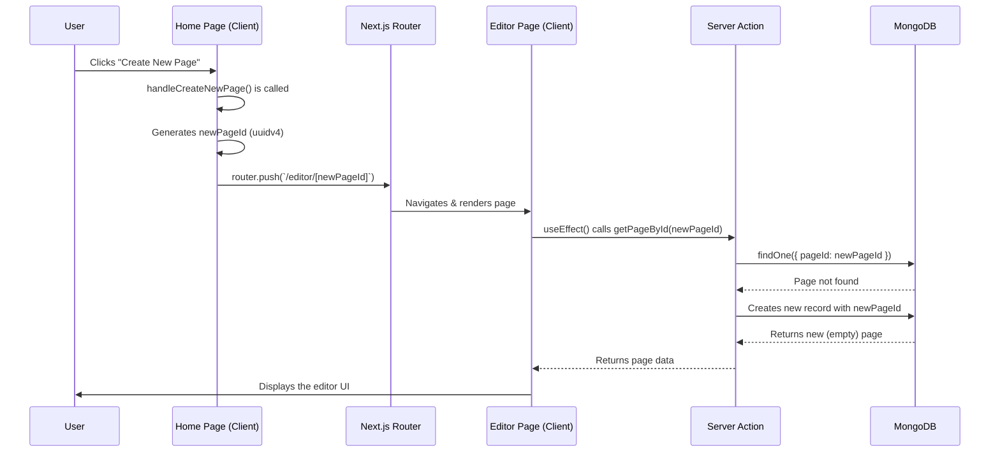
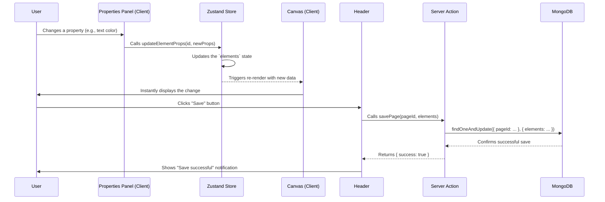
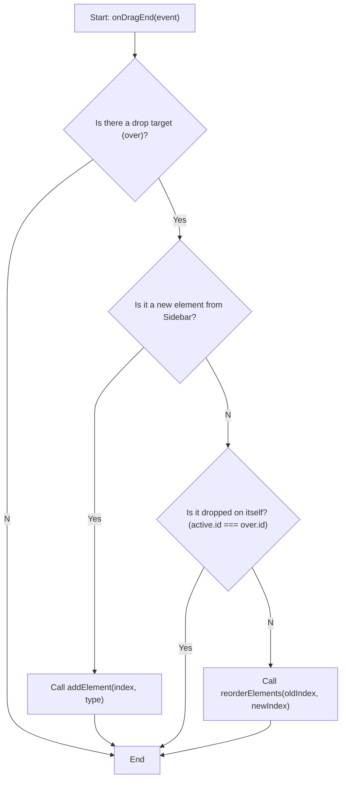
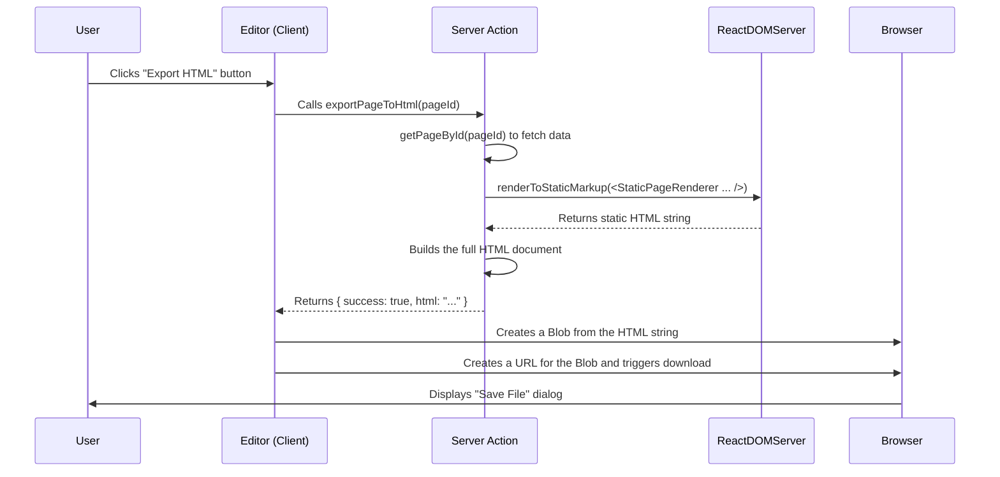

# Landing Pages Workflows

Workflow diagram of Projects

{/* truncate */}

import ZoomBlock from "@site/src/components/ZoomBlock";

## 1. New Page Creation Flow

This diagram describes the process from when a user clicks "Create New Page" until the editor is displayed.

<ZoomBlock>

</ZoomBlock>

## 2. Edit and Save Flow

This diagram illustrates the core edit-save loop of the application.

<ZoomBlock>

</ZoomBlock>

## 3. Drag and Drop Logic Flow

This diagram outlines the decision logic within the `onDragEnd` handler when a user performs a drag-and-drop action.

<ZoomBlock>

</ZoomBlock>

## 4. HTML Export Flow

This diagram describes the process from when a user requests to export a file until the browser initiates the download.

<ZoomBlock>

</ZoomBlock>
