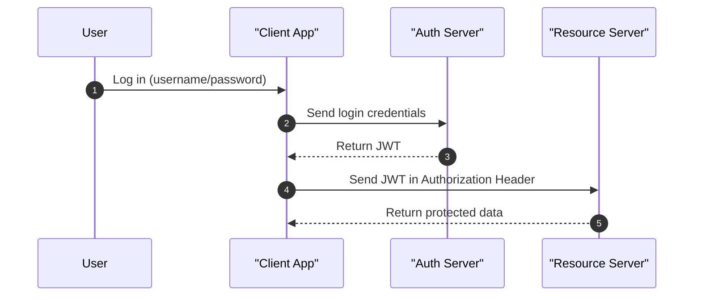
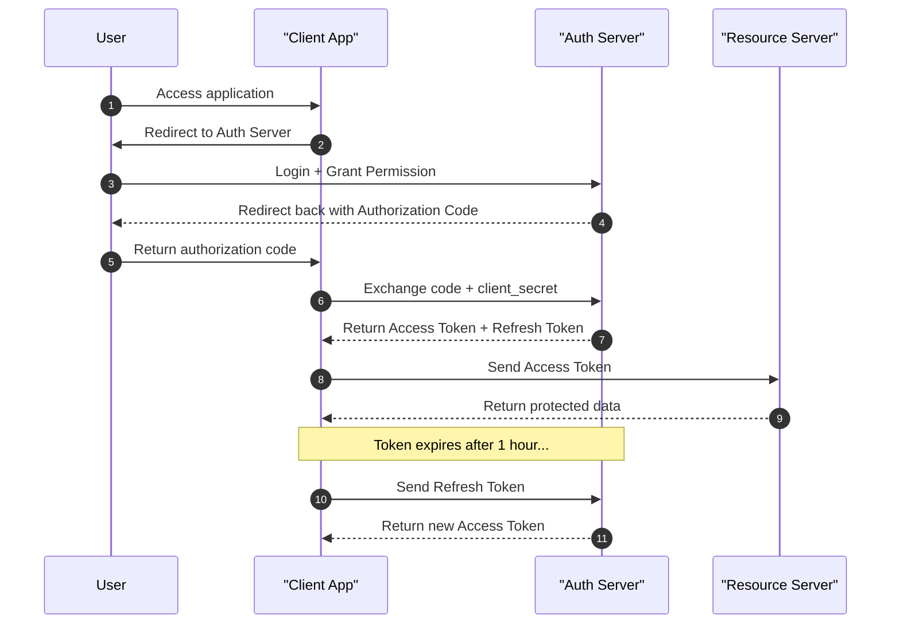
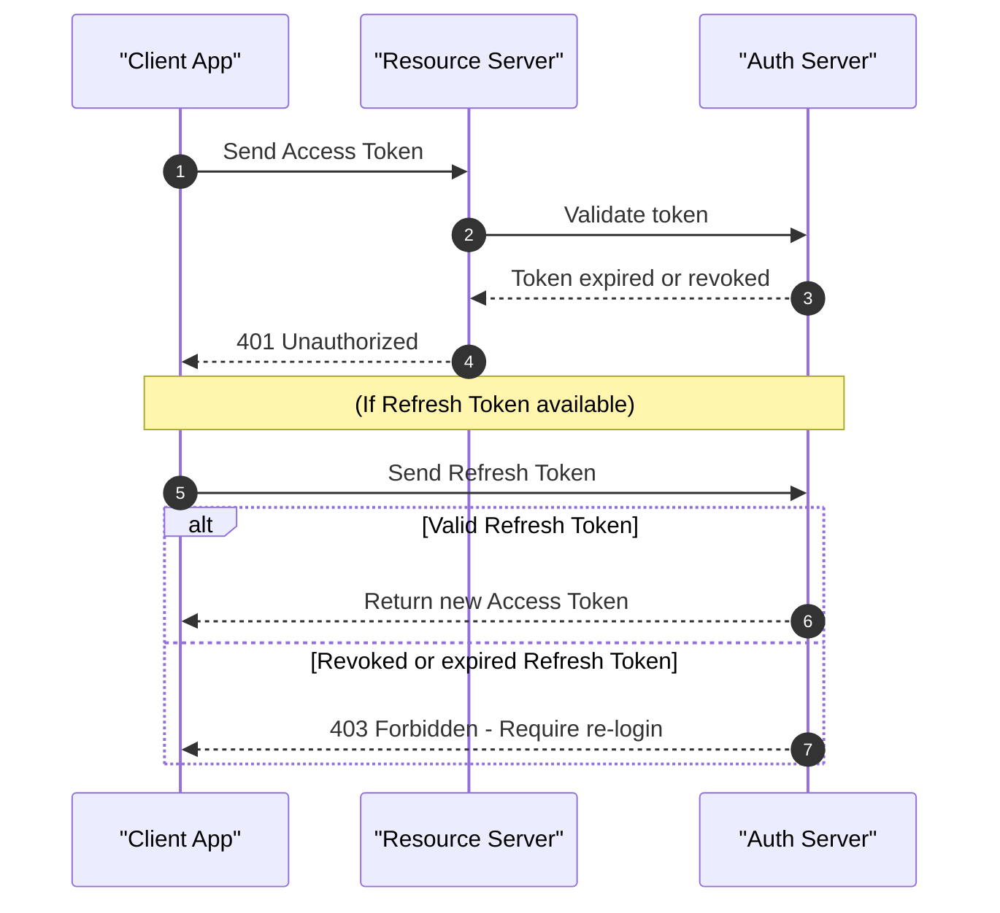

# Authentication Flows

## Traditional JWT (Stateless)

:::info Note

The **Auth Server does not maintain session state**. The JWT is signed, allowing the Resource Server to verify its integrity and authenticity **without database queries**.

:::

**Best Practices:**

* Always sign JWTs using strong algorithms like RS256 or HS256.
* Set an expiration (`exp`) and consider adding `iat` and `nbf` claims.
* Avoid putting sensitive user data directly inside JWT.

---

## OAuth 2.0

### Authorization Code Flow with Refresh Token

:::info Note

The **Refresh Token** enables obtaining a new access token without requiring the user to log in again.

:::

**Best Practices:**

* Store refresh tokens securely (e.g., in an HTTP-only, secure cookie).
* Set proper scopes during authorization.
* Rotate refresh tokens (RFC 6749 best practice).
* Implement PKCE (Proof Key for Code Exchange) for public clients (especially SPAs and mobile apps).

---

## Invalid / Revoked Tokens

:::info Note

**Invalid or expired tokens** are rejected by the Resource Server. The app may use a Refresh Token to re-authenticate. If that fails, the user must log in again.

:::

**Enhancements:**

* Maintain a token blacklist (if using JWT statelessly) or a centralized introspection endpoint.
* Log token usage to detect anomalies (e.g., token replay).

---

## Quick Summary

| Flow                               | Advantages                | Disadvantages                               |
| ---------------------------------- | ------------------------- | ------------------------------------------- |
| **Traditional JWT**                | Fast, no DB lookup needed | Cannot revoke tokens early                  |
| **OAuth 2.0 + Refresh Token**      | Secure session management | More complex, requires secure token storage |
| **Revoked/Expired Token Handling** | Crucial for security      | Requires token introspection or blacklist   |

---

## Additional Concepts

### 1. Token Types

* **Access Token**: Short-lived; used to access protected APIs.
* **Refresh Token**: Long-lived; used to renew access tokens.
* **ID Token** (OpenID Connect): Contains user identity information (e.g., email, name).

### 2. Token Storage Strategies

| Client Type     | Access Token Storage      | Refresh Token Storage     |
| --------------- | ------------------------- | ------------------------- |
| Web (SPA)       | Memory (ephemeral)        | Secure HTTP-only cookies  |
| Mobile (native) | Secure Storage (Keychain) | Secure Storage (Keychain) |
| Backend         | Server-side session store | Encrypted DB or in-memory |

### 3. OpenID Connect (OIDC)

An identity layer on top of OAuth 2.0, OIDC provides authentication in addition to authorization. Commonly used for:

* Social login (Google, Facebook, etc.)
* SSO (Single Sign-On)
* Identity Federation
