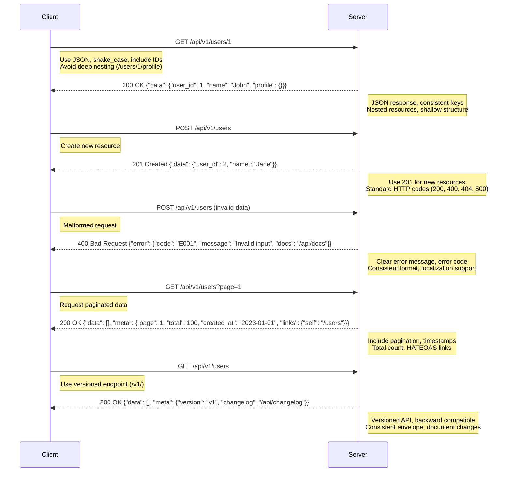

# RESTful API Response



## Best Practices for JSON Responses in RESTful APIs

### 1. Use JSON as the Default Format

- JSON is lightweight, widely supported, and human-readable.
- Ensure responses include the `Content-Type: application/json` header.

  ```json
  {
    "id": 1,
    "name": "John Doe"
  }
  ```

### 2. Consistent Key Naming Convention

- Use a consistent naming style, such as `snake_case` or `camelCase`, across all responses.
- Avoid mixing styles to reduce confusion.

  ```json
  {
    "user_id": 1,
    "full_name": "John Doe",
    "email_address": "john@example.com"
  }
  ```

### 3. Include Resource IDs and Timestamps

- Always include a unique identifier (`id`) for resources.
- Add `created_at` and `updated_at` timestamps for tracking resource lifecycle.

  ```json
  {
    "id": 1,
    "name": "John Doe",
    "created_at": "2025-06-18T14:22:00Z",
    "updated_at": "2025-06-18T14:22:00Z"
  }
  ```

### 4. Use Nested Resources for Relationships

- Represent related resources as nested objects or arrays, but avoid excessive nesting (>2 levels).
- Include only essential related data or provide links to fetch it.

  ```json
  {
    "id": 1,
    "name": "John Doe",
    "posts": [
      {
        "id": 101,
        "title": "My First Post"
      }
    ]
  }
  ```

### 5. Provide Clear Error Responses

- Use a consistent error format with `status`, `error`, `message`, and optional `details`.
- Include HTTP status code in the response body for clarity.

  ```json
  {
    "status": "error",
    "error": "invalid_input",
    "message": "Invalid email format",
    "details": {
      "email": "must be a valid email address"
    }
  }
  ```

### 6. Include Pagination Metadata for Collections

- For large datasets, include `total`, `per_page`, `current_page`, and `next_page_url`/`prev_page_url`.
- Wrap collection data in a `data` array.

  ```json
  {
    "data": [
      {
        "id": 1,
        "name": "John Doe"
      },
      {
        "id": 2,
        "name": "Jane Smith"
      }
    ],
    "meta": {
      "total": 2,
      "per_page": 10,
      "current_page": 1,
      "next_page_url": null,
      "prev_page_url": null
    }
  }
  ```

### 7. Support HATEOAS (Hypermedia)

- Include `links` to related resources or actions to improve API discoverability.
- Helps clients navigate the API without hardcoding URLs.

  ```json
  {
    "id": 1,
    "name": "John Doe",
    "links": {
      "self": "/api/users/1",
      "posts": "/api/users/1/posts"
    }
  }
  ```

### 8. Use Consistent Response Envelope

- Wrap responses in a consistent structure (e.g., `data`, `meta`, `errors`) to make parsing predictable.
- Even for single resources, maintain the same structure.

  ```json
  {
    "data": {
      "id": 1,
      "name": "John Doe"
    },
    "meta": {
      "timestamp": "2025-06-18T14:22:00Z"
    }
  }
  ```

### 9. Handle Null Values Appropriately

- Use `null` for missing or undefined values instead of omitting keys or using empty strings.
- Ensures consistency in response structure.

  ```json
  {
    "id": 1,
    "name": "John Doe",
    "phone": null
  }
  ```

### 10. Version Your API

- Include versioning in the response (e.g., via headers or a `version` field) to manage changes.
- Maintain backward compatibility when possible.

  ```json
  {
    "data": {
      "id": 1,
      "name": "John Doe"
    },
    "meta": {
      "version": "1.0"
    }
  }
  ```

## When to Follow Each JSON Response Best Practice

| Category                   | Best Practice                            | When to Follow                                                                      | Why It's Important                                                                     |
| -------------------------- | ---------------------------------------- | ----------------------------------------------------------------------------------- | -------------------------------------------------------------------------------------- |
| **Format & Structure**     | Use JSON as Default Format               | Always, for all API responses unless a specific format (e.g., XML) is required.     | JSON is lightweight, widely supported, and easy to parse across platforms.             |
|                            | Consistent Key Naming (e.g., snake_case) | Always, across all endpoints and responses.                                         | Ensures predictability and reduces client-side parsing errors.                         |
|                            | Include Resource IDs & Timestamps        | For all resources (single or collections) that represent persistent data.           | IDs ensure unique identification; timestamps track creation/modification for auditing. |
|                            | Handle Null Values Appropriately         | When a field is optional or data is unavailable.                                    | Maintains consistent structure, avoids ambiguity, and prevents missing key errors.     |
| **Resources & Relations**  | Use Nested Resources for Relationships   | When returning related data (e.g., a user’s posts) in a single response.            | Reduces the need for multiple requests, improving efficiency for clients.              |
|                            | Avoid Deep Nesting (> 2 Levels)          | When designing responses with related resources.                                    | Prevents overly complex responses that are hard to parse or maintain.                  |
|                            | Support HATEOAS with Links               | When building APIs that need discoverability or navigation (e.g., public APIs).     | Enables clients to navigate the API dynamically without hardcoding URLs.               |
| **Collections & Metadata** | Include Pagination Metadata              | When returning collections of resources (e.g., lists of users, posts).              | Allows clients to navigate large datasets efficiently without overloading responses.   |
|                            | Wrap Collections in 'data' Array         | Always for collection responses, even if empty.                                     | Provides a consistent structure for clients to parse single or multiple resources.     |
|                            | Use Consistent Response Envelope         | Always, for both single resources and collections.                                  | Ensures predictable response structure, simplifying client-side code.                  |
| **Error Handling**         | Provide Clear Error Responses            | For all error scenarios (e.g., validation failures, not found, server errors).      | Helps clients understand what went wrong and how to address it.                        |
|                            | Include Status, Error & Message          | In all error responses to provide context and machine-readable codes.               | Improves debugging and allows clients to handle errors programmatically.               |
| **Versioning**             | Version API in Response                  | When the API may evolve or has multiple versions (e.g., public or long-lived APIs). | Helps clients adapt to changes and ensures compatibility with older implementations.   |
|                            | Maintain Backward Compatibility          | When updating the API to avoid breaking existing clients.                           | Prevents disruption for clients relying on the current API structure.                  |

## Examples

```json
{
  "status": 200,
  "message": "Success",
  "data": [
    {
      "id": 1,
      "name": "Example"
    }
  ],
  "meta": {
    "total": 100,
    "page": 1,
    "limit": 10
  },
  "requestId": "abc123"
}
```

```json
{
  "status": 400,
  "message": "Bad Request",
  "error": {
    "code": "INVALID_INPUT",
    "details": "Field 'email' is invalid"
  },
  "requestId": "xyz789"
}
```
