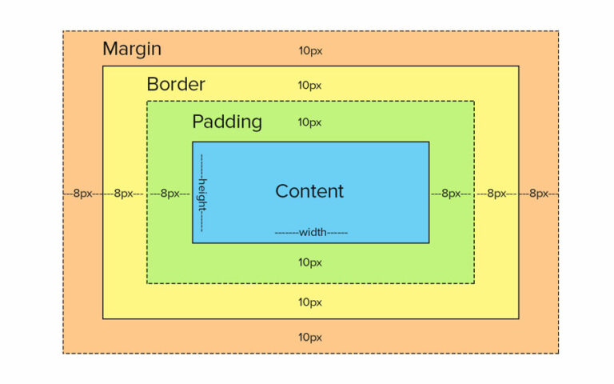

# CSS3

- Describes how HTML elements are to be displayed on screen, paper, or in other media
- Control the layout of multiple web pages all at once
- External stylesheets are stored in CSS files -> CSS removed the style formatting from the HTML page!

## Selectors

:::note CSS Selectors

**Used to "find" (or select) the HTML elements you want to style.**

- Simple selectors (select elements based on [name](../../HTML.md#documents--element), `id`, `class`)
- [Combinator selectors](https://www.w3schools.com/css/css_combinators.asp) (select elements based on a specific relationship between them)
- [Pseudo-class selectors](https://www.w3schools.com/css/css_pseudo_classes.asp) (select elements based on a certain state)
- [Pseudo-elements selectors](https://www.w3schools.com/css/css_pseudo_elements.asp) (select and style a part of an element)
- [Attribute selectors](https://www.w3schools.com/css/css_attribute_selectors.asp) (select elements based on an attribute or attribute value)

:::

```css
* {  /* Comment in css: Apply to all */
 color: blue;
}
/* Group selectors*/
h1, h2, p, 
.class-text-center, 
strong.contain-class-center {
 text-align: center;  
}
#id-need-bold, div#id-must-be-bold {
 font-weight: bold;
}
```

### Combination

```css
/* Child */
.root > .specified-child {
}
/* Adjacent Sibling */
.root + .first-placed-immediately-below {
}
/* General Sibling */
.root ~ .all-placed-immediately-below {
}
```

### Pseudo

:::info Structure

- Pseudo Classes `selector:pseudo-class`
- Pseudo Elements `selector::pseudo-element`
- [See more](https://www.w3schools.com/css/css_pseudo_classes.asp)

:::

### Attribute

| Using                          | Description                                     | Example                |
| ------------------------------ | ----------------------------------------------- | ---------------------- |
| `selector[attribute]`          | Has attribute                                   | `a[target]`            |
| `selector[attribute="value"]`  | Has attribute with exact value                  | `a[target="_blank"]`   |
| `selector[attribute!="value"]` | Has attribute with exact value or like "value-" | `div[class="date"]`    |
| `selector[attribute~="value"]` | Has attribute containing exact word "value"     | `img[title~='animal']` |
| `selector[attribute^="value"]` | Has attribute start with value                  | `a[href^='https']`     |
| `selector[attribute$="value"]` | Has attribute end with value                    | `a[href$=".pdf"]`      |
| `selector[attribute*="value"]` | Has attribute includes word: value              | `img[title*="dog"]`    |

### Specificity

- `*` - 0
- element - 1
- `.class` - 10
- `#id` - 100
- inline `style=""` - 1000
- `!important` - Infinity

:::note

- Combination will sum all points. Example: `div#first-name.text-center` -> 1 + 100 + 10 = 111
- Selector with same point will apply latest rule

:::

## Colours

- Name: `red`, `black`, `white`, `blue`,... [HTML Color Names](https://www.w3schools.com/colors/colors_names.asp)
- **RGB** (red, green, blue) & **RGBA** (alpha): `rgb(0, 0, 0)` | `rgba(255, 255, 255, 0.2)`
- **HEX**: `#rrggbb` - use `00 -> FF (0 -> 255)`
- **HSL** : `hsl(hue, saturation, lightness)` & **HSLA** - alpha like RGBA
  - hue: `[0, 360]`
    - 0 - red
    - 120 - green
    - 240 - blue
  - saturation:
    - 0% - shade of gray
    - 100% - full color
  - lightness:
    - 0% - black
    - 50% - neither light or dark
    - 100% - white

## Backgrounds

**Shorthand:** `background: color image repeat position;`

- `background-color`: [Colour](#colours)
- `background-image`: `url("image_file.type")`;
- `background-repeat`: `repeat` | `repeat-x[y]` | `no-repeat`;
- `background-position`: `left[right]` `top[bottom]`;
- `background-attachment`: `fixed[scroll]`;

**Other options:**

- `background-clip`
- `background-origin`

## Units

- **Absolute**
  - cm - centimeters
  - mm - milimeters
  - in - inches
  - `px` - pixels = 1/96 in
  - pt - points = 1/72 in
  - pc - picas = 12 pt
- **Relative**
  - `em` - n * *current font size*
  - `rem` - n * ***root font size***
  - `%` - base on parent element
  - ex - base on x-height (rarely)
  - ch - base on width of "0"
  - *`vw` - n -> n% width of viewport*
  - *`vh` - n -> n% height of viewport*
  - vmin - n -> n% viewport's smaller dimension
  - vmax - n -> n% viewport's larger dimension

## Borders

**Shorthand**: `border[-position]: width style(required) color`

- `-position`: `top`, `right`, `bottom`, `left`
- `border[-position]-width`: `top right bottom left`;
- `border[-position]-style`: `dotted`, `dashed`, `solid`, `double`, `groove`, `ridge`, `inset`, `outset`, `hidden`
- `border[-position]-color`: [Colour](#colours)
- `border-radius`: `0 (square) -> 50px (round)`

## Margins & Padding

- **Margin**: space around element
- **Padding**: space inside element
- ***Using***
  - `[type][-position]: width;`
  - `margin-top: 20px;`

## Size

- `min-height` - `height` - `max-height`
- `min-width` - `width` - `max-width`

### Box Model



## Elements

### Text

| Attribute          | Value                                                  | Note                                                                                                         |
| ------------------ | ------------------------------------------------------ | ------------------------------------------------------------------------------------------------------------ |
| `background-color` | [[#Colour]]                                            |                                                                                                              |
| `color`            | [[#Colour]]                                            |                                                                                                              |
| `text-align`       | left, center, justify, right                           | "justify" - each line is stretched so that every line has equal width                                        |
| `text-align-last`  | left, center, justify, right                           | Apply only last row of text (long text)                                                                      |
| `direction`        | ltr (default), rtl                                     |                                                                                                              |
| `unicode-bidi`     | bidi-override                                          | Used together with `direction`                                                                               |
| `vertical-align`   | base-line (default), text-top, text-bottom, sub, super |                                                                                                              |
| `text-decoration`  | **Example**: underline #333 solid 5px                  | Shorthand: -line -color -style -thickness (All are optional)                                                 |
| `text-transform`   | uppercase, lowercase, capitalize                       |                                                                                                              |
| `text-indent`      | **Example**: 50px                                      | The indentation of the first line of a text                                                                  |
| `letter-spacing`   | **Example**: 2px                                       | The space between the characters in a text                                                                   |
| `word-spacing`     | **Example**: 10px                                      | The space between words in a text                                                                            |
| `line-height`      | **Example**: 0.8                                       | The space between lines. **NOTE:** should use between 0.8 -> 2                                               |
| `white-space`      | nowrap, wrap, pre, pre-line, pre-wrap                  | Specifies how white-space inside an element is handled                                                       |
| `text-shadow`      | **Example**: 2px 2px 5px blue, 2px -2px 5px red;       | Order: horizontal-shadow vertical-shadow blur(optional) color.<br/>**FEATURE**: use "," and add more shadow; |

### Fonts

:::info Safe font for HTML & CSS

- Arial (sans-serif)
- Verdana (sans-serif)
- Tahoma (sans-serif)
- Trebuchet MS (sans-serif)
- Times New Roman (serif)
- Georgia (serif)
- Garamond (serif)
- Courier New (monospace)
- Brush Script MT (cursive)

:::

:::note Using Google font

1. `<link rel="stylesheet" href="https://fonts.googleapis.com/css?family=FontName">`
2. Add above tag to `<head>` tag

:::

| Attribute      | Value                                      | Note                                                                  |
| -------------- | ------------------------------------------ | --------------------------------------------------------------------- |
| `font`         | **Example**: 12px Arial, sans-serif        | -style -variant -weight -size(required)/line-height -family(required) |
| `font-family`  | **Example**: Arial, Helvetica, sans-serif; | Main font, Second font, fallback font (recommend)                     |
| `font-style`   | normal, italic / oblique                   |                                                                       |
| `font-weight`  | normal, bold, (100 -> 900)                 |                                                                       |
| `font-variant` | normal, small-caps                         |                                                                       |
| `font-size`    | **Example**: 0.8rem                        | **Recommend**: use `em`, `rem` instead of `px`                        |

### Link

```css
/* unvisited link */
a:link {
    color: violet;
}
/* visited link */
a:visited {
    color: green;
}
/* mouse over link */
a:hover {
    cursor: pointer; /* default */
}
/* selected link */
a:active {
    color: darkgreen !important;
}
```

### List

| Attribute             | Value                                                                                                                                                  | Note                   |
| --------------------- | ------------------------------------------------------------------------------------------------------------------------------------------------------ | ---------------------- |
| `list-style`          | **Example**: square inside url("sqpurple.gif");                                                                                                        | -type -position -image |
| `list-style-type`     | `none`, <br/> (ul): `circle`, `disc`, `square`; <br/> (ol): `decimal`, `decimal-leading-zero`, [`lower`, `upper`]-[`alpha`, `greek`, `latin`, `roman`] |                        |
| `list-style-position` | `outside`, `inside` (indent first line)                                                                                                                |                        |
| `list-style-image`    | url("image.type")                                                                                                                                      | Change mark icon       |

### Table

:::info Recommend setup

```css
table {
    width: 100%; /* full width */
    border-collapse: collapse;
}
```

:::

| Attribute         | Value                                        | Note                                                         |
| ----------------- | -------------------------------------------- | ------------------------------------------------------------ |
| `caption-side`    | top, bottom                                  |                                                              |
| `border-collapse` | collapse, separate                           |                                                              |
| `border-spacing`  | (horizontal vertical) **Example**: 10px 20px | use in case `border-collapse: separate;`                     |
| `empty-cell`      | show (default), hide                         | use in case `border-collapse: separate;`                     |
| `table-layout`    | auto (default), fixed                        | **Tip**: `fixed` make table render faster (same size column) |

## Display

> Toggle element: `visibility: visible|hidden;`

| `display` value | Description                                      |
| --------------- | ------------------------------------------------ |
| none            | Remove element                                   |
| inline          |                                                  |
| block           |                                                  |
| flex            | a block-level flex **container**                 |
| grid            | a block-level grid **container**                 |
| inline-block    | display inline but it can set `height` & `width` |
| inline-flex     | a inline-level flex **container**                |
| inline-grid     | a inline-level grid **container**                |
| contents        | only show contents                               |

### Position

| `position` value | Description                                               |
| ---------------- | --------------------------------------------------------- |
| static           | default                                                   |
| fixed            | fixed on screen                                           |
| relative         | base on current position                                  |
| absolute         | base on nearest element has `position: relative;`         |
| sticky           | `relative` (normal) + `fixed` (scroll to sticks in place) |

> POSITION not `static`:
>
> - Combine with `left`, `top`, `right`, `bottom` (not includes 4)
> - Can use `z-index` to specifies the stack order

### Overflow

| `overflow[-x/-y]` value | description                       |
| ----------------------- | --------------------------------- |
| visible                 | default                           |
| hidden                  | hide content                      |
| scroll                  | show scroll if content out of box |
| auto                    |                                   |

> Special: `overflow-break: normal|break-word;` -> handle overflow words

### Layout: `float` and `clear`

- `float: none|left|right|inherit` specifies how an element should float.
- `clear: none|left|right|both|inherit` specifies what elements can float beside the cleared element and on which side.

### Math function

| Method   | Note                       | Example                     |
| -------- | -------------------------- | --------------------------- |
| `calc()` | Good for set flexible size | `width: calc(100% - 10px);` |
| `min()`  | Use smaller value          | `height: min(50%, 200px);`  |
| `max()`  | Use larger value           | `height: max(400px, 60%);`  |

### Counter

```css
body {
    counter-reset: section;
}

h1 {
    counter-reset: subsection;
}

h1::before {
    counter-increment: section;
    content: 'Section ' counter(section) '. ';
}

h2::before {
    counter-increment: subsection;
    content: counter(section) '.' counter(subsection) ' ';
}
```

### `@font-face`: use your font

```css
@font-face {
    font-family: myFirstFont;
    src: url(sansation_light.woff);
    /* font-weight: bold;  */
    /* font-style: italic; */
}

div {
    font-family: myFirstFont;
}
```
<!-- 
## TODO

- [ ] `border-radius`
- [ ] `border-image`
- [ ] `special-color`: transparent, currentcolor
- [ ] `box-shadow`
- [ ] `transforms` + Animation
- [ ] Image properties
- [ ] Multiple Columns
- [ ] `resize`
- [ ] `var(--variable)`
- [ ] `box-sizing`
- [ ] Media Query
- [ ] Flex system
- [ ] Grid system
- [ ] Responsive Web Design
 -->

## Resources

- [CSS Reference](https://cssreference.io/)

## How to

- [Flip card](https://www.w3schools.com/howto/howto_css_flip_card.asp)
