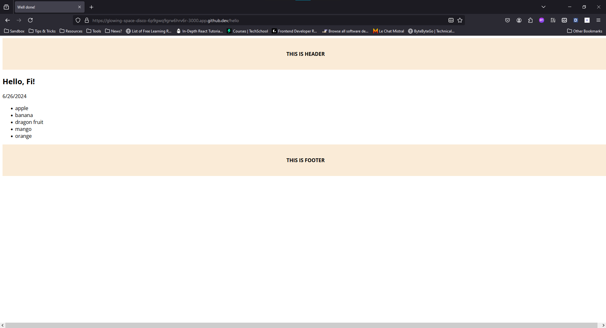

# EJS

> Embedded JavaScript

## Quick start

```bash
npm i ejs
```

:::info Set up with [Express](../../backend/JS_TS/Express.md)

```js
const express = require('express');
const app = express();
app.set('view engine', 'ejs');
```

:::

## Tags

| Code | Use for |
| --- | --- |
| `<%= variables %>` | output data |
| `<% users.forEach(user => { %>` | excute code |
| `<%- <h1>Hello</h1> %>` | render html |
| `<%- include('') %>` | partial files |
| `<%# comment %>` | Comment inline |

## Samples

```html title='index.ejs'
<!DOCTYPE html>
<html lang="en">
  <head>
    <meta charset="UTF-8" />
    <title><%= title %></title>
  </head>
  <body>
    <%# comment %>
    <%- include('./layout/header.ejs') %>

    <% if (user) { %>
        <h2>Hello, <%= user.name %>!</h2>
    <% } else { %>
        <h2>Hello, Guest!</h2>
    <% } %>

    <pre><%= date %></pre>

    <ul>
      <% items.forEach(i => { %>
      <li><%= i %></li>
      <% }) %>
    </ul>

    <%- include('./layout/footer.ejs') %>
  </body>
</html>
```

```html title='layout/header.ejs'
<header
  style="
    display: flex;
    width: 100vw;
    height: 100px;
    font-weight: bold;
    align-items: center;
    justify-content: center;
    background-color: antiquewhite;
  "
>
  THIS IS HEADER
</header>
```

```js
// express
app.get('/hello', (req, res) => {
  res.render('index.ejs', {
    title: 'Well done!',
    // user: undefined,
    user: { name: 'Fi' },
    items: ['apple', 'banana', 'dragon fruit', 'mango', 'orange'],
    date: new Date().toLocaleDateString(),
  });
});
```


