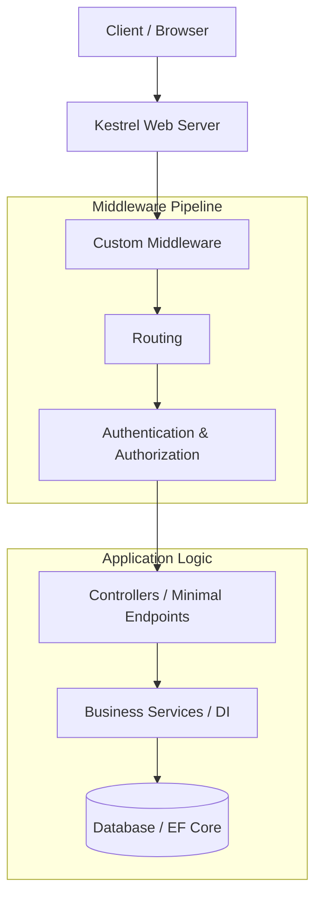
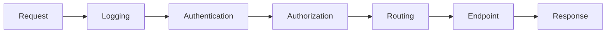
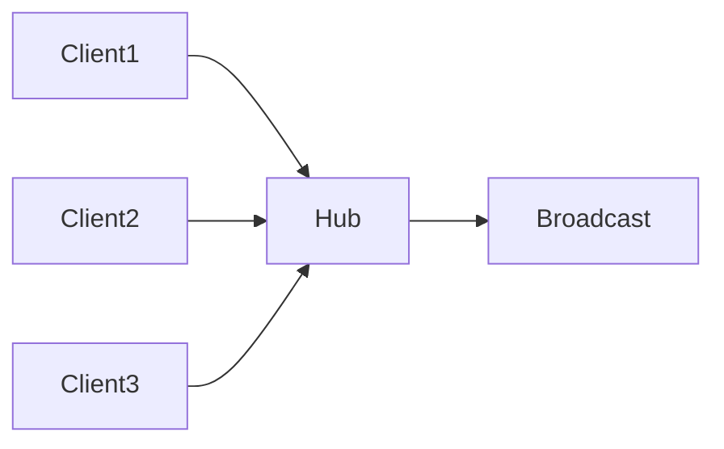
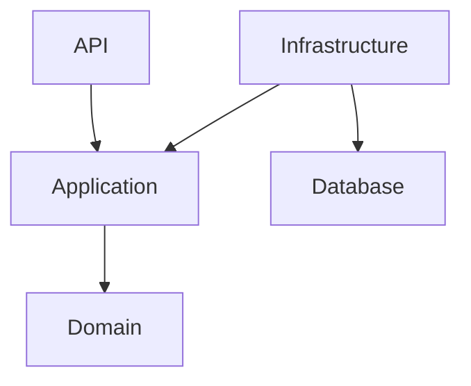
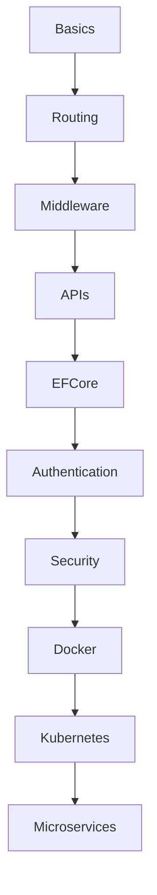

## Overview

ASP.NET Core is Microsoft's modern, cross-platform, high-performance web framework designed for the cloud era.

### Supported Workloads

- **Web APIs** — RESTful services for mobile and web frontends.
- **MVC Applications** — Traditional Server-Side Rendering (SSR).
- **Minimal APIs** — High-performance, low-ceremony microservices.
- **Real-time Apps** — Powered by SignalR.
- **gRPC Services** — Contract-first, high-performance RPC.
- **Blazor** — Interactive web UIs using C# instead of JavaScript.

### Platform Compatibility

| Platform | Supported |
|----------|-----------|
| Windows | ✅ |
| Linux | ✅ |
| macOS | ✅ |
| Docker | ✅ |
| Kubernetes | ✅ |

---

## Why Choose ASP.NET Core?

The framework consistently ranks as one of the fastest web frameworks in the **TechEmpower Benchmarks**. Its modular design allows you to include only the dependencies you need.

| Feature | Technical Benefit |
|---------|------------------|
| Cross-platform | Develop on macOS/Windows; deploy on Linux containers. |
| High Performance | Optimized Kestrel server and non-blocking I/O. |
| Built-in DI | Native Dependency Injection for cleaner, testable code. |
| Middleware Pipeline | Full control over the HTTP request/response lifecycle. |
| Cloud Native | Built-in support for health checks, logging, and configuration. |
| Unified Framework | One programming model for both Web UI and Web APIs. |

---

## System Architecture

The request flow in ASP.NET Core follows a "Russian Doll" model where requests pass through a series of components (Middleware) before reaching your logic.



---

## Core Concepts to Master

:::tip Cloud-Ready Design
To build "Cloud-Ready" apps, focus on the **Stateless** principle. Avoid in-memory sessions; use distributed caches like Redis and external identity providers.
:::

1. **Dependency Injection (DI):** Understanding `Transient`, `Scoped`, and `Singleton` lifetimes is critical for resource management.
2. **Configuration:** Utilizing `appsettings.json`, Environment Variables, and Secret Manager.
3. **Entity Framework Core:** The standard Object-Relational Mapper (ORM) for data access.
4. **Logging:** Built-in support for providers like Serilog or Azure Application Insights.

---

## Kestrel Web Server

ASP.NET Core uses Kestrel as its default web server.

Responsibilities:
- HTTP request handling
- HTTPS support
- High-performance networking
- Async processing

---

## Middleware Pipeline

Middleware components process HTTP requests sequentially.



### Example Middleware

```csharp
var builder = WebApplication.CreateBuilder(args);

var app = builder.Build();

app.Use(async (context, next) =>
{
    Console.WriteLine("Before Request");

    await next();

    Console.WriteLine("After Response");
});

app.Run();
```

---

## Project Structure

```
MyAspNetApp/
│
├── Controllers/
├── Models/
├── Services/
├── Repositories/
├── Middleware/
├── Data/
├── DTOs/
├── appsettings.json
├── Program.cs
└── MyAspNetApp.csproj
```

---

## Hosting Model

### Program.cs (.NET 6+)

```csharp
var builder = WebApplication.CreateBuilder(args);

builder.Services.AddControllers();

var app = builder.Build();

app.MapControllers();

app.Run();
```

---

## Dependency Injection (DI)

### Service Lifetimes

| Lifetime | Description |
|----------|-------------|
| Singleton | One instance for app lifetime |
| Scoped | One per HTTP request |
| Transient | New instance every time |

### Registering Services

```csharp
builder.Services.AddScoped<IUserService, UserService>();
```

### Constructor Injection

```csharp
public class UserController : ControllerBase
{
    private readonly IUserService _service;

    public UserController(IUserService service)
    {
        _service = service;
    }
}
```

---

## Routing

### Attribute Routing

```csharp
[ApiController]
[Route("api/users")]
public class UsersController : ControllerBase
{
    [HttpGet]
    public IActionResult Get()
    {
        return Ok();
    }
}
```

### Route Parameters

```csharp
[HttpGet("{id}")]
public IActionResult GetById(int id)
{
    return Ok(id);
}
```

---

## Controllers & APIs

```csharp
[ApiController]
[Route("api/products")]
public class ProductsController : ControllerBase
{
    [HttpGet]
    public IActionResult GetProducts()
    {
        return Ok(new[] { "Laptop", "Mouse" });
    }
}
```

---

## Minimal APIs

Minimal APIs reduce boilerplate.

```csharp
var builder = WebApplication.CreateBuilder(args);

var app = builder.Build();

app.MapGet("/", () => "Hello ASP.NET Core");

app.Run();
```

---

## Model Binding

Model binding converts HTTP data into C# objects.

```csharp
public class CreateUserRequest
{
    public string Name { get; set; }
}

[HttpPost]
public IActionResult Create(CreateUserRequest request)
{
    return Ok(request.Name);
}
```

---

## Validation

```csharp
public class RegisterRequest
{
    [Required]
    [EmailAddress]
    public string Email { get; set; }
}
```

---

## Entity Framework Core Integration

```csharp
builder.Services.AddDbContext<AppDbContext>(options =>
    options.UseSqlServer(
        builder.Configuration.GetConnectionString("Default")));
```

---

## Configuration System

Configuration supports:
- `appsettings.json`
- Environment variables
- Azure Key Vault
- Command-line args
- Secrets Manager

```json
{
  "ConnectionStrings": {
    "Default": "Server=.;Database=ShopDb;"
  }
}
```

---

## Logging

```csharp
private readonly ILogger<UserService> _logger;

_logger.LogInformation("User created");
```

---

## Authentication

| Authentication Type | Supported |
|--------------------|-----------|
| JWT | ✅ |
| Cookies | ✅ |
| OAuth2 | ✅ |
| OpenID Connect | ✅ |
| Identity Server | ✅ |

### JWT Authentication

```csharp
builder.Services.AddAuthentication("Bearer")
    .AddJwtBearer("Bearer", options =>
    {
        options.Authority = "https://localhost:5001";
        options.Audience = "api";
    });
```

---

## Authorization

```csharp
[Authorize(Roles = "Admin")]
public IActionResult AdminOnly()
{
    return Ok();
}
```

---

## Exception Handling

```csharp
app.UseExceptionHandler("/error");
```

---

## Middleware Ordering

```csharp
app.UseHttpsRedirection();
app.UseAuthentication();
app.UseAuthorization();
app.MapControllers();
```

---

## Swagger / OpenAPI

```csharp
builder.Services.AddEndpointsApiExplorer();
builder.Services.AddSwaggerGen();

app.UseSwagger();
app.UseSwaggerUI();
```

---

## CORS

```csharp
builder.Services.AddCors(options =>
{
    options.AddPolicy("AllowAll",
        policy =>
        {
            policy.AllowAnyOrigin()
                  .AllowAnyMethod()
                  .AllowAnyHeader();
        });
});
```

---

## Background Services

```csharp
public class Worker : BackgroundService
{
    protected override async Task ExecuteAsync(
        CancellationToken stoppingToken)
    {
        while (!stoppingToken.IsCancellationRequested)
        {
            await Task.Delay(1000);
        }
    }
}
```

---

## Real-Time Communication with SignalR



```csharp
public class ChatHub : Hub
{
    public async Task Send(string message)
    {
        await Clients.All.SendAsync("Receive", message);
    }
}
```

---

## gRPC in ASP.NET Core

Use cases:
- Microservices
- Internal APIs
- High-throughput systems

---

## Performance Optimization

| Optimization | Benefit |
|-------------|---------|
| Async/Await | Non-blocking I/O |
| Response Caching | Faster responses |
| Compression | Reduced bandwidth |
| Connection Pooling | Better DB performance |
| Minimal APIs | Lower overhead |

```csharp
[HttpGet]
public async Task<IActionResult> Get()
{
    var users = await _service.GetUsersAsync();
    return Ok(users);
}
```

---

## Security Best Practices

| Security Feature | Purpose |
|-----------------|---------|
| HTTPS | Encrypt traffic |
| JWT Validation | Secure authentication |
| Input Validation | Prevent injection |
| Rate Limiting | Prevent abuse |
| CORS | Restrict origins |
| Secret Manager | Protect secrets |

---

## Common Pitfalls

| Mistake | Problem |
|---------|---------|
| Blocking async calls | Thread starvation |
| Incorrect middleware order | Broken auth |
| Large controllers | Poor maintainability |
| Missing validation | Invalid data |
| Exposing secrets | Security risk |

---

## Testing ASP.NET Core

```csharp
[Fact]
public void Should_Return_User()
{
    Assert.NotNull(user);
}
```

Integration testing with:
- `TestServer`
- `WebApplicationFactory`
- In-memory hosting

---

## Clean Architecture



```
src/
│
├── Api/
├── Application/
├── Domain/
├── Infrastructure/
└── Tests/
```

---

## Advanced Topics

| Topic | Description |
|-------|-------------|
| Endpoint Filters | Request interception |
| Rate Limiting | Traffic control |
| Output Caching | Faster APIs |
| API Versioning | Backward compatibility |
| Health Checks | Service monitoring |
| OpenTelemetry | Observability |

```csharp
builder.Services.AddHealthChecks();
app.MapHealthChecks("/health");
```

---

## Deployment

| Platform | Supported |
|----------|-----------|
| IIS | ✅ |
| Docker | ✅ |
| Kubernetes | ✅ |
| Azure App Service | ✅ |
| Linux Nginx | ✅ |

```dockerfile
FROM mcr.microsoft.com/dotnet/aspnet:8.0
WORKDIR /app
COPY . .
ENTRYPOINT ["dotnet", "MyApp.dll"]
```

---

## Interview Questions

### Beginner
1. What is ASP.NET Core?
2. What is middleware?
3. Difference between MVC and Minimal APIs?
4. What is dependency injection?
5. Explain service lifetimes.

### Intermediate
1. How authentication works?
2. Explain middleware ordering.
3. Difference between scoped and singleton?
4. What is model binding?
5. How does routing work?

### Advanced
1. Explain request pipeline internals.
2. How would you scale ASP.NET Core?
3. Explain Kestrel architecture.
4. What causes thread starvation?
5. How would you implement CQRS?

---

## Cheat Sheet

| Task | Code |
|------|------|
| Add Controllers | `builder.Services.AddControllers()` |
| Map Controllers | `app.MapControllers()` |
| Enable Swagger | `AddSwaggerGen()` |
| Register DI | `AddScoped<T>()` |
| Enable CORS | `AddCors()` |
| Add Auth | `AddAuthentication()` |

---

## Learning Roadmap


