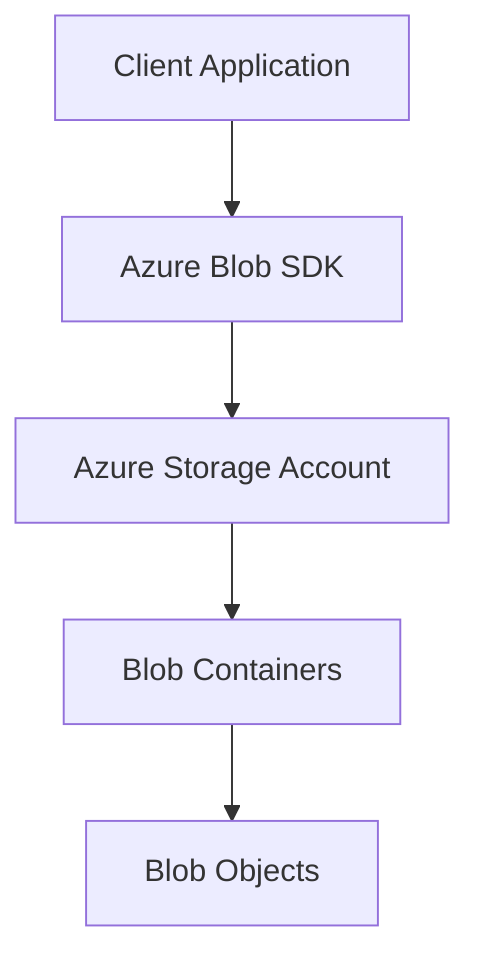
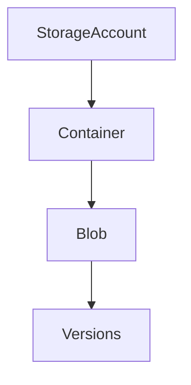
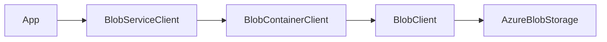
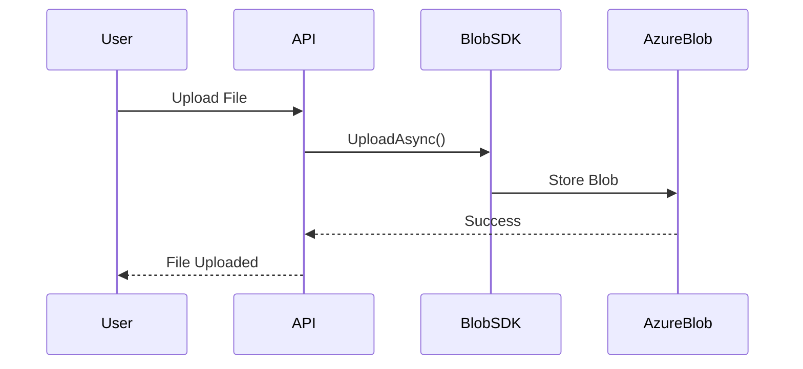
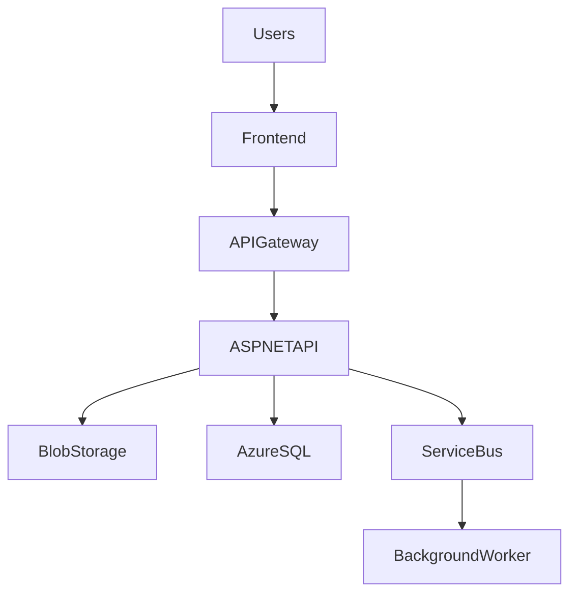
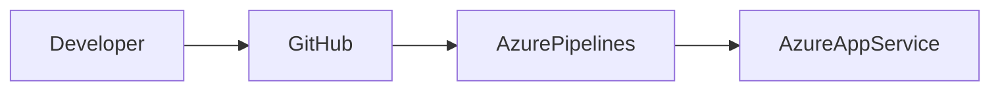
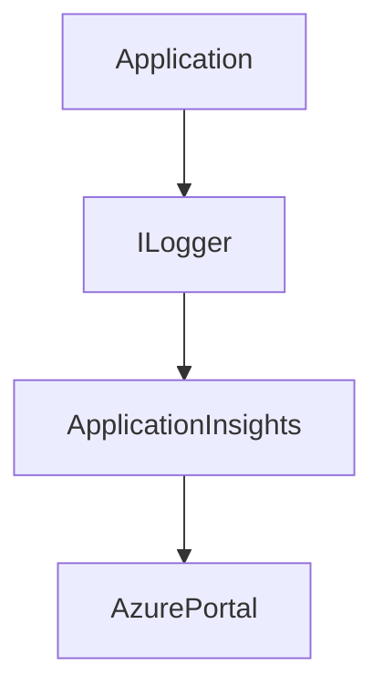
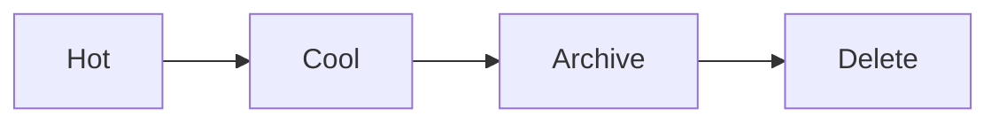
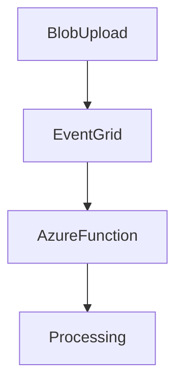
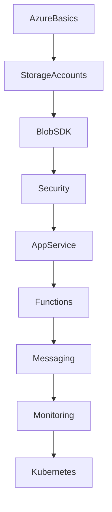

## Overview

Microsoft Azure is a cloud computing platform providing compute, storage, networking, security, identity, AI, and DevOps tooling.

**Azure Blob Storage** is Microsoft's scalable object storage service designed for:
- File storage
- Media hosting
- Backups
- Logging
- Data lakes
- Static websites

---

## Blob Storage Use Cases

| Use Case | Example |
|----------|---------|
| File Uploads | Images, PDFs, Videos |
| Backups | System snapshots |
| Static Hosting | Frontend websites |
| Streaming | Video delivery |
| Logs | Application logging |
| Data Lakes | Big data analytics |

---

## Azure Storage Architecture



---

## Storage Services

| Service | Purpose |
|---------|---------|
| Blob Storage | Object/file storage |
| Queue Storage | Messaging |
| Table Storage | NoSQL key-value |
| File Shares | SMB file system |

---

## Blob Types

| Blob Type | Description |
|-----------|-------------|
| Block Blob | Files/images/videos |
| Append Blob | Logging scenarios |
| Page Blob | Virtual disks |

---

## Azure Blob Storage Hierarchy



---

## Installing Azure Blob SDK

```bash
dotnet add package Azure.Storage.Blobs
```

---

## Authentication Methods

| Method | Recommended For |
|--------|----------------|
| Connection String | Development |
| Shared Access Signature (SAS) | Temporary access |
| Managed Identity | Production |
| Azure AD | Enterprise auth |

```json
{
  "AzureStorage": {
    "ConnectionString": "DefaultEndpointsProtocol=https;..."
  }
}
```

---

## Blob SDK Workflow



---

## Creating BlobServiceClient

```csharp
using Azure.Storage.Blobs;

var client = new BlobServiceClient(connectionString);
```

### Dependency Injection in ASP.NET Core

```csharp
builder.Services.AddSingleton(x =>
{
    return new BlobServiceClient(
        builder.Configuration["AzureStorage:ConnectionString"]);
});
```

---

## Common Operations

### Creating Containers

```csharp
var containerClient = client.GetBlobContainerClient("images");
await containerClient.CreateIfNotExistsAsync();
```

### Uploading Files

```csharp
var blobClient = containerClient.GetBlobClient("photo.jpg");
await blobClient.UploadAsync(stream);
```

### Downloading Files

```csharp
var response = await blobClient.DownloadAsync();
return response.Value.Content;
```

### Deleting Files

```csharp
await blobClient.DeleteIfExistsAsync();
```

### Listing Blobs

```csharp
await foreach (var blob in containerClient.GetBlobsAsync())
{
    Console.WriteLine(blob.Name);
}
```

---

## Upload Workflow



---

## Generating SAS Tokens

Shared Access Signatures allow temporary secure access.

```csharp
var sasUri = blobClient.GenerateSasUri(
    BlobSasPermissions.Read,
    DateTimeOffset.UtcNow.AddHours(1));
```

---

## Blob Metadata & Tags

```csharp
await blobClient.SetMetadataAsync(new Dictionary<string, string>
{
    { "UploadedBy", "Admin" }
});

await blobClient.SetTagsAsync(new Dictionary<string, string>
{
    { "Category", "Invoice" }
});
```

---

## Blob Access Tiers

| Tier | Usage |
|------|-------|
| Hot | Frequently accessed |
| Cool | Infrequent access |
| Archive | Rarely accessed |

```csharp
await blobClient.SetAccessTierAsync(AccessTier.Cool);
```

---

## Security Best Practices

| Feature | Purpose |
|---------|---------|
| Managed Identity | Remove secrets |
| SAS Tokens | Limited access |
| Private Endpoints | Internal networking |
| Encryption | Protect data |
| RBAC | Fine-grained permissions |

### Managed Identity (Production Recommended)

```csharp
using Azure.Identity;

var client = new BlobServiceClient(
    new Uri("https://mystorage.blob.core.windows.net"),
    new DefaultAzureCredential());
```

---

## Azure RBAC Roles

| Role | Access |
|------|--------|
| Storage Blob Data Reader | Read |
| Storage Blob Data Contributor | Read/Write |
| Owner | Full access |

---

## Major Azure Cloud Services

| Service | Purpose |
|---------|---------|
| App Service | Web app hosting |
| Azure Functions | Serverless |
| AKS | Kubernetes |
| Azure SQL | Managed SQL |
| Cosmos DB | NoSQL database |
| Service Bus | Messaging |
| Key Vault | Secret management |
| Application Insights | Monitoring |

---

## Azure Cloud Architecture



---

## Deploy ASP.NET Core to Azure

```bash
az webapp up --name myapp
```

Deploy workflow:



---

## Azure Functions — Blob Trigger

```csharp
public static class BlobTriggerFunction
{
    [FunctionName("BlobTriggerFunction")]
    public static void Run(
        [BlobTrigger("images/{name}")]
        Stream blob)
    {
    }
}
```

---

## Azure Service Bus

| Feature | Description |
|---------|-------------|
| Queues | Point-to-point |
| Topics | Publish/subscribe |
| Dead Letter Queue | Failed messages |
| Retry Policies | Reliability |

---

## Azure Key Vault

```csharp
builder.Configuration.AddAzureKeyVault(
    new Uri(vaultUrl),
    new DefaultAzureCredential());
```

---

## Application Insights

```csharp
builder.Services.AddApplicationInsightsTelemetry();
```



---

## Local Development with Azurite

```bash
docker run -p 10000:10000 mcr.microsoft.com/azure-storage/azurite
```

---

## Dockerizing ASP.NET Core + Azure SDK

```dockerfile
FROM mcr.microsoft.com/dotnet/aspnet:8.0
WORKDIR /app
COPY . .
ENTRYPOINT ["dotnet", "MyApp.dll"]
```

---

## Performance Optimization

| Optimization | Benefit |
|-------------|---------|
| Async Uploads | Scalability |
| CDN | Faster delivery |
| Compression | Lower bandwidth |
| Access Tiers | Lower cost |
| Parallel Uploads | Faster transfers |

### Retry Policies

```csharp
var options = new BlobClientOptions
{
    Retry =
    {
        MaxRetries = 5
    }
};
```

---

## Geo-Redundancy Options

| Replication | Description |
|-------------|-------------|
| LRS | Local redundancy |
| ZRS | Zone redundancy |
| GRS | Geo redundancy |
| RA-GRS | Read-access geo redundancy |

---

## Lifecycle Management

Automatically move blobs to cheaper tiers:



---

## Event-Driven Architecture



---

## Common Pitfalls

| Mistake | Problem |
|---------|---------|
| Storing secrets in code | Security risk |
| Using account keys everywhere | Poor security |
| Missing retry policies | Reliability issues |
| No lifecycle management | High storage cost |
| Large synchronous uploads | Poor scalability |

---

## Azure Blob SDK Cheat Sheet

| Task | Code |
|------|------|
| Create Client | `new BlobServiceClient()` |
| Get Container | `GetBlobContainerClient()` |
| Upload Blob | `UploadAsync()` |
| Download Blob | `DownloadAsync()` |
| Delete Blob | `DeleteIfExistsAsync()` |
| Generate SAS | `GenerateSasUri()` |

---

## Interview Questions

### Beginner
1. What is Azure Blob Storage?
2. What is BlobServiceClient?
3. Difference between containers and blobs?
4. What are SAS tokens?
5. What is Managed Identity?

### Intermediate
1. Explain Azure RBAC.
2. Difference between Blob Storage tiers?
3. How would you upload large files?
4. Explain Azure Functions.
5. What is Azurite?

### Advanced
1. How would you secure Azure Blob Storage?
2. Explain Azure storage replication strategies.
3. How would you design a scalable upload service?
4. Explain event-driven architecture using Azure.
5. How would you optimize Azure storage cost?

---

## Learning Roadmap


