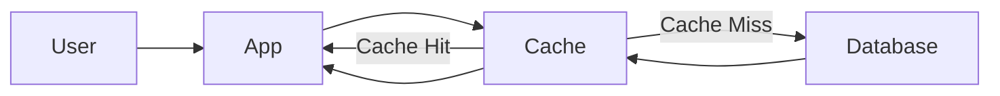
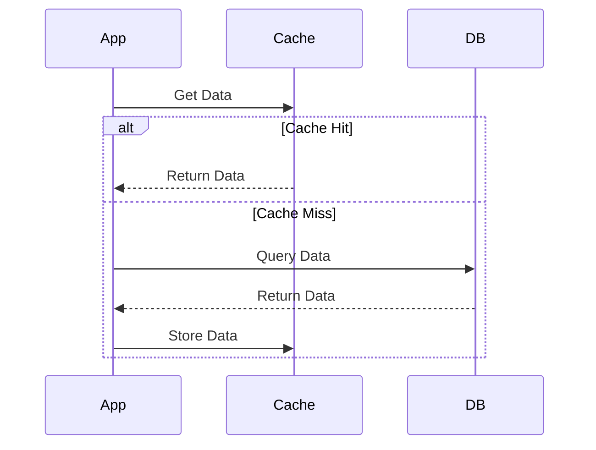
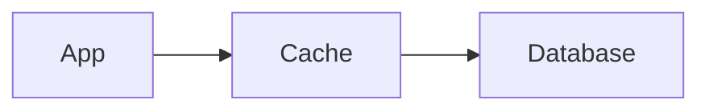
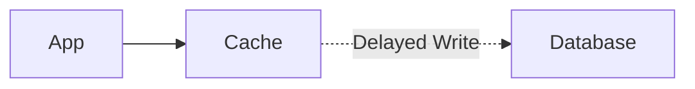
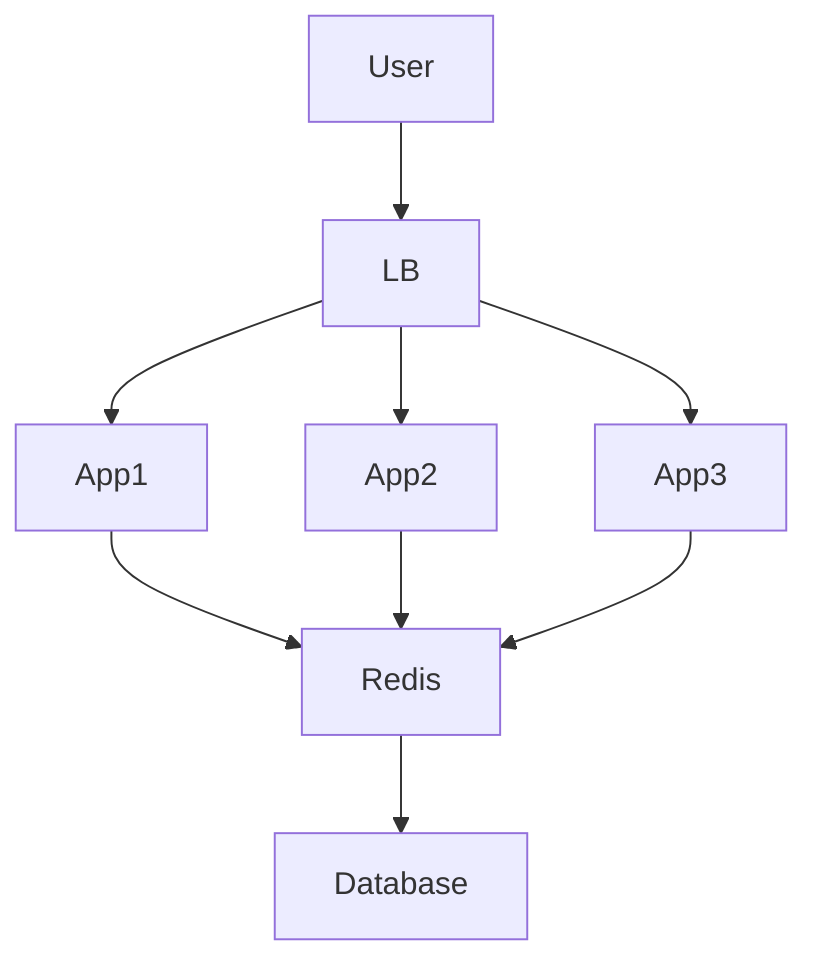
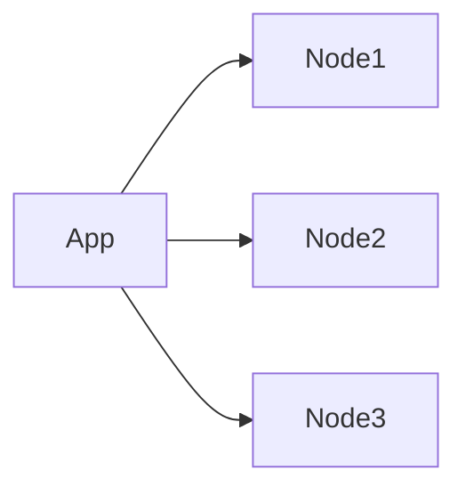
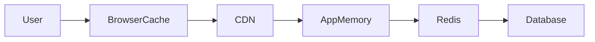
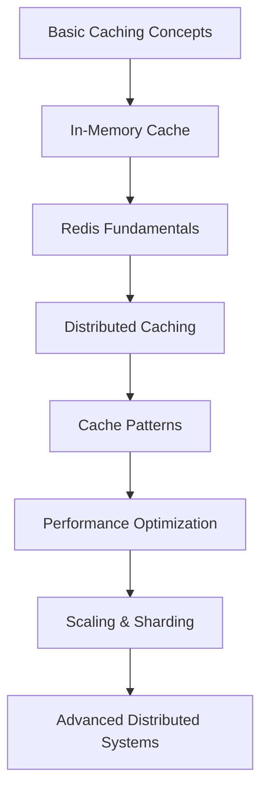

> Caching is one of the most important performance optimization techniques in modern software engineering.

## Overview

Caching stores frequently accessed data in a faster storage layer to reduce latency, improve performance, and decrease backend load.

| Benefit | Description |
|---------|-------------|
| Faster Response Time | Reduces latency |
| Reduced Database Load | Fewer database queries |
| Improved Scalability | Handles more users |
| Lower Infrastructure Cost | Less CPU and DB usage |
| Better User Experience | Faster page loads |
| Increased Availability | Backend failures may be hidden temporarily |

---

## Types of Caching

| Type | Examples |
|------|---------|
| Client-Side | Browser cache, LocalStorage, Service Workers |
| Server-Side | Redis, Memcached, in-memory dictionaries |
| Database Cache | PostgreSQL shared buffers, MySQL query cache |
| CDN Cache | Cloudflare, Akamai, AWS CloudFront |

---

## High-Level Caching Architecture



---

## Cache Terminology

| Term | Meaning |
|------|---------|
| Cache Hit | Data found in cache |
| Cache Miss | Data not found in cache |
| Eviction | Removing old cache entries |
| TTL | Time To Live |
| Warm Cache | Preloaded cache |
| Cold Cache | Empty cache |
| Invalidation | Removing stale data |

---

## Cache Eviction Policies

| Policy | Best For |
|--------|---------|
| LRU (Least Recently Used) | General-purpose caching |
| LFU (Least Frequently Used) | Predictable workloads |
| FIFO (First In First Out) | Simple queues |
| Random Replacement | Simple but less optimal |

---

## Cache Strategies

### Cache-Aside Pattern (Lazy Loading)

Most common caching strategy.



```csharp
public async Task<Product> GetProductAsync(int id)
{
    string key = $"product:{id}";

    var cached = await redis.GetStringAsync(key);

    if (cached != null)
    {
        return JsonSerializer.Deserialize<Product>(cached);
    }

    var product = await db.Products.FindAsync(id);

    await redis.SetStringAsync(
        key,
        JsonSerializer.Serialize(product),
        new DistributedCacheEntryOptions
        {
            AbsoluteExpirationRelativeToNow = TimeSpan.FromMinutes(5)
        });

    return product;
}
```

---

### Write-Through Cache

Data written to cache and database simultaneously.



**Advantages:** Consistent cache, fast reads. **Disadvantages:** Slower writes.

---

### Write-Behind Cache

Writes first go to cache, database updated asynchronously.



**Advantages:** Very fast writes, reduced DB pressure. **Disadvantages:** Risk of data loss.

---

## In-Memory Caching

### ASP.NET Core — IMemoryCache

```csharp
builder.Services.AddMemoryCache();
```

```csharp
public class ProductService
{
    private readonly IMemoryCache _cache;

    public ProductService(IMemoryCache cache)
    {
        _cache = cache;
    }

    public Product GetProduct(int id)
    {
        return _cache.GetOrCreate($"product:{id}", entry =>
        {
            entry.AbsoluteExpirationRelativeToNow =
                TimeSpan.FromMinutes(10);

            return LoadProductFromDatabase(id);
        });
    }
}
```

**Advantages:** Extremely fast, simple setup.

**Disadvantages:** Not shared between servers, lost after restart.

---

## Distributed Caching

Distributed cache shared across multiple application servers.



---

## Redis

The most popular distributed caching system.

| Feature | Description |
|---------|-------------|
| In-memory | Extremely fast |
| Persistence | Optional disk storage |
| Pub/Sub | Messaging support |
| Replication | High availability |
| Data Structures | Strings, lists, sets, hashes |
| TTL Support | Automatic expiration |

### Redis Data Types

| Type | Example Use |
|------|------------|
| String | User profile |
| Hash | Object fields |
| List | Queues |
| Set | Unique values |
| Sorted Set | Rankings/leaderboards |

### Redis CLI

```bash
SET user:1 "John"
GET user:1
EXPIRE user:1 300
TTL user:1
DEL user:1
INCR counter
```

### ASP.NET Core — Redis Integration

```csharp
builder.Services.AddStackExchangeRedisCache(options =>
{
    options.Configuration = "localhost:6379";
});
```

---

## Cache Invalidation

> Cache invalidation is one of the hardest problems in computer science.

### Strategies

| Strategy | Method |
|----------|--------|
| TTL Expiration | Automatic removal after a time limit |
| Manual Invalidation | `await redis.RemoveAsync("product:1")` |
| Event-Based | Invalidate after product update, order creation, etc. |

---

## Cache Consistency Problems

| Problem | Description | Solution |
|---------|-------------|----------|
| Stale Data | Cache contains outdated information | Short TTL or event-based invalidation |
| Race Conditions | Multiple updates overwrite each other | Locks or atomic operations |
| Cache Stampede | Many requests miss cache simultaneously | Mutex locking, request coalescing, early expiration |

---

## Distributed Cache Challenges

| Problem | Description |
|---------|-------------|
| Network Latency | Remote cache calls |
| Serialization Cost | Object conversion overhead |
| Consistency | Synchronization issues |
| Failures | Cache server downtime |
| Scaling | Cluster management |

---

## Cache Partitioning (Sharding)

Large cache distributed across multiple nodes using **Consistent Hashing** to distribute keys evenly.



---

## Multi-Level Caching



---

## HTTP Caching

| Header | Purpose |
|--------|---------|
| Cache-Control | Cache rules |
| Expires | Expiration date |
| ETag | Version identifier |
| Last-Modified | Timestamp validation |

```
Cache-Control: public, max-age=3600
ETag: "abc123"
```

---

## Performance Optimization

| Practice | Why |
|----------|-----|
| Use TTLs | Prevent stale data |
| Monitor hit rate | Measure effectiveness |
| Use distributed cache for scaling | Multi-server support |
| Cache expensive queries | Improve performance |
| Avoid over-caching | Reduce complexity |
| Gracefully handle failures | Improve resilience |

---

## Common Pitfalls

| Pitfall | Problem |
|---------|---------|
| Caching everything | Memory waste and complexity |
| Missing invalidation strategy | Stale data bugs |
| Huge cache objects | High serialization cost and memory pressure |
| Ignoring cache failures | Application breaks without cache |

---

## Cache Strategies Comparison

| Strategy | Read Speed | Write Speed | Complexity |
|----------|-----------|-------------|------------|
| Cache Aside | Fast | Normal | Medium |
| Write Through | Fast | Slower | Medium |
| Write Behind | Fast | Fast | High |
| Read Through | Fast | Medium | High |

---

## Interview Questions

### Beginner
1. What is caching?
2. What is cache hit vs miss?
3. What is TTL?

### Intermediate
1. Explain the cache-aside pattern.
2. What is distributed caching?
3. How does Redis work?
4. What is cache invalidation?

### Advanced
1. How do you prevent a cache stampede?
2. Explain consistent hashing.
3. Compare Redis vs Memcached.
4. Design a scalable caching architecture.

---

## Learning Roadmap


