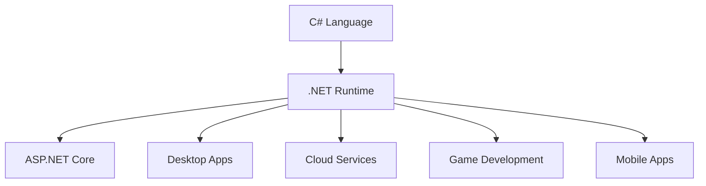
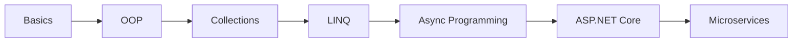

## Overview

C# (pronounced *C-Sharp*) is a modern, object-oriented programming language developed by Microsoft. It is widely used for:

- Backend development with ASP.NET Core
- Desktop applications
- Cloud services
- Game development with Unity
- Enterprise software
- APIs and microservices

C# runs on the .NET platform and provides powerful features such as:

- Automatic memory management
- Strong type safety
- Asynchronous programming
- LINQ for data querying
- Cross-platform support

## Why Learn C#

### Advantages

| Feature | Description |
|---------|-------------|
| Object-Oriented | Encourages reusable and maintainable code |
| Cross-Platform | Works on Windows, Linux, and macOS |
| High Performance | Optimized runtime with JIT compilation |
| Rich Ecosystem | Large .NET ecosystem and libraries |
| Enterprise Ready | Widely used in enterprise systems |
| Cloud Friendly | Excellent integration with Azure |

---

## .NET Ecosystem



## Installing the Environment

### Install .NET SDK

Official website: https://dotnet.microsoft.com/download

Verify installation:

```bash
dotnet --version
```

---

## Your First C# Program

```csharp
using System;

class Program
{
    static void Main(string[] args)
    {
        Console.WriteLine("Hello, World!");
    }
}
```

| Keyword | Meaning |
|---------|---------|
| using | Imports namespaces |
| class | Defines a class |
| static | Belongs to the class itself |
| void | No return value |
| Main | Entry point of application |

---

## Variables and Data Types

```csharp
int age = 25;
string name = "John";
double salary = 5000.50;
bool isActive = true;
```

| Type | Description | Example |
|------|-------------|---------|
| int | Integer | 10 |
| double | Floating point | 10.5 |
| decimal | Financial calculations | 99.99m |
| bool | True/False | true |
| char | Single character | 'A' |
| string | Text | "Hello" |

---

## Type Conversion

### Implicit Casting

```csharp
int number = 10;
double value = number;
```

### Explicit Casting

```csharp
double price = 9.99;
int rounded = (int)price;
```

### Parsing

```csharp
string text = "123";
int number = int.Parse(text);
```

---

## Operators

### Arithmetic Operators

| Operator | Meaning |
|----------|---------|
| + | Addition |
| - | Subtraction |
| * | Multiplication |
| / | Division |
| % | Modulus |

### Comparison Operators

```csharp
int a = 10;
int b = 20;

Console.WriteLine(a < b);
Console.WriteLine(a == b);
```

---

## Conditional Statements

### if Statement

```csharp
int age = 18;

if (age >= 18)
{
    Console.WriteLine("Adult");
}
else
{
    Console.WriteLine("Minor");
}
```

### switch Statement

```csharp
int day = 2;

switch(day)
{
    case 1:
        Console.WriteLine("Monday");
        break;

    case 2:
        Console.WriteLine("Tuesday");
        break;

    default:
        Console.WriteLine("Unknown");
        break;
}
```

---

## Loops

### for Loop

```csharp
for(int i = 0; i < 5; i++)
{
    Console.WriteLine(i);
}
```

### while Loop

```csharp
int count = 0;

while(count < 5)
{
    Console.WriteLine(count);
    count++;
}
```

### foreach Loop

```csharp
string[] fruits = { "Apple", "Orange", "Banana" };

foreach(var fruit in fruits)
{
    Console.WriteLine(fruit);
}
```

---

## Methods

```csharp
static int Add(int a, int b)
{
    return a + b;
}

int result = Add(5, 3);
Console.WriteLine(result);
```

---

## Object-Oriented Programming (OOP)

| Principle | Description |
|-----------|-------------|
| Encapsulation | Hiding internal details |
| Inheritance | Reusing code from base classes |
| Polymorphism | Multiple behaviors |
| Abstraction | Hiding complexity |

---

## Classes and Objects

```csharp
class Person
{
    public string Name;
    public int Age;

    public void Introduce()
    {
        Console.WriteLine($"My name is {Name}");
    }
}

Person person = new Person();
person.Name = "Alice";
person.Age = 30;
person.Introduce();
```

---

## Constructors

```csharp
class Car
{
    public string Brand;

    public Car(string brand)
    {
        Brand = brand;
    }
}
```

---

## Properties

```csharp
class Employee
{
    public string Name { get; set; }
    public int Age { get; set; }
    public string Department { get; }
}
```

---

## Access Modifiers

| Modifier | Access Level |
|----------|-------------|
| public | Accessible everywhere |
| private | Accessible only inside class |
| protected | Accessible in derived classes |
| internal | Accessible within assembly |

---

## Inheritance

```csharp
class Animal
{
    public void Eat()
    {
        Console.WriteLine("Eating...");
    }
}

class Dog : Animal
{
    public void Bark()
    {
        Console.WriteLine("Barking...");
    }
}
```

---

## Polymorphism

```csharp
class Animal
{
    public virtual void MakeSound()
    {
        Console.WriteLine("Animal sound");
    }
}

class Dog : Animal
{
    public override void MakeSound()
    {
        Console.WriteLine("Bark");
    }
}
```

---

## Abstraction

```csharp
abstract class Shape
{
    public abstract double CalculateArea();
}
```

---

## Interfaces

```csharp
interface ILogger
{
    void Log(string message);
}

class ConsoleLogger : ILogger
{
    public void Log(string message)
    {
        Console.WriteLine(message);
    }
}
```

---

## Exception Handling

```csharp
try
{
    int result = 10 / 0;
}
catch(Exception ex)
{
    Console.WriteLine(ex.Message);
}
finally
{
    Console.WriteLine("Finished");
}
```

---

## Collections

```csharp
List<string> names = new List<string>();
names.Add("John");
names.Add("Alice");

Dictionary<int, string> users = new Dictionary<int, string>();
users.Add(1, "Admin");
```

---

## LINQ

```csharp
List<int> numbers = new List<int> { 1, 2, 3, 4, 5 };

var evenNumbers = numbers.Where(n => n % 2 == 0);

foreach(var number in evenNumbers)
{
    Console.WriteLine(number);
}
```

---

## Async and Await

```csharp
public async Task FetchDataAsync()
{
    await Task.Delay(1000);

    Console.WriteLine("Data fetched");
}
```

Benefits:
- Non-blocking operations
- Better scalability
- Improved responsiveness

---

## File Handling

```csharp
File.WriteAllText("data.txt", "Hello");

string content = File.ReadAllText("data.txt");
```

---

## Dependency Injection (DI)

```csharp
services.AddScoped<IUserService, UserService>();
```

Benefits: loose coupling, easier testing, better maintainability.

---

## Nullable Types

```csharp
int? number = null;

string name = input ?? "Default";
```

---

## Memory Management

C# uses automatic garbage collection to free unused memory.

Best practices:
- Dispose of unmanaged resources with `using` statements
- Avoid memory leaks by releasing subscriptions and event handlers

---

## Recommended Project Structure

```
/src
  /Controllers
  /Services
  /Repositories
  /Models
  /Interfaces
  /DTOs
```

---

## Real-World Use Cases

| Use Case | Technology |
|----------|-----------|
| REST APIs | ASP.NET Core |
| Enterprise Apps | .NET |
| Cloud Services | Azure |
| Games | Unity |
| Desktop Apps | WPF / WinForms |

---

## Interview Questions

### Beginner
1. What is C#?
2. Difference between class and object?
3. What is inheritance?
4. What is polymorphism?
5. What is an interface?

### Intermediate
1. Difference between abstract class and interface?
2. What is dependency injection?
3. Explain async/await.
4. What is LINQ?
5. What is garbage collection?

### Advanced
1. Explain CLR and JIT.
2. What are delegates and events?
3. What is middleware in ASP.NET Core?
4. Explain memory management in .NET.
5. What are expression trees?

---

## Learning Roadmap



---

## Recommended Resources

- [Official C# Documentation](https://learn.microsoft.com/dotnet/csharp/)
- LeetCode
- HackerRank
- Exercism
- CodeWars
