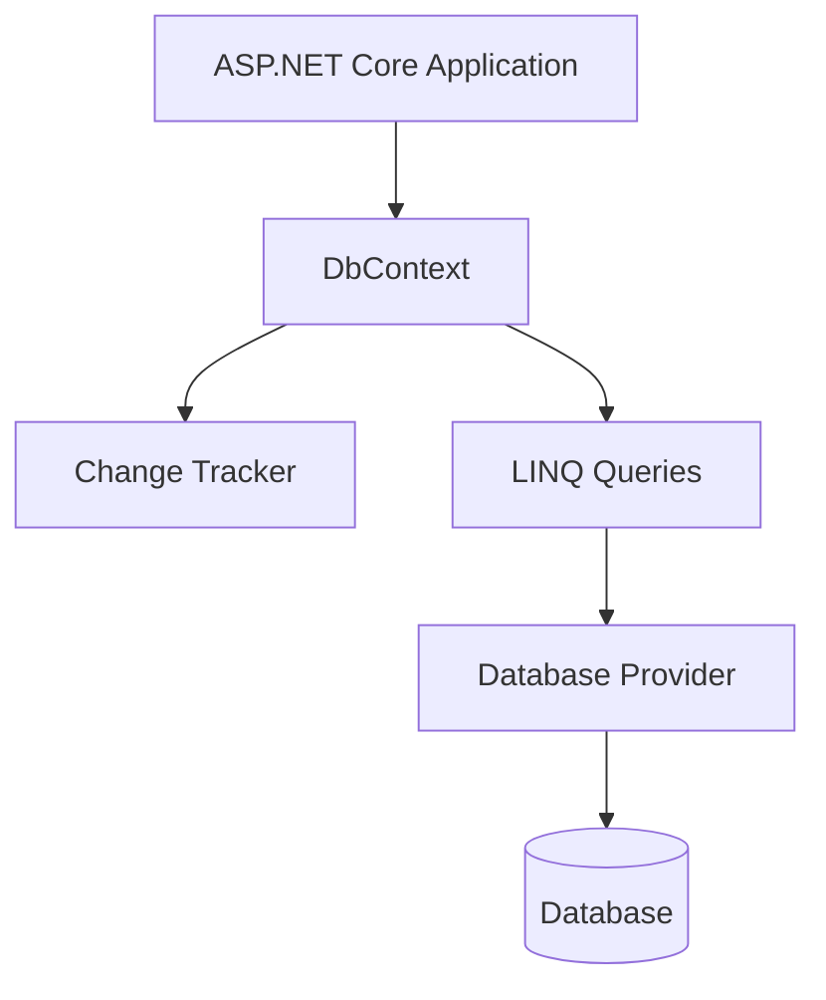
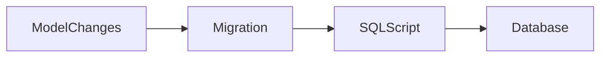
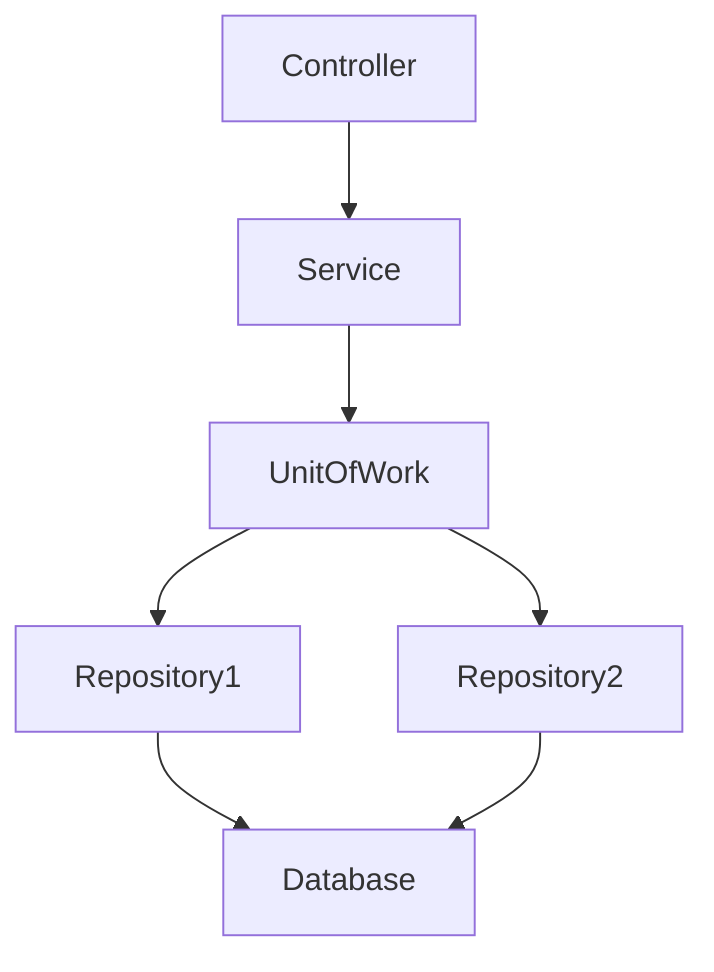
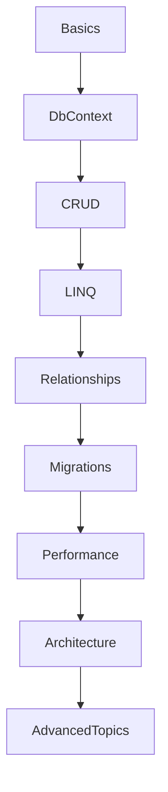

## Overview

Entity Framework Core (EF Core) is a modern Object-Relational Mapper (ORM) for .NET. It enables developers to:

- Work with databases using C# objects
- Avoid writing most SQL manually
- Perform CRUD operations
- Manage database schema migrations
- Use LINQ for querying
- Support multiple database providers

---

## Why EF Core?

| Feature | Benefit |
|---------|---------|
| LINQ Support | Strongly typed queries |
| Migrations | Version-controlled database schema |
| Change Tracking | Automatic updates |
| Cross-platform | Works on Windows/Linux/macOS |
| Provider Model | SQL Server, PostgreSQL, SQLite, MySQL |
| Performance | Optimized query execution |
| Async Support | Scalable applications |

---

## EF Core Architecture



---

## Installing EF Core

### SQL Server Provider

```bash
dotnet add package Microsoft.EntityFrameworkCore.SqlServer
```

### PostgreSQL Provider (Npgsql)

```bash
dotnet add package Npgsql.EntityFrameworkCore.PostgreSQL
```

### Tools Package

```bash
dotnet add package Microsoft.EntityFrameworkCore.Tools
```

---

## DbContext

DbContext is the central class in EF Core. Responsibilities:
- Database connection
- Query execution
- Change tracking
- Saving changes
- Transaction handling

```csharp
public class AppDbContext : DbContext
{
    public AppDbContext(DbContextOptions<AppDbContext> options)
        : base(options)
    {
    }

    public DbSet<User> Users { get; set; }
}
```

---

## Entity Classes

Entities represent database tables.

```csharp
public class User
{
    public int Id { get; set; }
    public string Name { get; set; }
    public string Email { get; set; }
}
```

---

## Registering EF Core in ASP.NET Core

### SQL Server

```csharp
builder.Services.AddDbContext<AppDbContext>(options =>
    options.UseSqlServer(
        builder.Configuration.GetConnectionString("Default")));
```

### PostgreSQL (Npgsql)

```csharp
builder.Services.AddDbContext<AppDbContext>(options =>
    options.UseNpgsql(
        builder.Configuration.GetConnectionString("Default")));
```

---

## Connection Strings

### SQL Server

```json
{
  "ConnectionStrings": {
    "Default": "Server=.;Database=ShopDb;Trusted_Connection=True;TrustServerCertificate=True"
  }
}
```

### PostgreSQL

```json
{
  "ConnectionStrings": {
    "Default": "Host=localhost;Database=ShopDb;Username=postgres;Password=secret"
  }
}
```

---

## Migrations

Migrations manage schema changes.

```bash
dotnet ef migrations add InitialCreate
dotnet ef database update
```

Migration workflow:



---

## CRUD Operations

### Create

```csharp
var user = new User
{
    Name = "John",
    Email = "john@example.com"
};

_context.Users.Add(user);
await _context.SaveChangesAsync();
```

### Read

```csharp
var users = await _context.Users.ToListAsync();
```

### Update

```csharp
var user = await _context.Users.FindAsync(1);
user.Name = "Updated";
await _context.SaveChangesAsync();
```

### Delete

```csharp
var user = await _context.Users.FindAsync(1);
_context.Users.Remove(user);
await _context.SaveChangesAsync();
```

---

## LINQ Queries

### Filtering

```csharp
var users = await _context.Users
    .Where(x => x.Name.Contains("John"))
    .ToListAsync();
```

### Sorting

```csharp
var users = await _context.Users
    .OrderBy(x => x.Name)
    .ToListAsync();
```

### Projection

```csharp
var users = await _context.Users
    .Select(x => new { x.Id, x.Name })
    .ToListAsync();
```

---

## Relationships

| Relationship | Example |
|-------------|---------|
| One-to-One | User → Profile |
| One-to-Many | Blog → Posts |
| Many-to-Many | Students ↔ Courses |

### One-to-Many Example

```csharp
public class Blog
{
    public int Id { get; set; }
    public ICollection<Post> Posts { get; set; }
}

public class Post
{
    public int Id { get; set; }
    public int BlogId { get; set; }
    public Blog Blog { get; set; }
}
```

---

## Fluent API

Used for advanced configuration.

```csharp
protected override void OnModelCreating(ModelBuilder modelBuilder)
{
    modelBuilder.Entity<User>()
        .HasIndex(x => x.Email)
        .IsUnique();
}
```

---

## Data Annotations

```csharp
public class User
{
    [Key]
    public int Id { get; set; }

    [Required]
    [MaxLength(100)]
    public string Name { get; set; }
}
```

---

## Change Tracking

### Tracking Query

```csharp
var users = await _context.Users.ToListAsync();
```

### No Tracking Query (faster reads)

```csharp
var users = await _context.Users
    .AsNoTracking()
    .ToListAsync();
```

---

## Loading Related Data

### Eager Loading

```csharp
var blogs = await _context.Blogs
    .Include(x => x.Posts)
    .ToListAsync();
```

### Lazy Loading

```csharp
public virtual ICollection<Post> Posts { get; set; }
```

### Explicit Loading

```csharp
await _context.Entry(blog)
    .Collection(x => x.Posts)
    .LoadAsync();
```

---

## Transactions

```csharp
using var transaction = await _context.Database.BeginTransactionAsync();

try
{
    await _context.SaveChangesAsync();
    await transaction.CommitAsync();
}
catch
{
    await transaction.RollbackAsync();
}
```

---

## Concurrency Handling

```csharp
public class Product
{
    public int Id { get; set; }

    [Timestamp]
    public byte[] RowVersion { get; set; }
}
```

---

## Raw SQL Queries

```csharp
var users = await _context.Users
    .FromSqlRaw("SELECT * FROM Users")
    .ToListAsync();
```

---

## Performance Optimization

| Optimization | Benefit |
|-------------|---------|
| AsNoTracking | Faster reads |
| Projection | Smaller payloads |
| Pagination | Reduced memory usage |
| Compiled Queries | Faster execution |
| Batch Updates | Fewer DB calls |

### Pagination

```csharp
var users = await _context.Users
    .Skip(0)
    .Take(10)
    .ToListAsync();
```

### Avoid N+1 Queries

```csharp
// Bad
foreach (var blog in blogs)
{
    Console.WriteLine(blog.Posts.Count);
}

// Good
var blogs = await _context.Blogs
    .Include(x => x.Posts)
    .ToListAsync();
```

### Indexing

```csharp
modelBuilder.Entity<User>()
    .HasIndex(x => x.Email);
```

---

## Security Best Practices

| Practice | Purpose |
|----------|---------|
| Parameterized Queries | Prevent SQL Injection |
| Validation | Protect data integrity |
| Least Privilege | Limit DB permissions |
| Secrets Manager | Secure connection strings |

EF Core automatically parameterizes LINQ queries — always prefer LINQ over raw interpolated SQL:

```csharp
// Safe
.Where(x => x.Name == name)

// UNSAFE — SQL injection risk
FromSqlRaw($"SELECT * FROM Users WHERE Name = '{name}'")
```

---

## Repository Pattern

```csharp
public class UserRepository : IUserRepository
{
    private readonly AppDbContext _context;

    public UserRepository(AppDbContext context)
    {
        _context = context;
    }

    public async Task<List<User>> GetAllAsync()
    {
        return await _context.Users.ToListAsync();
    }
}
```

---

## Unit of Work Pattern



---

## Testing EF Core

### In-Memory Database (unit tests)

```csharp
builder.Services.AddDbContext<AppDbContext>(options =>
    options.UseInMemoryDatabase("TestDb"));
```

### SQLite Testing (preferred for realistic integration tests)

```csharp
options.UseSqlite("DataSource=:memory:");
```

---

## Advanced Topics

| Topic | Description |
|-------|-------------|
| Interceptors | Query interception |
| Compiled Queries | Faster repeated queries |
| Value Converters | Custom mappings |
| Temporal Tables | Historical tracking |
| Global Query Filters | Multi-tenancy/soft delete |
| Shadow Properties | Hidden columns |

### Global Query Filters (Soft Delete)

```csharp
modelBuilder.Entity<User>()
    .HasQueryFilter(x => !x.IsDeleted);
```

### Logging SQL Queries

```csharp
builder.Services.AddDbContext<AppDbContext>(options =>
    options
        .UseNpgsql(connectionString)
        .LogTo(Console.WriteLine));
```

---

## Npgsql-Specific Features

### JSON Columns

```csharp
public class Order
{
    public int Id { get; set; }
    public JsonDocument Metadata { get; set; }
}
```

### Array Columns

```csharp
public class Tag
{
    public int Id { get; set; }
    public string[] Labels { get; set; }
}
```

### Full-Text Search

```csharp
.Where(x => EF.Functions.ToTsVector("english", x.Content)
    .Matches("dotnet"))
```

---

## Database Providers

| Provider | Package |
|----------|---------|
| SQL Server | `Microsoft.EntityFrameworkCore.SqlServer` |
| PostgreSQL | `Npgsql.EntityFrameworkCore.PostgreSQL` |
| SQLite | `Microsoft.EntityFrameworkCore.Sqlite` |
| MySQL | `Pomelo.EntityFrameworkCore.MySql` |
| Oracle | `Oracle.EntityFrameworkCore` |

---

## EF Core Cheat Sheet

| Task | Code |
|------|------|
| Add Entity | `_context.Add(entity)` |
| Save Changes | `SaveChangesAsync()` |
| Query Data | `ToListAsync()` |
| Include Relations | `Include(x => x.Posts)` |
| Disable Tracking | `AsNoTracking()` |
| Add Migration | `dotnet ef migrations add` |

---

## Learning Roadmap



---

## Interview Questions

### Beginner
1. What is EF Core?
2. What is DbContext?
3. What is a DbSet?
4. Difference between tracking and no tracking?
5. What are migrations?

### Intermediate
1. Explain eager vs lazy loading.
2. What causes N+1 problems?
3. How does change tracking work?
4. Explain Fluent API.
5. What is concurrency handling?

### Advanced
1. How would you optimize EF Core performance?
2. Explain query execution pipeline.
3. What are compiled queries?
4. How would you implement soft delete?
5. Explain transaction handling in EF Core.
