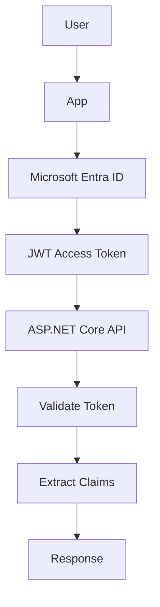
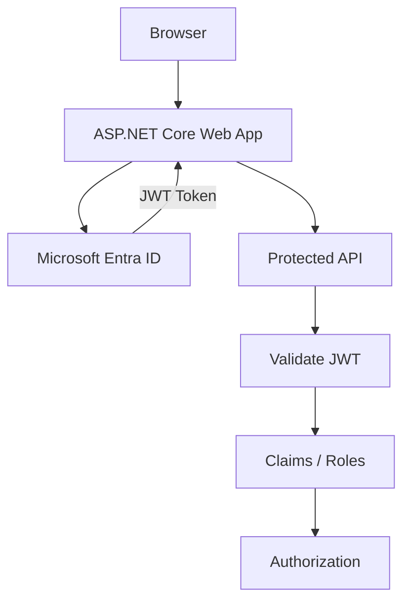

## Overview

**Microsoft Entra ID** (formerly Azure Active Directory / Azure AD) is Microsoft's cloud-based Identity and Access Management (IAM) platform. It provides authentication, authorization, and identity services for web apps, APIs, and cloud-native applications.

**JWT (JSON Web Token)** is the industry-standard token format used by Entra ID to convey identity and authorization claims between parties.

---

## Core Concepts

| Concept | Description |
|---------|-------------|
| Tenant | Your organization's dedicated instance of Entra ID |
| Application Registration | Register your app to obtain credentials |
| Client ID | Unique identifier for your registered app |
| Tenant ID | Your organization's directory ID |
| Client Secret / Certificate | App credentials for server-to-server flows |
| Scope | What permissions the token grants |
| Claims | Key-value pairs inside the JWT (user info, roles, etc.) |
| Access Token | Short-lived token to call APIs |
| ID Token | Token containing user identity information |
| Refresh Token | Long-lived token to obtain new access tokens |

---

## JWT Structure

A JWT consists of three Base64URL-encoded parts separated by dots:

```
header.payload.signature
```

### Header

```json
{
  "alg": "RS256",
  "typ": "JWT"
}
```

### Payload (Claims)

```json
{
  "iss": "https://login.microsoftonline.com/{tenant}/v2.0",
  "sub": "abc123",
  "aud": "api://your-client-id",
  "exp": 1717000000,
  "iat": 1716996400,
  "name": "John Doe",
  "preferred_username": "john@example.com",
  "oid": "user-object-id",
  "roles": ["Admin", "Reader"],
  "scp": "User.Read"
}
```

### Common Claims

| Claim | Description |
|-------|-------------|
| `iss` | Issuer — Entra ID endpoint |
| `sub` | Subject — unique user ID (per app) |
| `aud` | Audience — your API's app ID |
| `exp` | Expiration time |
| `oid` | Object ID — user's unique ID across the tenant |
| `name` | Full name |
| `preferred_username` | Email / UPN |
| `roles` | App roles assigned to user |
| `scp` | Delegated scopes |
| `tid` | Tenant ID |

---

## Authentication Flows



### OAuth 2.0 / OIDC Flows

| Flow | Use Case |
|------|---------|
| Authorization Code + PKCE | Web apps, SPAs |
| Client Credentials | Service-to-service (no user) |
| On-behalf-of (OBO) | API calling another API |
| Device Code | CLI tools, IoT devices |

---

## App Registration in Azure Portal

1. Go to **Azure Portal → Microsoft Entra ID → App registrations**
2. Click **New registration**, enter a name
3. Set redirect URI (e.g., `https://localhost:5001/signin-oidc`)
4. Copy **Application (client) ID** and **Directory (tenant) ID**
5. Under **Certificates & secrets**, create a **Client secret**
6. Under **Expose an API**, add a scope (e.g., `api://your-client-id/access_as_user`)
7. Under **App roles**, define roles (e.g., `Admin`, `Reader`)

---

## Setting Up ASP.NET Core with Entra ID

### Install Package

```bash
dotnet add package Microsoft.Identity.Web
```

### appsettings.json

```json
{
  "AzureAd": {
    "Instance": "https://login.microsoftonline.com/",
    "TenantId": "your-tenant-id",
    "ClientId": "your-client-id",
    "Audience": "api://your-client-id",
    "CallbackPath": "/signin-oidc"
  }
}
```

### Program.cs — Protect an API

```csharp
using Microsoft.Identity.Web;

var builder = WebApplication.CreateBuilder(args);

builder.Services
    .AddAuthentication(JwtBearerDefaults.AuthenticationScheme)
    .AddMicrosoftIdentityWebApi(builder.Configuration.GetSection("AzureAd"));

builder.Services.AddAuthorization();

var app = builder.Build();

app.UseAuthentication();
app.UseAuthorization();

app.MapControllers();

app.Run();
```

### Program.cs — Web App with Sign-In

```csharp
builder.Services
    .AddAuthentication(OpenIdConnectDefaults.AuthenticationScheme)
    .AddMicrosoftIdentityWebApp(builder.Configuration.GetSection("AzureAd"));

builder.Services.AddAuthorization();
```

---

## Manual JWT Bearer (without Microsoft.Identity.Web)

```csharp
builder.Services.AddAuthentication(JwtBearerDefaults.AuthenticationScheme)
    .AddJwtBearer(options =>
    {
        options.Authority = $"https://login.microsoftonline.com/{tenantId}/v2.0";
        options.Audience = "api://your-client-id";

        options.TokenValidationParameters = new TokenValidationParameters
        {
            ValidateIssuer = true,
            ValidateAudience = true,
            ValidateLifetime = true,
            ValidateIssuerSigningKey = true
        };
    });
```

---

## Role-Based Authorization

### Defining Roles in Entra ID

1. In App Registration → **App roles** → Add roles (e.g., `Admin`, `Reader`)
2. Assign roles to users or groups in **Enterprise Applications → Users and groups**

### Using Roles in Controllers

```csharp
[Authorize(Roles = "Admin")]
[HttpDelete("{id}")]
public IActionResult Delete(int id)
{
    return Ok();
}

[Authorize(Roles = "Admin,Reader")]
[HttpGet]
public IActionResult GetAll()
{
    return Ok();
}
```

---

## Scope-Based Authorization

### Require a Scope

```csharp
[RequiredScope("User.Read")]
[HttpGet("profile")]
public IActionResult GetProfile()
{
    return Ok();
}
```

Or via policy:

```csharp
builder.Services.AddAuthorization(options =>
{
    options.AddPolicy("ReadAccess", policy =>
        policy.RequireScope("User.Read"));
});
```

---

## Policy-Based Authorization

```csharp
builder.Services.AddAuthorization(options =>
{
    options.AddPolicy("AdminOnly", policy =>
        policy.RequireRole("Admin"));

    options.AddPolicy("InternalUser", policy =>
        policy.RequireClaim("tid", "your-tenant-id"));
});
```

```csharp
[Authorize(Policy = "AdminOnly")]
public IActionResult AdminPanel()
{
    return Ok();
}
```

---

## Reading Claims in a Controller

```csharp
[Authorize]
[HttpGet("me")]
public IActionResult GetCurrentUser()
{
    var userId = User.FindFirstValue("oid");
    var name = User.FindFirstValue("name");
    var email = User.FindFirstValue("preferred_username");
    var roles = User.FindAll(ClaimTypes.Role).Select(c => c.Value);

    return Ok(new { userId, name, email, roles });
}
```

---

## Service-to-Service (Client Credentials)

Used when an API calls another API without a user context.

```csharp
builder.Services.AddHttpClient<IExternalApiClient, ExternalApiClient>()
    .AddHttpMessageHandler<BearerTokenHandler>();
```

### Acquiring a Token with MSAL

```csharp
var app = ConfidentialClientApplicationBuilder
    .Create(clientId)
    .WithClientSecret(clientSecret)
    .WithAuthority($"https://login.microsoftonline.com/{tenantId}")
    .Build();

var result = await app.AcquireTokenForClient(
    new[] { "https://graph.microsoft.com/.default" })
    .ExecuteAsync();

string accessToken = result.AccessToken;
```

---

## On-Behalf-Of (OBO) Flow

An API receives a token from a user and exchanges it for a token to call a downstream API.

```csharp
var result = await app
    .AcquireTokenOnBehalfOf(
        new[] { "https://graph.microsoft.com/User.Read" },
        new UserAssertion(incomingToken))
    .ExecuteAsync();
```

---

## Token Validation Checklist

| Check | What to Validate |
|-------|-----------------|
| Issuer (`iss`) | Must match your Entra ID tenant endpoint |
| Audience (`aud`) | Must match your API's client ID |
| Expiry (`exp`) | Token must not be expired |
| Signature | Must be signed by Entra ID's public keys |
| Tenant (`tid`) | Optional: restrict to your tenant only |

---

## Security Best Practices

| Practice | Why |
|----------|-----|
| Use Managed Identity for API-to-API | Eliminates client secrets |
| Store secrets in Key Vault | Never store secrets in code or config files |
| Validate audience and issuer | Prevent token misuse |
| Use short-lived access tokens | Reduce exposure window |
| Implement token caching | Avoid re-issuing tokens on every request |
| Use HTTPS everywhere | Prevent token interception |
| Restrict allowed tenants | Prevent cross-tenant attacks |

---

## Common Pitfalls

| Mistake | Problem |
|---------|---------|
| Not validating audience | Any Entra ID token accepted |
| Storing client secrets in code | Security breach risk |
| Not handling token expiry | Silent auth failures |
| Using wrong flow type | Token missing required claims |
| Missing `scp` or `roles` claim validation | Unauthorized access |

---

## Testing Authentication

### Disable Auth in Development

```csharp
if (app.Environment.IsDevelopment())
{
    // Optionally bypass auth
}
```

### Mock JWT in Integration Tests

```csharp
services.PostConfigure<JwtBearerOptions>(
    JwtBearerDefaults.AuthenticationScheme, options =>
{
    options.TokenValidationParameters.ValidateIssuer = false;
    options.TokenValidationParameters.ValidateAudience = false;
    options.TokenValidationParameters.IssuerSigningKey =
        new SymmetricSecurityKey(Encoding.UTF8.GetBytes("test-secret-key"));
});
```

---

## Architecture Overview



---

## Interview Questions

### Beginner
1. What is Microsoft Entra ID?
2. What is a JWT and what does it contain?
3. What is the difference between authentication and authorization?
4. What is an access token vs an ID token?

### Intermediate
1. Explain the Authorization Code + PKCE flow.
2. How do you protect an ASP.NET Core API with Entra ID?
3. What is the client credentials flow?
4. How do you implement role-based access with Entra ID?
5. What claims should you validate in a JWT?

### Advanced
1. Explain the On-Behalf-Of (OBO) flow.
2. How do you implement token caching in MSAL?
3. How do you restrict access to a specific tenant?
4. What is Continuous Access Evaluation (CAE)?
5. How do you handle token refresh in a long-running background service?

---

## Cheat Sheet

| Task | Code / Config |
|------|--------------|
| Add JWT auth | `.AddMicrosoftIdentityWebApi(config.GetSection("AzureAd"))` |
| Require auth | `[Authorize]` |
| Require role | `[Authorize(Roles = "Admin")]` |
| Require scope | `[RequiredScope("User.Read")]` |
| Read claim | `User.FindFirstValue("oid")` |
| Client credentials token | `AcquireTokenForClient(scopes)` |
| OBO token | `AcquireTokenOnBehalfOf(scopes, assertion)` |

---

## Resources

- [Microsoft Identity Web](https://learn.microsoft.com/entra/msal/dotnet/)
- [Microsoft Entra ID Documentation](https://learn.microsoft.com/entra/identity/)
- [JWT.io Debugger](https://jwt.io)
- [MSAL .NET](https://learn.microsoft.com/azure/active-directory/develop/msal-overview)
- [ASP.NET Core Security](https://learn.microsoft.com/aspnet/core/security/)
