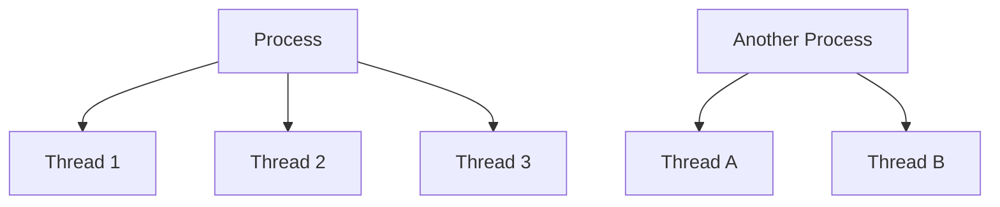
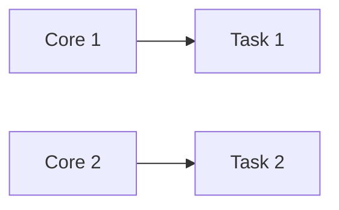
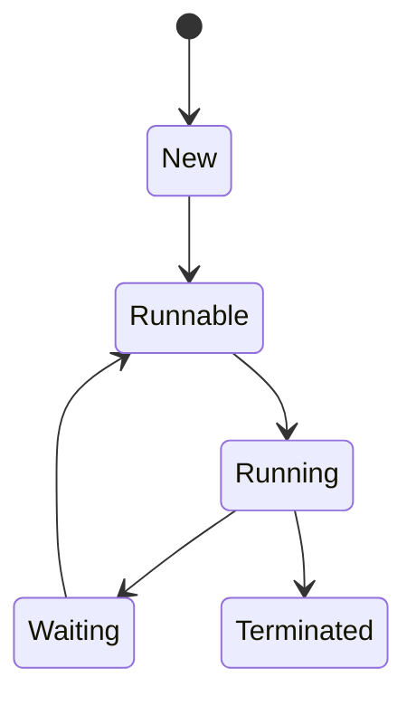
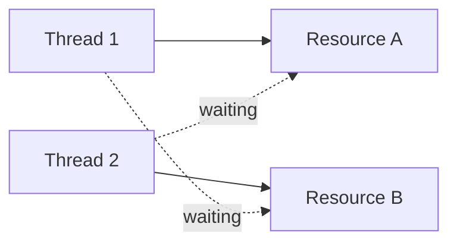
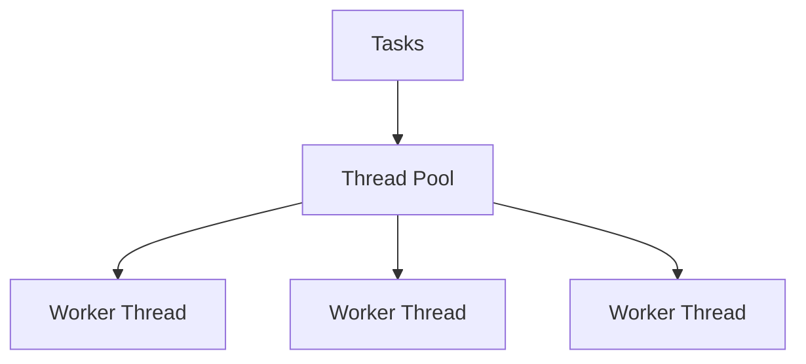
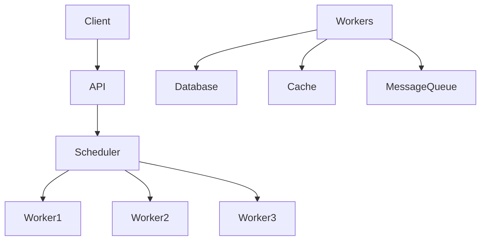
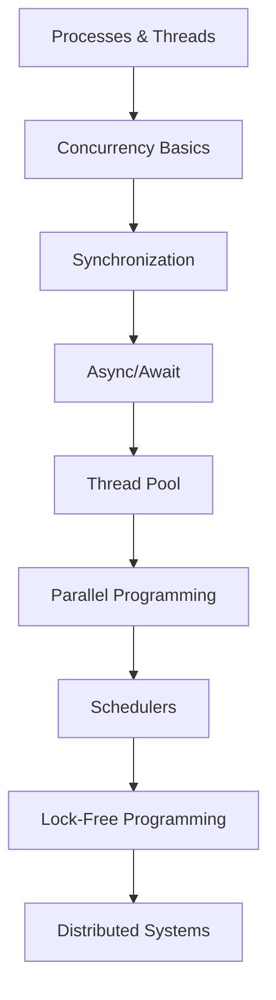

> A complete technical learning guide for understanding threads, concurrency, synchronization, task scheduling, and high-performance application design.

## Overview

Modern applications must handle multiple users, concurrent requests, background jobs, and real-time processing.

Multithreading and scheduling help applications:
- Improve responsiveness
- Utilize CPU efficiently
- Execute tasks concurrently
- Scale under heavy load

---

## Core Concepts

| Concept | Description |
|---------|-------------|
| Process | Independent running application |
| Thread | Lightweight execution unit inside a process |
| Concurrency | Multiple tasks making progress together |
| Parallelism | Tasks executing simultaneously |
| Context Switching | CPU switching between threads |
| Synchronization | Coordinating shared resources |
| Deadlock | Threads waiting forever |
| Race Condition | Unpredictable result from concurrent access |
| Scheduler | Determines execution order |

---

## Process vs Thread



| | Process | Thread |
|-|---------|--------|
| Memory | Own memory space | Shares process memory |
| Weight | Heavyweight | Lightweight |
| Isolation | Isolated from others | Requires synchronization |

---

## Concurrency vs Parallelism

**Concurrency** — Multiple tasks progress over time (context switching on one CPU).

**Parallelism** — Tasks execute simultaneously on multiple cores.



---

## Thread Lifecycle



---

## Thread Creation

```csharp
using System;
using System.Threading;

class Program
{
    static void PrintNumbers()
    {
        for (int i = 0; i < 5; i++)
        {
            Console.WriteLine(i);
        }
    }

    static void Main()
    {
        Thread thread = new Thread(PrintNumbers);
        thread.Start();
        Console.WriteLine("Main Thread");
    }
}
```

---

## Race Condition

```csharp
int counter = 0;

Parallel.For(0, 1000, i =>
{
    counter++;  // Not atomic — corrupted result
});
```

---

## Locking

```csharp
private static readonly object _lock = new();

lock(_lock)
{
    counter++;
}
```

---

## Deadlock



### Preventing Deadlocks

| Strategy | Description |
|----------|-------------|
| Lock Ordering | Always acquire locks in same order |
| Timeout | Avoid infinite waits |
| Reduce Lock Scope | Keep locks short |
| Avoid Nested Locks | Simplify synchronization |

---

## Thread Pool

Creating threads is expensive. Thread Pool reuses threads.



---

## Task Parallel Library (TPL)

Modern .NET uses `Task` — prefer this over `new Thread()`.

```csharp
Task.Run(() =>
{
    Console.WriteLine("Running task");
});
```

---

## Async vs Multithreading

| | Async/Await | Multithreading |
|-|-------------|---------------|
| Type | Non-blocking | Parallel execution |
| Best for | I/O-bound | CPU-bound |
| Weight | Lightweight | Heavier |
| Usage | Uses scheduler | Uses threads directly |

### Async/Await Example

```csharp
public async Task<string> DownloadAsync()
{
    using HttpClient client = new();
    return await client.GetStringAsync("https://example.com");
}
```

---

## CPU-Bound vs I/O-Bound

| Type | Example | Solution |
|------|---------|----------|
| CPU-Bound | Image processing | Multithreading |
| I/O-Bound | API calls, file reads | Async/Await |

---

## Parallel Programming

```csharp
// Parallel.For
Parallel.For(0, 10, i =>
{
    Console.WriteLine(i);
});

// Parallel LINQ (PLINQ)
var result = data
    .AsParallel()
    .Where(x => x > 10)
    .ToList();
```

---

## Scheduling Algorithms

| Algorithm | Description |
|-----------|-------------|
| First Come First Serve | FIFO execution |
| Round Robin | Time slicing — fair, responsive |
| Priority Scheduling | Higher priority first |
| Shortest Job First | Short tasks first |

---

## Context Switching

CPU switches between threads by saving and loading state. Too many threads → poor performance due to context switching overhead.

---

## Synchronization Primitives

### Semaphore (limited access)

```csharp
SemaphoreSlim semaphore = new(3);

await semaphore.WaitAsync();
try
{
    // Access resource
}
finally
{
    semaphore.Release();
}
```

### Mutex (exclusive access)

```csharp
Mutex mutex = new();

mutex.WaitOne();
try
{
    // Critical section
}
finally
{
    mutex.ReleaseMutex();
}
```

### Cancellation Tokens

```csharp
CancellationTokenSource cts = new();

Task.Run(() =>
{
    while (!cts.Token.IsCancellationRequested)
    {
        Console.WriteLine("Working");
    }
});

cts.Cancel();
```

---

## Producer Consumer Pattern


```csharp
BlockingCollection<int> queue = new();

Task.Run(() => queue.Add(1));
Task.Run(() =>
{
    int item = queue.Take();
});
```

---

## Common Multithreading Patterns

| Pattern | Use Case |
|---------|---------|
| Producer Consumer | Queues |
| Thread Pool | Reusable workers |
| Fork Join | Divide & merge tasks |
| Actor Model | Isolated concurrency |
| Pipeline | Sequential stages |

---

## Performance Best Practices

```csharp
// Prefer Task.Run() over new Thread()
Task.Run(() => Work());

// Minimize lock scope
HeavyWork();
lock(_lock)
{
    UpdateSharedData();  // Keep lock short
}

// Atomic operations instead of locks
Interlocked.Increment(ref counter);
```

---

## Common Pitfalls

| Pitfall | Problem |
|---------|---------|
| Too Many Threads | Context switching overhead |
| Deadlocks | Infinite waiting |
| Race Conditions | Corrupted data |
| Blocking Calls | Reduced scalability |
| Shared State | Complexity |

---

## Advanced Topics

### Lock-Free Programming

Uses atomic operations instead of locks.

```csharp
Interlocked.Increment(ref counter);
```

### Actor Model

Actors communicate via messages — no shared state.

Technologies: Akka.NET, Orleans.

### Reactive Programming

Event-driven asynchronous programming with Rx.NET.

---

## Real-World Architecture Example



---

## Cheat Sheet

| Concept | Key Idea |
|---------|---------|
| Thread | Execution unit |
| Process | Application container |
| Lock | Synchronization |
| Semaphore | Limited access |
| Mutex | Exclusive access |
| Async | Non-blocking I/O |
| Parallelism | Multi-core execution |
| Scheduler | Task management |

---

## Interview Questions

### Beginner
1. Difference between process and thread?
2. What is race condition?
3. What is deadlock?
4. What is synchronization?

### Intermediate
1. Difference between async and multithreading?
2. Explain thread pool.
3. What is semaphore?
4. What causes context switching?

### Advanced
1. Explain work stealing.
2. How does the task scheduler work?
3. What are lock-free structures?
4. How would you design a high-throughput scheduler?

---

## Learning Roadmap


