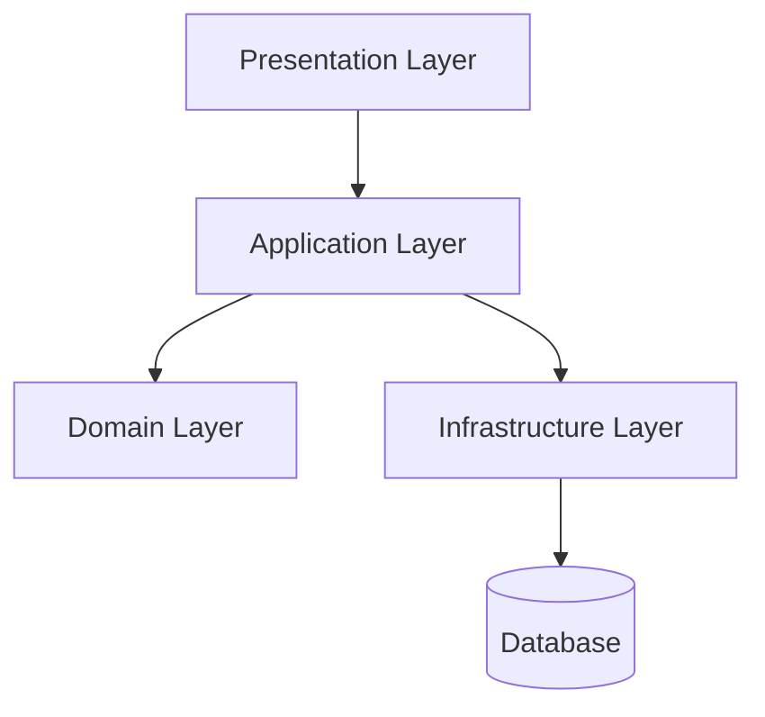
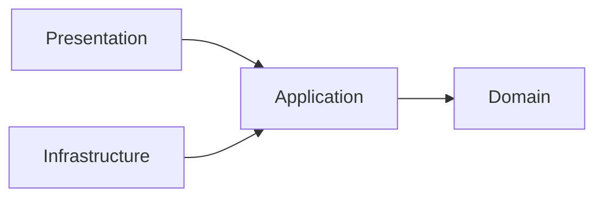
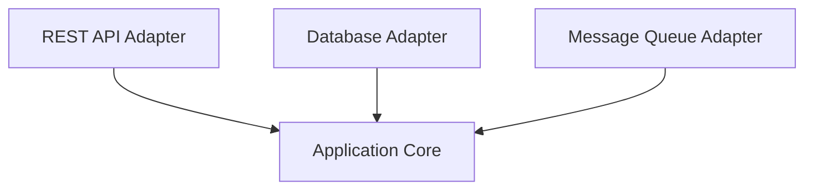
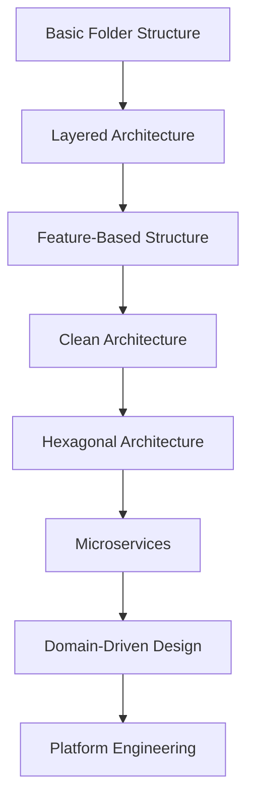

> A well-designed project structure improves maintainability, scalability, readability, onboarding speed, and development efficiency.

## Overview

Project structure defines how source code, configurations, modules, resources, tests, and deployment assets are organized within a software system.

Benefits of a good project structure:

| Benefit | Description |
|---------|-------------|
| Maintainability | Easier to update and modify code |
| Scalability | Easier to grow the system |
| Team Collaboration | Developers can quickly understand code layout |
| Testing | Clear separation improves testability |
| Deployment | Organized infrastructure and configs |
| Reusability | Shared modules become easier |
| Security | Sensitive logic can be isolated |

---

## Core Principles

### Separation of Concerns (SoC)

| Layer | Responsibility |
|-------|---------------|
| UI | Presentation |
| Business Logic | Application rules |
| Data Access | Database communication |
| Infrastructure | External systems |

### Modularity

```
Bad:
Everything in one folder

Good:
Feature-based modular structure
```

### High Cohesion — Related code stays together

```
User/
 ├── UserController
 ├── UserService
 ├── UserRepository
```

### Loose Coupling — Depend on abstractions

```csharp
public interface IUserRepository
{
    User GetById(Guid id);
}
```

---

## Common Project Structure Styles

### 4.1 Layered Architecture

Most traditional enterprise applications use layered architecture.

```
src/
 ├── Presentation/
 ├── Application/
 ├── Domain/
 ├── Infrastructure/
 └── Shared/
```

| Layer | Purpose |
|-------|---------|
| Presentation | Controllers, APIs, UI |
| Application | Use cases, services |
| Domain | Entities, business rules |
| Infrastructure | Database, external APIs |
| Shared | Common utilities |



**Advantages:** Easy to understand, good for enterprise systems, clear responsibility boundaries.

**Disadvantages:** Can become tightly coupled, difficult for large monoliths.

---

### 4.2 Feature-Based Structure

Organize by business features instead of technical layers.

```
src/
 ├── Features/
 │    ├── Users/
 │    │    ├── Controllers/
 │    │    ├── Services/
 │    │    ├── Models/
 │    │    └── Tests/
 │    └── Orders/
 │         ├── Controllers/
 │         ├── Services/
 │         ├── Models/
 │         └── Tests/
 ├── Shared/
 └── Infrastructure/
```

**Advantages:** Easier scaling, better ownership, easier onboarding, reduced coupling.

**Disadvantages:** Shared code management becomes harder, requires stronger architecture discipline.

---

### 4.3 Clean Architecture

Popularized by Robert C. Martin (Uncle Bob).

**Core Rule:** Dependencies must point inward.

```
src/
 ├── Domain/
 ├── Application/
 ├── Infrastructure/
 └── Presentation/
```



| Layer | Can Depend On |
|-------|--------------|
| Presentation | Application |
| Infrastructure | Application |
| Application | Domain |
| Domain | Nothing |

**Benefits:** Highly testable, framework independent, scalable, maintainable.

**Drawbacks:** Higher complexity, more boilerplate, steeper learning curve.

---

### 4.4 Hexagonal Architecture (Ports & Adapters)

Separates application core from external systems.



| Concept | Description |
|---------|-------------|
| Port | Interface |
| Adapter | External implementation |
| Core | Business logic |

---

## Monorepo vs Polyrepo

### Monorepo

```
repo/
 ├── frontend/
 ├── backend/
 ├── shared-lib/
 └── infrastructure/
```

**Advantages:** Easier dependency sharing, unified CI/CD, easier refactoring.

**Disadvantages:** Large repository size, CI can become slower.

### Polyrepo

**Advantages:** Independent deployments, smaller repositories, better isolation.

**Disadvantages:** Harder dependency sharing, coordination complexity.

---

## Frontend Project Structure

### React

```
src/
 ├── components/
 ├── pages/
 ├── hooks/
 ├── services/
 ├── store/
 ├── routes/
 ├── assets/
 ├── utils/
 └── tests/
```

### Angular

```
src/
 ├── app/
 │    ├── core/
 │    ├── shared/
 │    ├── features/
 │    └── layouts/
```

### Vue

```
src/
 ├── components/
 ├── composables/
 ├── views/
 ├── router/
 ├── stores/
 └── services/
```

---

## Backend Project Structure

### ASP.NET Core

```
src/
 ├── Api/
 ├── Application/
 ├── Domain/
 ├── Infrastructure/
 └── Tests/
```

### Node.js

```
src/
 ├── controllers/
 ├── services/
 ├── repositories/
 ├── middleware/
 ├── routes/
 ├── models/
 └── utils/
```

### Java Spring Boot

```
src/main/java/
 ├── controller/
 ├── service/
 ├── repository/
 ├── entity/
 ├── dto/
 └── config/
```

---

## Microservices Project Structure

```
services/
 ├── auth-service/
 ├── order-service/
 ├── payment-service/
 └── gateway/
```

### Recommended Internal Structure per Service

```
order-service/
 ├── src/
 ├── tests/
 ├── Dockerfile
 ├── helm/
 ├── k8s/
 └── ci/
```

---

## Configuration Management

```
config/
 ├── development/
 ├── staging/
 ├── production/
 └── secrets/
```

---

## Testing Structure

```
tests/
 ├── unit/
 ├── integration/
 ├── performance/
 └── e2e/
```

```csharp
[Fact]
public void Should_Calculate_Total()
{
    var total = calculator.Sum(5, 5);
    Assert.Equal(10, total);
}
```

---

## CI/CD Structure

```
.github/
 ├── workflows/
 │    ├── build.yml
 │    ├── test.yml
 │    └── deploy.yml
```


---

## Security Considerations

| Principle | Description |
|-----------|-------------|
| Least Privilege | Limit access |
| Secret Isolation | Store secrets securely |
| Dependency Scanning | Prevent vulnerabilities |
| Environment Isolation | Separate environments |
| Access Control | Protect repositories |

Sensitive files to keep out of source control:
```
.env
secrets.json
private-key.pem
```

---

## Common Mistakes

| Mistake | Problem |
|---------|---------|
| Huge utility folders | Hard to maintain |
| Circular dependencies | Build/runtime issues |
| Deep nesting | Poor readability |
| Mixed responsibilities | Tight coupling |
| No modular boundaries | Scaling problems |

---

## Best Practices

- ✅ Organize by feature when possible
- ✅ Keep modules small
- ✅ Separate infrastructure from business logic
- ✅ Use dependency injection
- ✅ Keep tests close to features
- ✅ Use clear naming conventions
- ✅ Standardize folder structures
- ✅ Document architecture decisions

---

## Example Enterprise Structure

```
enterprise-app/
 ├── apps/
 │    ├── web/
 │    ├── mobile/
 │    └── api/
 ├── services/
 │    ├── auth/
 │    ├── payments/
 │    └── notifications/
 ├── packages/
 │    ├── ui/
 │    ├── shared/
 │    └── sdk/
 ├── infrastructure/
 │    ├── terraform/
 │    ├── kubernetes/
 │    └── docker/
 ├── docs/
 └── scripts/
```

---

## Learning Roadmap



---

## Interview Questions

### Beginner
1. Why is project structure important?
2. What is separation of concerns?
3. Difference between layered and feature-based structures?

### Intermediate
1. What problems does Clean Architecture solve?
2. How do you avoid circular dependencies?
3. Monorepo vs polyrepo tradeoffs?

### Advanced
1. How would you structure a large enterprise system?
2. How do you organize shared libraries?
3. How do you enforce architecture boundaries?

---

## Recommended Tools

| Purpose | Tools |
|---------|-------|
| Monorepo | Nx, Turborepo |
| Architecture Validation | ArchUnit, NetArchTest |
| Dependency Analysis | SonarQube |
| Documentation | Docusaurus |
| Diagrams | Mermaid |
| Build Systems | Bazel, Gradle |
