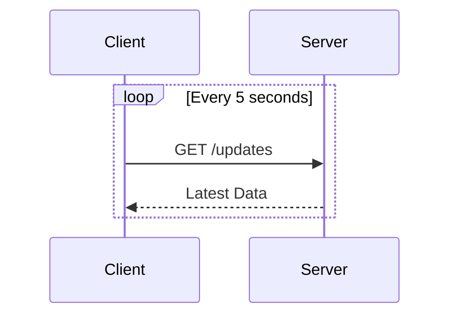
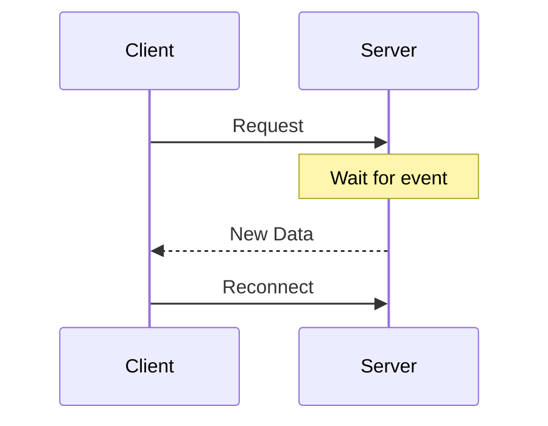
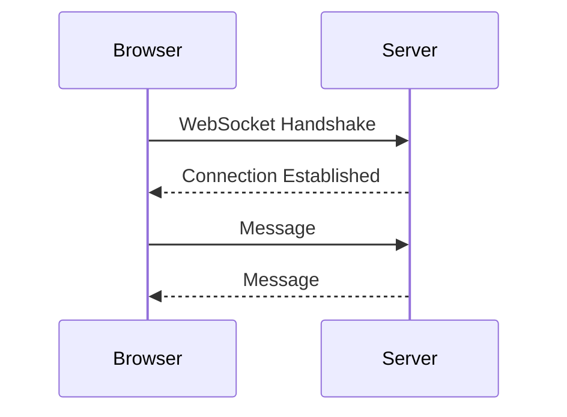
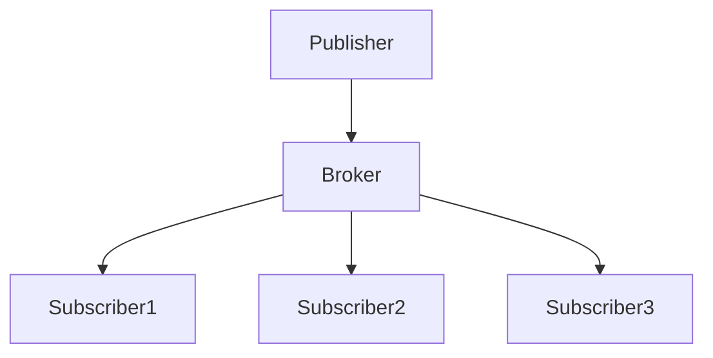
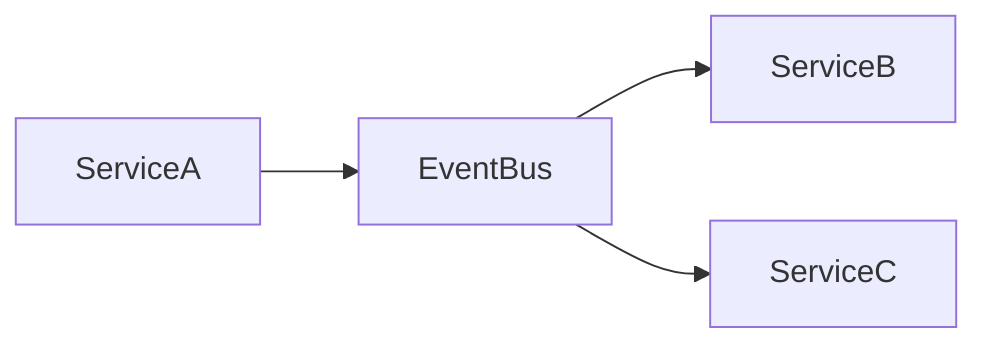
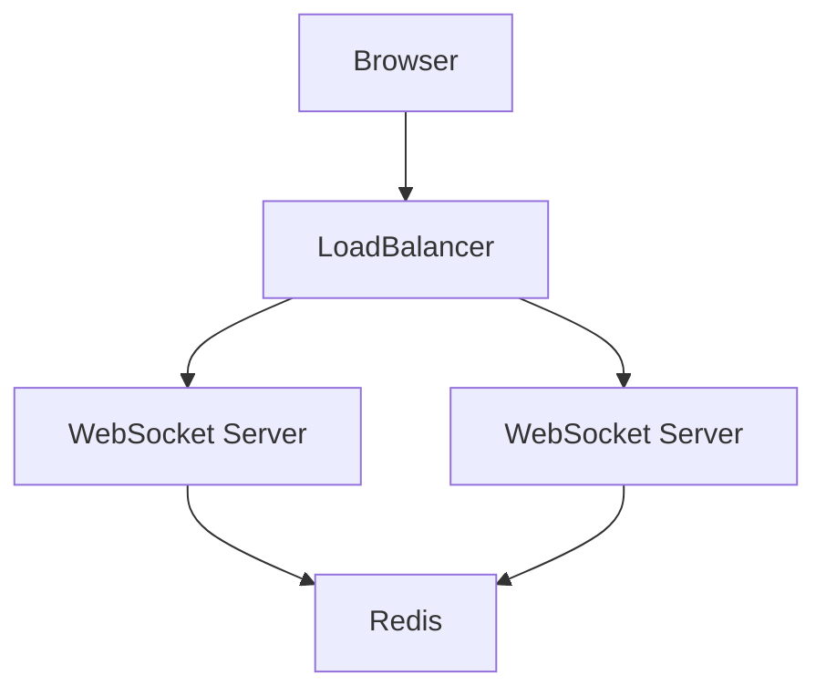
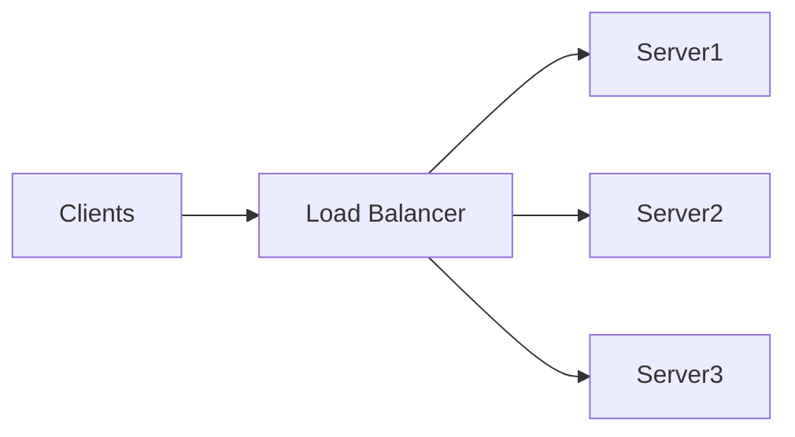
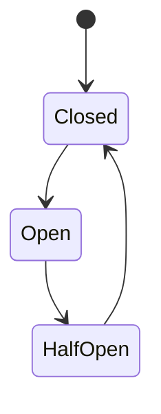
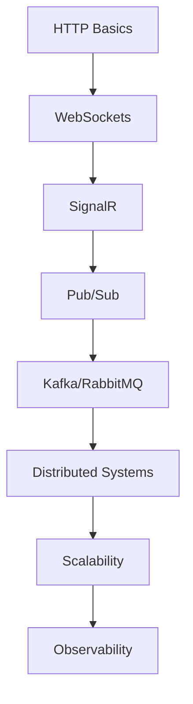

## Overview

Real-Time Communication (RTC) enables systems to exchange data instantly or near-instantly between clients, servers, services, or devices.

Modern applications use real-time communication for:
- Chat systems, Live notifications
- Multiplayer games
- Financial trading systems
- IoT telemetry
- Live dashboards
- Video conferencing
- Collaborative editing
- Streaming platforms

---

## Why Real-Time Communication Matters

Traditional HTTP communication is request-response based — inefficient for:
- Instant updates
- Continuous streams
- Low-latency systems
- Bidirectional communication

---

## Communication Models

### Polling

Client repeatedly asks the server for updates.



**Disadvantages:** High latency, wastes bandwidth, expensive at scale.

---

### Long Polling

Client waits until server has new data.



---

### WebSockets

Persistent bidirectional communication channel.



---

### Server-Sent Events (SSE)

One-way server-to-client streaming. Use cases: notifications, live feeds, monitoring dashboards.

---

## Core Concepts

### Latency Types

| Type | Description |
|------|-------------|
| Network Latency | Packet travel delay |
| Processing Latency | Server processing time |
| Serialization Latency | Encoding/decoding overhead |

### Message Delivery Models

| Model | Description |
|-------|-------------|
| At Most Once | May lose messages |
| At Least Once | Possible duplicates |
| Exactly Once | No duplicates, no loss |

### Backpressure

Occurs when receivers cannot process data fast enough.

Solutions: Rate limiting, buffering, message dropping, flow control.

---

## Architecture Patterns

### Publish-Subscribe (Pub/Sub)

Publishers send messages without knowing subscribers.



Technologies: Redis Pub/Sub, Apache Kafka, RabbitMQ, NATS.

---

### Event-Driven Architecture



---

### WebSocket Architecture (Scaled)



| Component | Purpose |
|-----------|---------|
| Load Balancer | Distributes connections |
| WebSocket Server | Maintains persistent sessions |
| Redis | Shared pub/sub |
| Message Broker | Cross-node messaging |

---

## Real-Time Protocols

### WebSocket

- Full duplex, persistent connection, TCP-based, low overhead
- Handshake: `GET /chat HTTP/1.1 → Upgrade: websocket`

### gRPC Streaming Types

| Type | Description |
|------|-------------|
| Unary | Request-response |
| Server Streaming | Server pushes stream |
| Client Streaming | Client uploads stream |
| Bidirectional | Two-way stream |

### WebRTC

Peer-to-peer real-time media communication. Use cases: video calls, voice calls, screen sharing.

---

## Message Brokers

| Broker | Characteristics |
|--------|----------------|
| Apache Kafka | High throughput, durable logs, partitioning, replay capability |
| RabbitMQ | Reliable delivery, routing support, flexible messaging |
| Redis Pub/Sub | Extremely fast, lightweight, non-persistent |

---

## SignalR in ASP.NET Core

SignalR simplifies real-time communication with WebSocket abstraction, automatic reconnect, group messaging, and transport fallback.

### Creating a Hub

```csharp
using Microsoft.AspNetCore.SignalR;

public class ChatHub : Hub
{
    public async Task SendMessage(string user, string message)
    {
        await Clients.All.SendAsync(
            "ReceiveMessage",
            user,
            message
        );
    }
}
```

### Registering SignalR

```csharp
var builder = WebApplication.CreateBuilder(args);

builder.Services.AddSignalR();

var app = builder.Build();

app.MapHub<ChatHub>("/chatHub");

app.Run();
```

### JavaScript Client

```javascript
const connection = new signalR.HubConnectionBuilder()
    .withUrl("/chatHub")
    .build();

connection.on("ReceiveMessage", (user, message) => {
    console.log(`${user}: ${message}`);
});

await connection.start();

await connection.invoke("SendMessage", "Alice", "Hello World");
```

---

## Scaling Real-Time Systems

### Horizontal Scaling



Distributed backplanes for cross-server messaging: Redis Backplane, Azure SignalR Service.

---

## Security

```csharp
[Authorize]
public class NotificationHub : Hub
{
}
```

Best practices:
- JWT / OAuth2 authentication
- TLS/HTTPS encryption
- Rate limiting to protect against DDoS, message floods, connection exhaustion

---

## Performance Optimization

### Serialization Formats

| Format | Characteristics |
|--------|----------------|
| JSON | Human readable |
| MessagePack | Compact binary |
| Protocol Buffers | High performance |

Best practices:
- Compress payloads
- Use binary serialization
- Implement idle timeout and heartbeats
- Batch multiple events into one payload

---

## Reliability Patterns

### Circuit Breaker



Solutions for message duplication: idempotency, unique event IDs.

Solutions for connection storms: exponential backoff, randomized reconnect delay.

---

## Monitoring Metrics

| Metric | Description |
|--------|-------------|
| Active Connections | Current sessions |
| Message Throughput | Messages/sec |
| Latency | Response delay |
| Error Rate | Failed operations |
| Queue Depth | Backpressure indicator |

---

## Common Pitfalls

| Problem | Cause | Solution |
|---------|-------|----------|
| Memory Leaks | Unreleased subscriptions / unclosed sockets | Properly dispose connections |
| Connection Storms | Mass reconnect attempts | Exponential backoff |
| Message Duplication | Retry logic without idempotency | Unique event IDs |

---

## Cheat Sheet

| Concept | Summary |
|---------|---------|
| WebSocket | Persistent bidirectional communication |
| SSE | One-way server streaming |
| SignalR | ASP.NET Core real-time framework |
| Kafka | Distributed event streaming |
| Pub/Sub | Decoupled messaging pattern |
| Backpressure | Consumer overload protection |
| Sticky Sessions | Same-client server affinity |
| CQRS | Separate reads/writes |
| Event Sourcing | Store events as source of truth |

---

## Learning Roadmap



---

## Recommended Technologies

| Category | Technologies |
|----------|-------------|
| Real-Time Framework | SignalR, Socket.IO |
| Message Broker | Kafka, RabbitMQ, NATS |
| Cache/Backplane | Redis |
| Streaming | Flink, Spark Streaming |
| Monitoring | Prometheus, Grafana |
| Tracing | OpenTelemetry |

---

## Interview Questions

### Beginner
1. What is WebSocket?
2. Difference between polling and WebSocket?
3. What is SignalR?
4. What is pub/sub?
5. What is latency?

### Intermediate
1. How do you scale WebSocket servers?
2. What are sticky sessions?
3. Explain backpressure.
4. Difference between Kafka and RabbitMQ?
5. Explain eventual consistency.

### Advanced
1. Design a real-time chat system.
2. How would you handle millions of WebSocket connections?
3. Explain distributed event ordering.
4. Design a multiplayer game backend.
5. How do you prevent connection storms?
