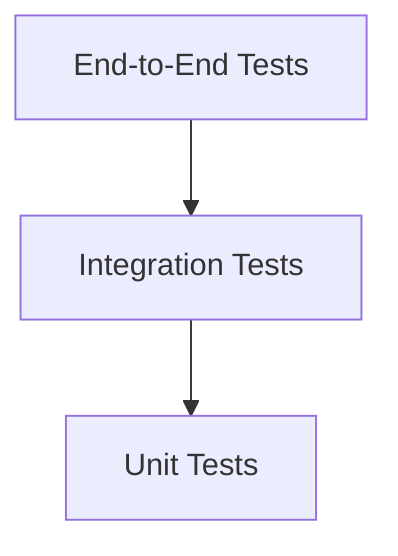
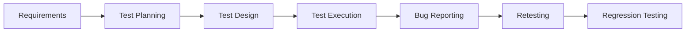
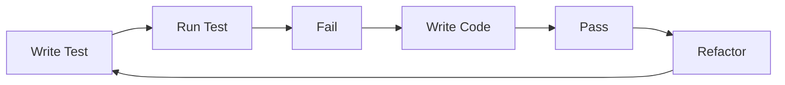
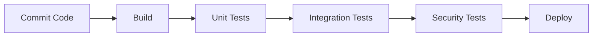
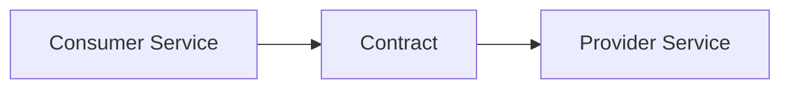
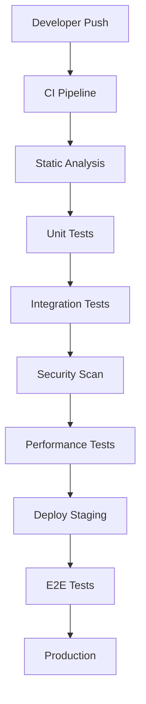

> Testing is essential for building reliable, scalable, and maintainable systems.

## Overview

Software Testing evaluates and verifies that software works correctly, meets requirements, and is free from defects.

Without testing: bugs reach production, systems become unstable, deployments become risky.

With proper testing: faster development, safer refactoring, better architecture, continuous delivery becomes possible.

---

## Types of Testing

| Type | Purpose |
|------|---------|
| Unit Testing | Test isolated components |
| Integration Testing | Test component interaction |
| Functional Testing | Validate business functionality |
| End-to-End Testing | Simulate user workflows |
| Regression Testing | Prevent old bugs from returning |
| Smoke Testing | Validate critical functionality |
| Performance Testing | Measure speed and scalability |
| Load Testing | Simulate high traffic |
| Stress Testing | Test breaking points |
| Security Testing | Find vulnerabilities |
| Acceptance Testing | Validate against business requirements |

---

## Testing Pyramid



| Level | Characteristics |
|-------|----------------|
| Unit Tests | Fast, cheap, highly isolated, most numerous |
| Integration Tests | Validate communication between modules |
| End-to-End Tests | Expensive, slow, closest to real user behavior |

---

## Testing Lifecycle



---

## Unit Testing

### AAA Pattern (Arrange, Act, Assert)

```csharp
[Fact]
public void Withdraw_ShouldReduceBalance()
{
    // Arrange
    var account = new BankAccount(100);

    // Act
    account.Withdraw(40);

    // Assert
    Assert.Equal(60, account.Balance);
}
```

---

## Test-Driven Development (TDD)



Benefits: Better design, lower coupling, safer refactoring, high confidence.

---

## Integration Testing

Integration testing validates communication between: APIs, databases, external services, queues, microservices.

```csharp
public class UserServiceTests
{
    [Fact]
    public async Task CreateUser_ShouldPersistData()
    {
        var dbContext = CreateTestDbContext();
        var service = new UserService(dbContext);

        await service.CreateUserAsync("John");

        Assert.Equal(1, dbContext.Users.Count());
    }
}
```

---

## End-to-End Testing (E2E)

E2E tests simulate real user workflows. Example flow:
1. Open website
2. Login
3. Add item to cart
4. Checkout
5. Verify order confirmation

### Selenium Example

```csharp
using OpenQA.Selenium;
using OpenQA.Selenium.Chrome;

var driver = new ChromeDriver();

driver.Navigate().GoToUrl("https://example.com");

driver.FindElement(By.Id("username")).SendKeys("admin");
driver.FindElement(By.Id("password")).SendKeys("123456");
driver.FindElement(By.Id("login")).Click();
```

---

## Mocking

Mocks simulate dependencies during testing.

### Moq Example

```csharp
var repositoryMock = new Mock<IUserRepository>();

repositoryMock.Setup(x => x.GetUser(1))
              .Returns(new User { Name = "John" });

var service = new UserService(repositoryMock.Object);

var result = service.GetUser(1);

Assert.Equal("John", result.Name);
```

---

## Code Coverage

| Type | Description |
|------|-------------|
| Line Coverage | Executed lines |
| Branch Coverage | Executed branches |
| Path Coverage | Executed paths |

---

## CI/CD Testing Pipeline



---

## Performance Testing

### Load Testing vs Stress Testing

| Load Testing | Stress Testing |
|-------------|---------------|
| Normal expected traffic | Extreme traffic |
| Measure stability | Find a breaking point |
| Capacity planning | Failure analysis |

---

## API Testing

Validations: status codes, response schema, authentication, authorization, response time, error handling.

```csharp
[Fact]
public async Task GetUser_ShouldReturn200()
{
    var response = await _client.GetAsync("/api/users/1");

    Assert.Equal(HttpStatusCode.OK, response.StatusCode);
}
```

---

## Security Testing

Focuses on: authentication, authorization, SQL injection, XSS, CSRF, secrets exposure.

---

## Common Testing Tools

| Category | Tools |
|----------|-------|
| Unit Testing | xUnit, NUnit, MSTest |
| Mocking | Moq, NSubstitute |
| API Testing | Postman, RestAssured |
| UI Testing | Selenium, Playwright |
| Load Testing | JMeter, k6 |
| Coverage | Coverlet, JaCoCo |
| CI/CD | GitHub Actions, Jenkins |

---

## Testing in Microservices

Challenges: distributed systems, network failures, service dependencies, eventual consistency.

Strategies: contract testing, consumer-driven tests, service virtualization.

### Contract Testing



---

## Best Practices

- Write small tests — easier debugging and better readability
- Keep tests deterministic — avoid random values, time dependencies, external systems
- Test behavior, not implementation — focus on outcomes
- Use meaningful names: `CalculateTotal_ShouldReturnCorrectPrice_WhenDiscountApplied`

---

## Common Pitfalls

| Pitfall | Problem |
|---------|---------|
| Too many E2E tests | Slow pipeline |
| Shared test state | Flaky tests |
| Testing implementation details | Fragile tests |
| Ignoring edge cases | Production bugs |
| No automation | Manual overhead |

---

## Flaky Tests

Causes: timing issues, shared state, race conditions, external dependencies.

---

## Testing Strategy by Project Size

| Size | Strategy |
|------|---------|
| Small Projects | Mostly unit tests, minimal integration tests |
| Medium Projects | Unit + integration, some E2E |
| Enterprise Systems | Full testing pyramid, automation pipelines, security testing, performance testing, chaos engineering |

---

## Chaos Engineering

Intentionally introduces failures (server crashes, network latency, database failures) to improve resilience.

---

## Performance Optimization for Tests

```csharp
// Use in-memory databases
UseInMemoryDatabase("TestDb");
```

- Run tests in parallel
- Avoid real network calls — mock external APIs
- Use test containers for integration tests

---

## Enterprise Testing Workflow



---

## Recommended Project Structure

```
src/
tests/
  unit/
  integration/
  e2e/
```

---

## Interview Questions

### Basic
1. What is unit testing?
2. What is mocking?
3. Explain the testing pyramid.
4. Difference between integration and E2E testing?

### Intermediate
1. What makes a good test?
2. What causes flaky tests?
3. Explain TDD.
4. How do you test APIs?

### Advanced
1. How do you test microservices?
2. Explain contract testing.
3. How would you design enterprise testing pipelines?
4. Strategies for resilient distributed systems?

---

## Testing Cheat Sheet

| Concept | Summary |
|---------|---------|
| Unit Test | Isolated component test |
| Integration Test | Multiple components |
| E2E Test | Full workflow |
| Mock | Fake dependency |
| Stub | Predefined response |
| Fake | Simplified implementation |
| Spy | Tracks interactions |
| Regression Test | Prevent reintroduced bugs |
