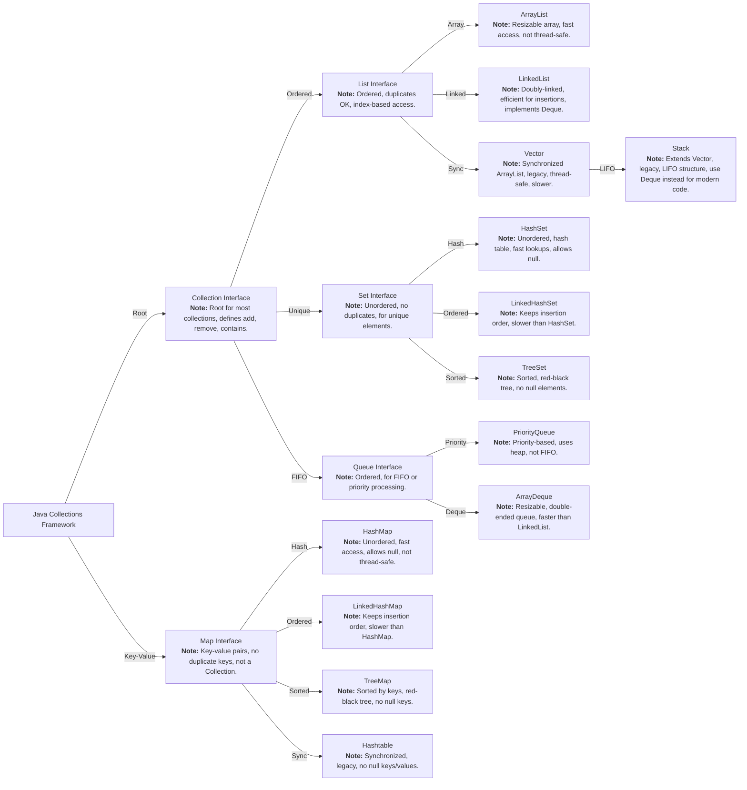

## Arrays

- `type varName[]` or `type[] varName`
- `type varName[][]` or `type[][] varName`

```java
// String status[] = { "Active", "Inactive", "Purged" };
String status[] = new String[] { "Active", "Inactive", "Purged" };

// multi-dimentional
int[][] myNumbers = { {1, 2, 3, 4}, {5, 6, 7} };

// Printing
System.out.println(Arrays.toString( status ));
System.out.println(Arrays.deepToString( myNumbers ));
```

### Arrays Concepts

<details>
  <summary>Concatenate Arrays</summary>
    ```java
        int[] array1 = {1, 2, 3};
        int[] array2 = {4, 5, 6};

        // Create a new array with size equal to the sum of both arrays
        int[] concatenatedArray = new int[array1.length + array2.length];

        // Copy elements from the first array
        System.arraycopy(array1, 0, concatenatedArray, 0, array1.length);

        // Copy elements from the second array
        System.arraycopy(array2, 0, concatenatedArray, array1.length, array2.length);

        System.out.println(Arrays.toString(concatenatedArray));  // Output: [1, 2, 3, 4, 5, 6]
    ```

</details>
<details>
<summary>Splitting</summary>
    ```java
        int[] array = {1, 2, 3, 4, 5, 6};
        int splitIndex = 3;

        // First part of the array
        int[] firstHalf = Arrays.copyOfRange(array, 0, splitIndex);

        // Second part of the array
        int[] secondHalf = Arrays.copyOfRange(array, splitIndex, array.length);

        System.out.println("First Half: " + Arrays.toString(firstHalf));  // Output: [1, 2, 3]
        System.out.println("Second Half: " + Arrays.toString(secondHalf));  // Output: [4, 5, 6]
    ```

</details>
<details>
<summary>Resize</summary>
    ```java
        int[] array = {1, 2, 3};

        // Resize array to hold 5 elements
        int[] resizedArray = Arrays.copyOf(array, 5);

        // The new elements are initialized to the default value (0 for integers)
        System.out.println(Arrays.toString(resizedArray));  // Output: [1, 2, 3, 0, 0]
    ```

</details>
<details>
<summary>Filter</summary>
    ```java
        int[] array = {1, 2, 3, 4, 5, 6};

        // Filter even numbers using Java Streams (Java 8+)
        int[] filteredArray = Arrays.stream(array)
                                    .filter(n -> n % 2 == 0)
                                    .toArray();

        System.out.println(Arrays.toString(filteredArray));  // Output: [2, 4, 6]
    ```

</details>
<details>
<summary>Map</summary>
    ```java
        int[] array = {1, 2, 3, 4, 5};

        // Apply a function to multiply each element by 2
        int[] mappedArray = Arrays.stream(array)
                                  .map(n -> n * 2)
                                  .toArray();

        System.out.println(Arrays.toString(mappedArray));  // Output: [2, 4, 6, 8, 10]
    ```

</details>
<details>
<summary>Clone</summary>
    ```java
        int[] array = {1, 2, 3, 4, 5};

        // Clone the array
        int[] clonedArray = array.clone();

        // Modify the cloned array (original array remains unchanged)
        clonedArray[0] = 10;

        System.out.println("Original Array: " + Arrays.toString(array));  // Output: [1, 2, 3, 4, 5]
        System.out.println("Cloned Array: " + Arrays.toString(clonedArray));  // Output: [10, 2, 3, 4, 5]
    ```

</details>

## Collection Framework



### List Interface

- **Strength**: Ordered collection (elements maintain their insertion order), allows duplicates, can access elements by index.
- **Common Implementations**: `ArrayList`, `LinkedList`

#### **ArrayList**

- **Strengths**:
- Fast random access (O(1) time complexity for `get`).
- Dynamic resizing of the array.
- **When to use**: When you need fast access by index and don't need to frequently insert/delete elements in the middle.

```java
import java.util.ArrayList;

public class ArrayListExample {
  public static void main(String[] args) {
      // Creating an ArrayList of Strings
      ArrayList<String> list = new ArrayList<>();
      list.add("Apple");
      list.add("Banana");
      list.add("Orange");

      // Access by index
      System.out.println(list.get(1));  // Output: Banana

      // Iterate over list
      for (String fruit : list) {
          System.out.println(fruit);
      }
  }
}
```

#### **LinkedList**

- **Strengths**:
  - Fast insertions and deletions (O(1) for `add`/`remove` at the beginning or end).
  - Implements `Deque`, so it can be used as a queue or stack.
- **When to use**: When you frequently insert or delete elements in the middle or at the ends of the list.

```java
import java.util.LinkedList;

public class LinkedListExample {
    public static void main(String[] args) {
        // Creating a LinkedList of Strings
        LinkedList<String> list = new LinkedList<>();
        list.add("Dog");
        list.add("Cat");
        list.addFirst("Elephant");  // Add to the beginning
        list.addLast("Tiger");      // Add to the end

        // Iterate over the list
        for (String animal : list) {
            System.out.println(animal);
        }
    }
}
```

### Set Interface

- **Strength**: Unordered collection that **does not allow duplicates**.
- **Common Implementations**: `HashSet`, `TreeSet`

#### **HashSet**

- **Strengths**:
  - Fast lookup and insertion (O(1) time complexity).
  - Best when you only care about uniqueness, not the order.
- **When to use**: When you need a collection that ensures no duplicate elements and don't care about order.

```java
import java.util.HashSet;

public class HashSetExample {
    public static void main(String[] args) {
        // Creating a HashSet of integers
        HashSet<Integer> set = new HashSet<>();
        set.add(1);
        set.add(2);
        set.add(3);
        set.add(2);  // Duplicate value will not be added

        // Output will be in no particular order
        for (int num : set) {
            System.out.println(num);
        }
    }
}
```

#### **TreeSet**

- **Strengths**:
  - Automatically sorted set.
  - Implements the `NavigableSet` interface, so it provides additional methods like `floor()`, `ceiling()`, etc.
- **When to use**: When you need a sorted set and fast access to the next or previous elements.

```java
import java.util.TreeSet;

public class TreeSetExample {
    public static void main(String[] args) {
        // Creating a TreeSet of integers
        TreeSet<Integer> set = new TreeSet<>();
        set.add(10);
        set.add(5);
        set.add(20);

        // TreeSet maintains elements in sorted order
        for (int num : set) {
            System.out.println(num);  // Output: 5, 10, 20
        }
    }
}
```

### Map Interface

- **Strength**: Stores key-value pairs, no duplicate keys allowed.
- **Common Implementations**: `HashMap`, `TreeMap`

#### **HashMap**

- **Strengths**:
  - Fast lookup by key (O(1) time complexity for most operations).
  - Allows one `null` key and multiple `null` values.
- **When to use**: When you need fast access to key-value pairs and don't care about the order of entries.

```java
import java.util.HashMap;

public class HashMapExample {
    public static void main(String[] args) {
        // Creating a HashMap to store key-value pairs
        HashMap<String, Integer> map = new HashMap<>();
        map.put("Alice", 30);
        map.put("Bob", 25);
        map.put("Charlie", 35);

        // Access value by key
        System.out.println(map.get("Bob"));  // Output: 25

        // Iterate through the map
        for (String key : map.keySet()) {
            System.out.println(key + ": " + map.get(key));
        }
    }
}
```

#### **TreeMap**

- **Strengths**:
  - Stores keys in sorted order.
  - Implements the `NavigableMap` interface, providing methods like `firstEntry()`, `lastEntry()`, etc.
- **When to use**: When you need a map with sorted keys.

```java
import java.util.TreeMap;

public class TreeMapExample {
    public static void main(String[] args) {
        // Creating a TreeMap to store key-value pairs
        TreeMap<String, Integer> map = new TreeMap<>();
        map.put("Alice", 30);
        map.put("Bob", 25);
        map.put("Charlie", 35);

        // TreeMap maintains keys in sorted order
        for (String key : map.keySet()) {
            System.out.println(key + ": " + map.get(key));
        }
    }
}
```

### Queue Interface

- **Strength**: First-in-first-out (FIFO) order for processing elements.
- **Common Implementations**: `PriorityQueue`, `LinkedList` (also implements `Deque`)

#### **PriorityQueue**

- **Strengths**:
  - Automatically orders elements based on their priority (natural ordering or a custom comparator).
- **When to use**: When you need to process elements in a prioritized order.

```java
import java.util.PriorityQueue;

public class PriorityQueueExample {
    public static void main(String[] args) {
        // Creating a PriorityQueue of integers
        PriorityQueue<Integer> queue = new PriorityQueue<>();
        queue.add(10);
        queue.add(5);
        queue.add(20);

        // Elements are dequeued in priority order (natural ordering in this case)
        while (!queue.isEmpty()) {
            System.out.println(queue.poll());  // Output: 5, 10, 20
        }
    }
}
```

### Deque Interface

- **Strength**: Double-ended queue that supports element insertion and removal at both ends.
- **Common Implementations**: `ArrayDeque`

#### **ArrayDeque**

- **Strengths**:
  - Fast insertions and removals at both ends (O(1)).
  - More efficient than `LinkedList` for stack/queue implementations.
- **When to use**: When you need a queue or stack and need to insert/remove elements at both ends.

```java
import java.util.ArrayDeque;

public class ArrayDequeExample {
    public static void main(String[] args) {
        // Creating an ArrayDeque to use as a stack
        ArrayDeque<Integer> deque = new ArrayDeque<>();
        deque.push(1);  // Add element at the top
        deque.push(2);
        deque.push(3);

        // Pop elements from the top (stack behavior)
        while (!deque.isEmpty()) {
            System.out.println(deque.pop());  // Output: 3, 2, 1
        }
    }
}
```

| Class/Interface | Strength                    | Best Use Case                                                      |
| --------------- | --------------------------- | ------------------------------------------------------------------ |
| `ArrayList`     | Fast random access          | When you need fast access by index and rare insertions/deletions   |
| `LinkedList`    | Fast insertions/deletions   | When you frequently insert/remove elements at the beginning/middle |
| `HashSet`       | No duplicates, fast lookup  | When you need uniqueness and don't care about order                |
| `TreeSet`       | Sorted, no duplicates       | When you need uniqueness and sorted order                          |
| `HashMap`       | Fast key-value lookup       | When you need fast access by key and don't care about order        |
| `TreeMap`       | Sorted key-value pairs      | When you need a sorted map                                         |
| `PriorityQueue` | Elements sorted by priority | When you need to process elements in priority order                |
| `ArrayDeque`    | Fast stack/queue operations | When you need to add/remove elements at both ends                  |
