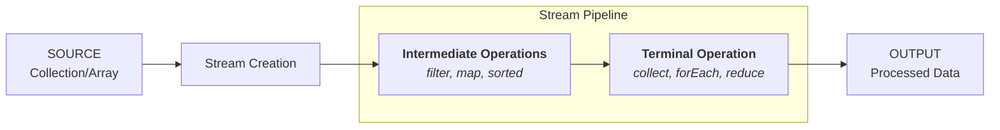

## Stream

- [**Stream API**](https://www.geeksforgeeks.org/stream-in-java/) is used to process collections of objects
- **Features**
  - A stream is **not a data structure** instead it takes input from the [Collections](#collection-framework), [Arrays](#arrays) or I/O channels.
  - Streams **don’t change the original data structure**, they only provide the result as per the pipelined methods.
- **Key Benefits**
  - **Declarative Style**: Streams allow you to focus on what you want to do with the data (e.g., filter, map) rather than how to do it (e.g., loops).
  - **Parallel Processing**: Easy to parallelize operations to improve performance for large datasets.
  - **Lazy Evaluation**: Intermediate operations are only evaluated when a terminal operation is invoked, improving efficiency.



```java
import java.util.Arrays;
import java.util.List;
import java.util.stream.Collectors;

public class StreamExample {
    public static void main(String[] args) {
        List<String> names = Arrays.asList("John", "Jane", "Tom", "Doe", "Emily", "Anna", "George");

        // Stream processing
        List<String> filteredNames = names.stream()
            .filter(name -> name.startsWith("J"))  // Intermediate operation: filter
            .map(String::toUpperCase)              // Intermediate operation: map
            .sorted()                              // Intermediate operation: sorted
            .collect(Collectors.toList());         // Terminal operation: collect to List

        // Output the result
        // JANE
        // JOHN
        filteredNames.forEach(System.out::println);  // Terminal operation: forEach
    }
}
```
