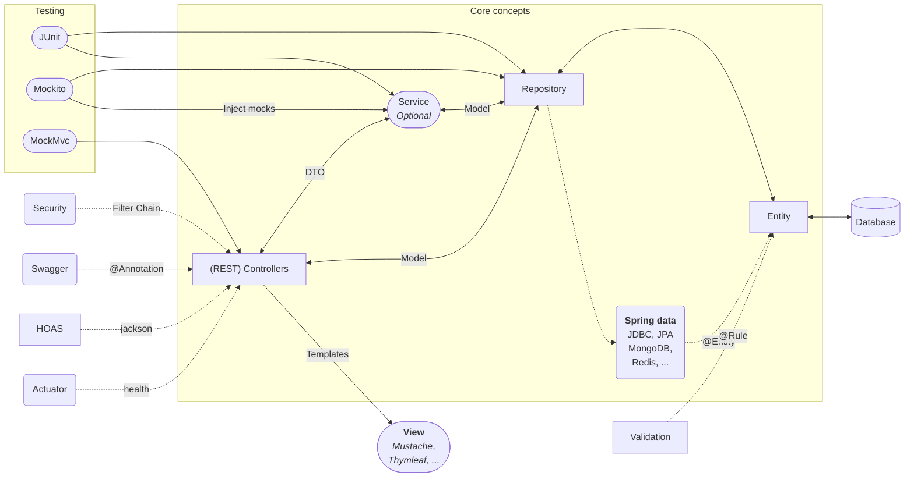

# Spring Framework

## Structural Overview



## Spring Framework

### Inversion of Control and Dependency Injection

This is the foundational principle of the Spring Framework.

- **Inversion of Control (IoC):** Traditionally, a component is responsible for creating or obtaining its own dependencies. The IoC principle inverts this control. Instead of the component managing its dependencies, an external container does it.
- **The IoC Container:** The Spring container (`ApplicationContext`) is responsible for instantiating, configuring, and assembling objects known as **beans**.
- **Dependency Injection (DI):** This is the pattern used to implement IoC. The container "injects" the dependencies (i.e., other objects a bean needs) into a bean when it is created.

Dependencies are typically declared using annotations:

- `@Component`: A generic stereotype for any Spring-managed component.
- `@Service`: Signifies a bean in the service layer (business logic).
- `@Repository`: Signifies a bean in the data access layer.
- `@Controller` / `@RestController`: Signifies a bean in the presentation layer.
- `@Autowired`: Used to perform the injection of a bean.

```java
@Service
public class ProductService {

    private final ProductRepository productRepository;

    // The ProductRepository dependency is injected by the Spring container
    @Autowired
    public ProductService(ProductRepository productRepository) {
        this.productRepository = productRepository;
    }

    // Business logic methods...
}
```

### Spring MVC for Web Applications

For REST APIs, Spring uses its **Model-View-Controller** (MVC) module.

- **DispatcherServlet:** Acts as the central "front controller". It receives all incoming HTTP requests and delegates them to the appropriate handlers (controllers).
- **`@RestController`:** A specialized version of `@Controller` that assumes all methods return data directly in the response body (e.g., as JSON), eliminating the need for `@ResponseBody` on every method.

---

## Spring Boot

Spring Boot is an evolution of Spring that radically simplifies the development of stand-alone, production-grade Spring-based applications.

### 1. Auto-Configuration

- Spring Boot automatically configures your application based on the dependencies (JARs) you have added to the project.
- For example, if `spring-boot-starter-web` is on the classpath, Spring Boot automatically configures Tomcat, Jackson (for JSON), and Spring MVC.

### 2. Starter Dependencies

Starters are convenient dependency descriptors that you can include in your build file (e.g., Maven's `pom.xml`). They group related dependencies together. Key starters for REST APIs include:

- `spring-boot-starter-web`: For building RESTful web applications using Spring MVC and an embedded Tomcat server.
- `spring-boot-starter-data-jpa`: For database access using [Java Persistence API (JPA)](/docs/technologies/java/api/jpa.md) with Hibernate.
- `spring-boot-starter-validation`: For using Java's Bean Validation with Hibernate Validator.
- `spring-boot-starter-test`: For testing with libraries like JUnit, Mockito, and [Spring Test](/docs/technologies/java/spring-framework/spring-test.md).

### 3. Embedded Server

Spring Boot includes an embedded server (Tomcat by default) so you can run your application as a standalone JAR file (`java -jar my-app.jar`). You no longer need to deploy a WAR file to an external web server.

### 4. The `@SpringBootApplication` Annotation

This is a convenience annotation that combines three others:

- `@Configuration`: Tags the class as a source of bean definitions for the application context.
- `@EnableAutoConfiguration`: Tells Spring Boot to start adding beans based on classpath settings.
- `@ComponentScan`: Tells Spring to scan for other components, configurations, and services in the specified package.

### 5. Building a REST API: Key Components

Here are the primary components used to build a REST API in Spring Boot.

#### 5.1. Controller Layer (`@RestController`)

This layer handles HTTP requests and maps them to specific methods.

| Annotation/Class                      | Description                                                                                                    |
| ------------------------------------- | -------------------------------------------------------------------------------------------------------------- |
| `@RequestMapping('/api/v1/products')` | Defines a base path for all methods in the controller.                                                         |
| `@GetMapping("/{id}")`                | Maps HTTP GET requests to a method.                                                                            |
| `@PostMapping()`                      | Maps HTTP POST requests (for creating resources).                                                              |
| `@PutMapping("/{id}")`                | Maps HTTP PUT requests (for updating resources).                                                               |
| `@DeleteMapping("/{id}")`             | Maps HTTP DELETE requests.                                                                                     |
| `@PathVariable("id")`                 | Binds a method parameter to a URI template variable (e.g., `{id}`).                                            |
| `@RequestBody()`                      | Binds the HTTP request body to a method parameter (typically a DTO).                                           |
| `ResponseEntity<T>`                   | An object representing the entire HTTP response, including status code, headers, and body. Gives full control. |

```java
@RestController
@RequestMapping("/api/v1/products")
public class ProductController {
    private final ProductService productService;

    public ProductController(ProductService productService) {
        this.productService = productService;
    }

    @GetMapping("/{id}")
    public ResponseEntity<ProductDTO> getProductById(@PathVariable Long id) {
        ProductDTO product = productService.findProductById(id);
        return ResponseEntity.ok(product);
    }

    @PostMapping
    public ResponseEntity<ProductDTO> createProduct(@Valid @RequestBody CreateProductDTO createProductDTO) {
        ProductDTO newProduct = productService.createProduct(createProductDTO);
        // Returns HTTP 201 Created status
        return new ResponseEntity<>(newProduct, HttpStatus.CREATED);
    }
}
```

#### 5.2. Service Layer (`@Service`)

This layer contains the core business logic. It decouples the controller from the data access layer.

```java
@Service
public class ProductService {

    private final ProductRepository productRepository;
    private final ModelMapper modelMapper; // A library for object mapping

    // ... constructor injection

    public ProductDTO findProductById(Long id) {
        Product product = productRepository.findById(id)
                .orElseThrow(() -> new ResourceNotFoundException("Product not found with id: " + id));
        return modelMapper.map(product, ProductDTO.class);
    }

    public ProductDTO createProduct(CreateProductDTO createProductDTO) {
        Product product = modelMapper.map(createProductDTO, Product.class);
        Product savedProduct = productRepository.save(product);
        return modelMapper.map(savedProduct, ProductDTO.class);
    }
}
```

#### 5.3. Repository Layer (`@Repository` & Spring Data JPA)

This layer is responsible for data access. Spring Data JPA makes it incredibly easy by providing a repository abstraction.

- **`JpaRepository<EntityType, IdType>`**: An interface you can extend. It comes with built-in CRUD methods like `save()`, `findById()`, `findAll()`, and `deleteById()`.
- **Custom Queries**: You can define custom queries by simply declaring a method signature in your repository interface. Spring Data will parse the method name and create the query for you.

```java
@Repository
public interface ProductRepository extends JpaRepository<Product, Long> {
    // Spring Data JPA will automatically implement this method
    // SELECT * FROM product WHERE category = ?
    List<Product> findByCategory(String category);

    // Example of a custom query using @Query
    @Query("SELECT p FROM Product p WHERE p.price > :minPrice")
    List<Product> findProductsAbovePrice(@Param("minPrice") double minPrice);
}
```

#### 5.4. Entity (`@Entity`) and DTOs

- **Entity (`@Entity`)**: A Java class that is mapped to a database table. Each instance represents a row in the table.
- **DTO (Data Transfer Object)**:
  - A plain Java object used to transfer data between layers, especially between the service and controller.
  - Using DTOs is a best practice to avoid exposing internal database entities directly to the client.

```java
@Entity
@Table(name = "products")
public class Product {
    @Id
    @GeneratedValue(strategy = GenerationType.IDENTITY)
    private Long id;

    @Column(nullable = false)
    private String name;

    private double price;
    private String category;
    // Getters and Setters...
}
```

### 6. Exception Handling & Validation

- **`@ControllerAdvice`**: Create a global exception handler class to manage exceptions across the whole application, avoiding scattered try-catch blocks in controllers.
- **`@ExceptionHandler`**: A method-level annotation within a `@ControllerAdvice` class to handle specific exceptions and return a custom response.
- **Validation (`@Valid`)**: Use the `@Valid` annotation on `@RequestBody` parameters to trigger validation based on annotations (`@NotNull`, `@Size`, `@Email`, etc.) defined in your DTO classes.

## Advanced Topics for Further Learning

Once you are comfortable with the basics, consider exploring these advanced topics to build more robust and scalable applications:

- **Asynchronous Operations**: Use `@Async` to run long-running tasks in the background without blocking the main request thread.
- **Database Migrations**: Manage your database schema changes systematically using tools like **Flyway** or **Liquibase**.
- **Caching**: Integrate a caching layer using Spring's caching abstraction (`@Cacheable`, `@CacheEvict`) with providers like EhCache or Redis to improve performance.
- **Containerization**: Package your Spring Boot application into a **Docker** container for consistent deployment and scalability.
- **Reactive Programming**: Explore **Spring WebFlux** for building non-blocking, reactive APIs that can handle high concurrency with fewer resources.
- **Microservices Architecture**: Learn about Spring Cloud, which provides tools for building distributed systems (e.g., Service Discovery with Eureka, API Gateway with Spring Cloud Gateway, Centralized Configuration with Spring Cloud Config).

import DocCardList from "@theme/DocCardList";

<DocCardList />

## References

- [Start project here!](https://start.spring.io)
- [Home Page](https://spring.io/)
- [API Versioning](/docs/key-notes/api-versioning.md)
