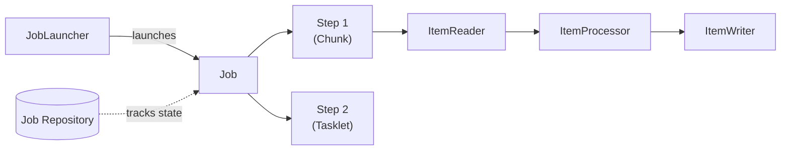

# Spring Batch

Spring Batch is the standard framework for processing large volumes of records — ETL pipelines, reports, data migration — with retry, skip, and restart capabilities.



## Core Concepts

| Concept | Description |
|---|---|
| `Job` | Top-level batch process composed of one or more Steps |
| `Step` | Independent phase of a Job (chunk-oriented or Tasklet) |
| `ItemReader<I>` | Reads input data one item at a time |
| `ItemProcessor<I, O>` | Transforms/filters an item (optional) |
| `ItemWriter<O>` | Writes a chunk of processed items |
| `Tasklet` | Simple step that executes a single operation |
| `JobRepository` | Persists job metadata (status, parameters, execution history) |
| `JobLauncher` | Entry point for running a Job |

## 1. Getting Started

```xml title="pom.xml"
<dependency>
    <groupId>org.springframework.boot</groupId>
    <artifactId>spring-boot-starter-batch</artifactId>
</dependency>
<dependency>
    <groupId>com.h2database</groupId>
    <artifactId>h2</artifactId>
    <scope>runtime</scope>
</dependency>
```

Spring Batch requires a database for the `JobRepository`. H2 works for development; use PostgreSQL or MySQL in production.

```yaml title="application.yml"
spring:
  batch:
    job:
      enabled: false          # disable auto-run on startup
    jdbc:
      initialize-schema: always
```

## 2. Chunk-Oriented Step

Process records in configurable-sized chunks. Each chunk is read, processed, and written within a single transaction.

```java
@Configuration
@EnableBatchProcessing
public class CsvToDbBatchConfig {

    @Bean
    public Job importUsersJob(JobRepository jobRepository, Step importStep) {
        return new JobBuilder("importUsersJob", jobRepository)
                .start(importStep)
                .build();
    }

    @Bean
    public Step importStep(JobRepository jobRepository,
                           PlatformTransactionManager txManager,
                           ItemReader<UserCsv> reader,
                           ItemProcessor<UserCsv, User> processor,
                           ItemWriter<User> writer) {
        return new StepBuilder("importStep", jobRepository)
                .<UserCsv, User>chunk(100, txManager)   // commit every 100 items
                .reader(reader)
                .processor(processor)
                .writer(writer)
                .faultTolerant()
                .skip(Exception.class).skipLimit(10)    // skip up to 10 bad records
                .build();
    }
}
```

### ItemReader — Flat File (CSV)

```java
@Bean
public FlatFileItemReader<UserCsv> reader() {
    return new FlatFileItemReaderBuilder<UserCsv>()
            .name("userItemReader")
            .resource(new ClassPathResource("users.csv"))
            .delimited()
            .names("firstName", "lastName", "email")
            .targetType(UserCsv.class)
            .build();
}
```

### ItemReader — JDBC (Database)

```java
@Bean
public JdbcCursorItemReader<User> dbReader(DataSource dataSource) {
    return new JdbcCursorItemReaderBuilder<User>()
            .name("dbUserReader")
            .dataSource(dataSource)
            .sql("SELECT * FROM users WHERE processed = false")
            .rowMapper(new BeanPropertyRowMapper<>(User.class))
            .build();
}
```

### ItemProcessor

```java
@Component
public class UserProcessor implements ItemProcessor<UserCsv, User> {

    @Override
    public User process(UserCsv item) {
        if (item.getEmail() == null || item.getEmail().isBlank()) {
            return null;  // returning null filters the item out
        }
        return new User(
            item.getFirstName().trim(),
            item.getLastName().trim(),
            item.getEmail().toLowerCase()
        );
    }
}
```

### ItemWriter — JPA

```java
@Bean
public RepositoryItemWriter<User> writer(UserRepository userRepository) {
    return new RepositoryItemWriterBuilder<User>()
            .repository(userRepository)
            .methodName("save")
            .build();
}
```

### ItemWriter — JDBC (Batch Insert)

```java
@Bean
public JdbcBatchItemWriter<User> jdbcWriter(DataSource dataSource) {
    return new JdbcBatchItemWriterBuilder<User>()
            .itemSqlParameterSourceProvider(new BeanPropertyItemSqlParameterSourceProvider<>())
            .sql("INSERT INTO users (first_name, last_name, email) VALUES (:firstName, :lastName, :email)")
            .dataSource(dataSource)
            .build();
}
```

## 3. Tasklet Step

For one-off operations: clean up temp files, send a notification, truncate a staging table.

```java
@Bean
public Step cleanupStep(JobRepository jobRepository, PlatformTransactionManager txManager) {
    return new StepBuilder("cleanupStep", jobRepository)
            .tasklet((contribution, chunkContext) -> {
                // perform one-time work
                Files.deleteIfExists(Path.of("/tmp/staging.csv"));
                return RepeatStatus.FINISHED;
            }, txManager)
            .build();
}
```

## 4. Multi-Step Job with Flow Control

```java
@Bean
public Job etlJob(JobRepository jobRepository, Step extractStep, Step transformStep, Step loadStep) {
    return new JobBuilder("etlJob", jobRepository)
            .start(extractStep)
            .next(transformStep)
            .next(loadStep)
            .build();
}
```

Conditional flow based on exit status:

```java
new JobBuilder("conditionalJob", jobRepository)
    .start(validationStep)
        .on("FAILED").to(notifyStep)
        .on("*").to(processStep)
    .end()
    .build();
```

## 5. Launching Jobs

### On-demand via REST endpoint

```java
@RestController
@RequestMapping("/batch")
public class BatchController {
    private final JobLauncher jobLauncher;
    private final Job importUsersJob;

    @PostMapping("/import")
    public ResponseEntity<String> runImport() throws Exception {
        JobParameters params = new JobParametersBuilder()
                .addLong("timestamp", System.currentTimeMillis())  // unique run ID
                .toJobParameters();
        JobExecution execution = jobLauncher.run(importUsersJob, params);
        return ResponseEntity.ok("Job status: " + execution.getStatus());
    }
}
```

### Scheduled via Spring Scheduler

```java
@Component
public class BatchScheduler {
    private final JobLauncher jobLauncher;
    private final Job importUsersJob;

    @Scheduled(cron = "0 0 2 * * *")  // every day at 02:00
    public void runNightlyImport() throws Exception {
        JobParameters params = new JobParametersBuilder()
                .addLong("timestamp", System.currentTimeMillis())
                .toJobParameters();
        jobLauncher.run(importUsersJob, params);
    }
}
```

```java
@SpringBootApplication
@EnableScheduling
public class BatchApplication { ... }
```

## 6. Monitoring Job Execution

```java
@Component
public class JobListener implements JobExecutionListener {

    @Override
    public void beforeJob(JobExecution jobExecution) {
        System.out.println("Job started: " + jobExecution.getJobInstance().getJobName());
    }

    @Override
    public void afterJob(JobExecution jobExecution) {
        System.out.printf("Job finished with status %s. Read: %d, Written: %d%n",
            jobExecution.getStatus(),
            jobExecution.getStepExecutions().stream().mapToLong(StepExecution::getReadCount).sum(),
            jobExecution.getStepExecutions().stream().mapToLong(StepExecution::getWriteCount).sum()
        );
    }
}
```

Register on the Job:

```java
new JobBuilder("importUsersJob", jobRepository)
    .listener(jobListener)
    .start(importStep)
    .build();
```

## References

- [Spring Batch Reference](https://spring.io/projects/spring-batch)
- [Spring Initializr](https://start.spring.io)
