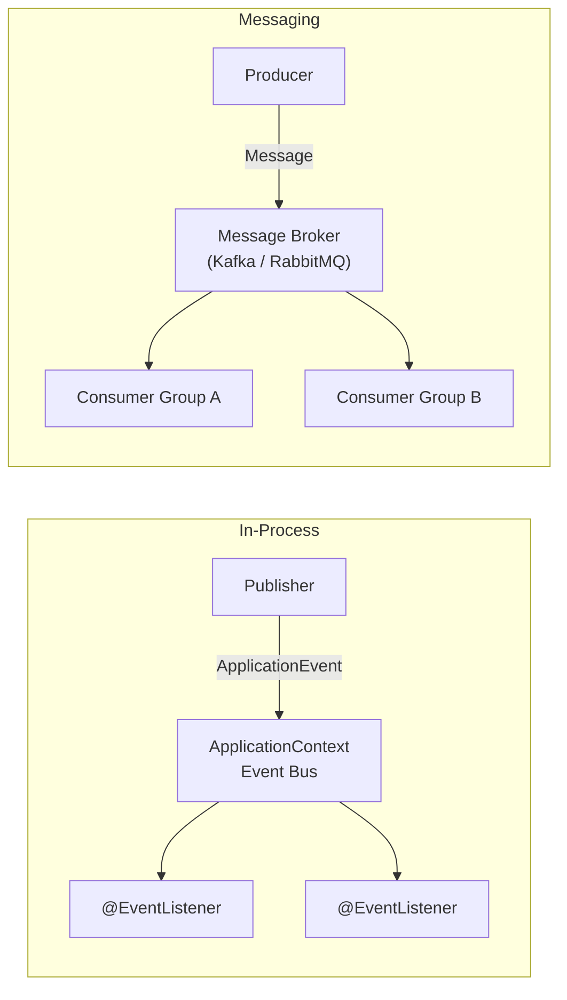

# Spring Event-Driven Architecture

Event-driven design decouples producers from consumers. Spring supports three levels: in-process application events, Spring Cloud Stream for messaging middleware, and direct Kafka/RabbitMQ integration.



## 1. Application Events (In-Process)

Lightweight event bus built into `ApplicationContext`. No external dependencies.

```java
// Define event
public record OrderPlacedEvent(Long orderId, String customerEmail) {}

// Publish event
@Service
public class OrderService {
    private final ApplicationEventPublisher eventPublisher;

    public Order placeOrder(CreateOrderDTO dto) {
        Order order = saveOrder(dto);
        eventPublisher.publishEvent(new OrderPlacedEvent(order.getId(), dto.getEmail()));
        return order;
    }
}

// Listen to event
@Component
public class NotificationListener {
    @EventListener
    public void onOrderPlaced(OrderPlacedEvent event) {
        // send confirmation email to event.customerEmail()
    }

    @EventListener
    @Async  // run in a separate thread
    public void onOrderPlacedAsync(OrderPlacedEvent event) {
        // async processing
    }
}
```

Enable async events in your config:

```java
@Configuration
@EnableAsync
public class AsyncConfig {}
```

## 2. Spring Cloud Stream (Kafka / RabbitMQ)

Abstracts the messaging middleware so you can swap Kafka for RabbitMQ with a config change.

```xml title="pom.xml (Kafka binder)"
<dependency>
    <groupId>org.springframework.cloud</groupId>
    <artifactId>spring-cloud-starter-stream-kafka</artifactId>
</dependency>
```

```xml title="pom.xml (RabbitMQ binder)"
<dependency>
    <groupId>org.springframework.cloud</groupId>
    <artifactId>spring-cloud-starter-stream-rabbit</artifactId>
</dependency>
```

### Producer

```java
@Service
public class OrderEventProducer {
    private final StreamBridge streamBridge;

    public void publishOrderPlaced(OrderPlacedEvent event) {
        streamBridge.send("order-placed-out-0", event);
    }
}
```

```yaml title="application.yml"
spring:
  cloud:
    stream:
      bindings:
        order-placed-out-0:
          destination: order-placed-topic
          content-type: application/json
      kafka:
        binder:
          brokers: localhost:9092
```

### Consumer

```java
@Configuration
public class OrderEventConsumer {

    @Bean
    public Consumer<OrderPlacedEvent> orderPlaced() {
        return event -> {
            System.out.println("Processing order: " + event.orderId());
            // inventory update, email notification, etc.
        };
    }
}
```

```yaml title="application.yml (consumer)"
spring:
  cloud:
    stream:
      bindings:
        orderPlaced-in-0:
          destination: order-placed-topic
          group: inventory-service
```

### Processor (consume + produce)

```java
@Bean
public Function<OrderPlacedEvent, InvoiceCreatedEvent> processOrder() {
    return event -> {
        Invoice invoice = createInvoice(event);
        return new InvoiceCreatedEvent(invoice.getId(), event.orderId());
    };
}
```

## 3. Direct Kafka / RabbitMQ Integration

Use when you need full control without the Stream abstraction.

### Kafka

```xml title="pom.xml"
<dependency>
    <groupId>org.springframework.kafka</groupId>
    <artifactId>spring-kafka</artifactId>
</dependency>
```

```java
// Producer
@Service
public class KafkaProducerService {
    private final KafkaTemplate<String, Object> kafkaTemplate;

    public void send(String topic, Object message) {
        kafkaTemplate.send(topic, message);
    }
}

// Consumer
@Component
public class KafkaConsumerService {
    @KafkaListener(topics = "order-events", groupId = "notification-group")
    public void listen(OrderPlacedEvent event) {
        System.out.println("Received: " + event);
    }
}
```

```yaml title="application.yml"
spring:
  kafka:
    bootstrap-servers: localhost:9092
    consumer:
      group-id: notification-group
      auto-offset-reset: earliest
      key-deserializer: org.apache.kafka.common.serialization.StringDeserializer
      value-deserializer: org.springframework.kafka.support.serializer.JsonDeserializer
    producer:
      key-serializer: org.apache.kafka.common.serialization.StringSerializer
      value-serializer: org.springframework.kafka.support.serializer.JsonSerializer
```

### RabbitMQ

```xml title="pom.xml"
<dependency>
    <groupId>org.springframework.boot</groupId>
    <artifactId>spring-boot-starter-amqp</artifactId>
</dependency>
```

```java
// Config
@Configuration
public class RabbitConfig {
    public static final String QUEUE = "order.queue";
    public static final String EXCHANGE = "order.exchange";
    public static final String ROUTING_KEY = "order.placed";

    @Bean
    public Queue queue() { return new Queue(QUEUE); }

    @Bean
    public TopicExchange exchange() { return new TopicExchange(EXCHANGE); }

    @Bean
    public Binding binding(Queue queue, TopicExchange exchange) {
        return BindingBuilder.bind(queue).to(exchange).with(ROUTING_KEY);
    }
}

// Producer
@Service
public class RabbitProducerService {
    private final RabbitTemplate rabbitTemplate;

    public void send(OrderPlacedEvent event) {
        rabbitTemplate.convertAndSend(RabbitConfig.EXCHANGE, RabbitConfig.ROUTING_KEY, event);
    }
}

// Consumer
@Component
public class RabbitConsumerService {
    @RabbitListener(queues = RabbitConfig.QUEUE)
    public void listen(OrderPlacedEvent event) {
        System.out.println("Received: " + event);
    }
}
```

## References

- [Spring Cloud Stream Reference](https://spring.io/projects/spring-cloud-stream)
- [Spring Kafka Reference](https://spring.io/projects/spring-kafka)
- [Spring Initializr](https://start.spring.io)
