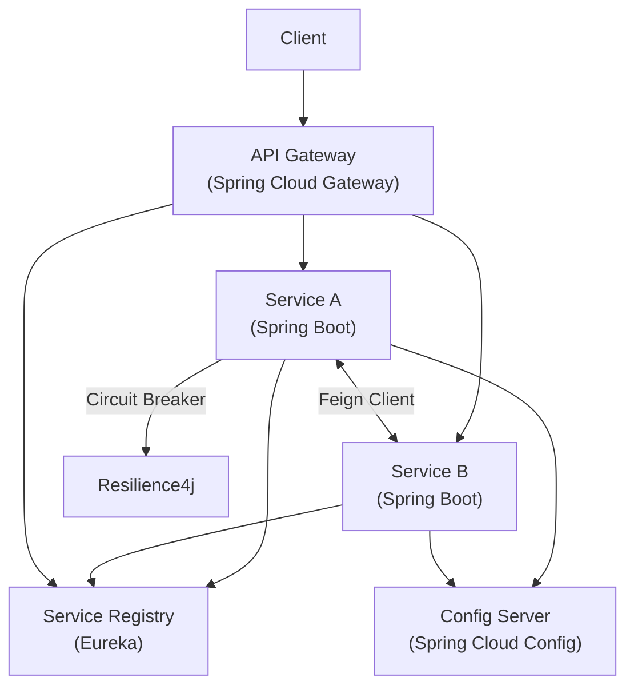

# Spring Microservices (Spring Cloud)

Spring Cloud provides tools for distributed systems — service discovery, configuration, routing, and resilience.



## 1. Service Discovery (Eureka)

Services register themselves and discover others by name instead of hardcoded URLs.

**Eureka Server:**

```xml title="pom.xml"
<dependency>
    <groupId>org.springframework.cloud</groupId>
    <artifactId>spring-cloud-starter-netflix-eureka-server</artifactId>
</dependency>
```

```java
@SpringBootApplication
@EnableEurekaServer
public class DiscoveryServerApplication {
    public static void main(String[] args) {
        SpringApplication.run(DiscoveryServerApplication.class, args);
    }
}
```

```yaml title="application.yml (Eureka Server)"
server:
  port: 8761
eureka:
  client:
    register-with-eureka: false
    fetch-registry: false
```

**Eureka Client (any microservice):**

```xml title="pom.xml"
<dependency>
    <groupId>org.springframework.cloud</groupId>
    <artifactId>spring-cloud-starter-netflix-eureka-client</artifactId>
</dependency>
```

```yaml title="application.yml (Client)"
spring:
  application:
    name: order-service
eureka:
  client:
    service-url:
      defaultZone: http://localhost:8761/eureka/
```

## 2. API Gateway (Spring Cloud Gateway)

Single entry point that routes requests to downstream services with filtering capabilities.

```xml title="pom.xml"
<dependency>
    <groupId>org.springframework.cloud</groupId>
    <artifactId>spring-cloud-starter-gateway</artifactId>
</dependency>
```

```yaml title="application.yml"
spring:
  cloud:
    gateway:
      routes:
        - id: order-service
          uri: lb://order-service        # lb:// uses Eureka load-balancing
          predicates:
            - Path=/api/orders/**
          filters:
            - StripPrefix=1
        - id: product-service
          uri: lb://product-service
          predicates:
            - Path=/api/products/**
```

## 3. Inter-Service Communication

### OpenFeign (Declarative HTTP Client)

```xml title="pom.xml"
<dependency>
    <groupId>org.springframework.cloud</groupId>
    <artifactId>spring-cloud-starter-openfeign</artifactId>
</dependency>
```

```java
@SpringBootApplication
@EnableFeignClients
public class OrderServiceApplication { ... }

@FeignClient(name = "product-service")
public interface ProductClient {
    @GetMapping("/api/products/{id}")
    ProductDTO getProduct(@PathVariable Long id);
}

@Service
public class OrderService {
    private final ProductClient productClient;

    public Order createOrder(Long productId, int qty) {
        ProductDTO product = productClient.getProduct(productId);
        // build order using product data...
    }
}
```

## 4. Circuit Breaker (Resilience4j)

Prevents cascading failures by stopping calls to an unhealthy service.

```xml title="pom.xml"
<dependency>
    <groupId>org.springframework.cloud</groupId>
    <artifactId>spring-cloud-starter-circuitbreaker-resilience4j</artifactId>
</dependency>
```

```java
@FeignClient(name = "product-service", fallback = ProductClientFallback.class)
public interface ProductClient {
    @GetMapping("/api/products/{id}")
    ProductDTO getProduct(@PathVariable Long id);
}

@Component
public class ProductClientFallback implements ProductClient {
    @Override
    public ProductDTO getProduct(Long id) {
        return new ProductDTO(id, "Unknown Product", 0.0);
    }
}
```

```yaml title="application.yml"
resilience4j:
  circuitbreaker:
    instances:
      product-service:
        sliding-window-size: 10
        failure-rate-threshold: 50
        wait-duration-in-open-state: 10s
```

## 5. Centralized Configuration (Spring Cloud Config)

Externalize configuration for all services from a single Git-backed source.

```xml title="pom.xml (Config Server)"
<dependency>
    <groupId>org.springframework.cloud</groupId>
    <artifactId>spring-cloud-config-server</artifactId>
</dependency>
```

```java
@SpringBootApplication
@EnableConfigServer
public class ConfigServerApplication { ... }
```

```yaml title="application.yml (Config Server)"
spring:
  cloud:
    config:
      server:
        git:
          uri: https://github.com/your-org/config-repo
```

```yaml title="bootstrap.yml (Client)"
spring:
  application:
    name: order-service
  config:
    import: optional:configserver:http://localhost:8888
```

## References

- [Spring Cloud Documentation](https://spring.io/projects/spring-cloud)
- [Spring Initializr](https://start.spring.io)
