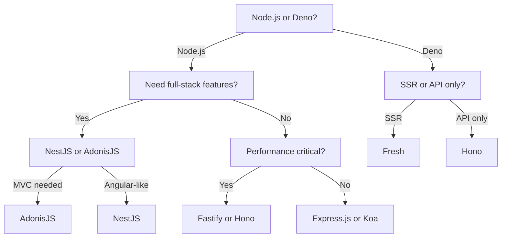

# Backend Frameworks

## General Information

| **Framework** | **Release Year** | **Community & Support**                      |
| ------------- | ---------------- | -------------------------------------------- |
| Express.js    | 2010             | **Massive** - extensive middleware ecosystem |
| NestJS        | 2017             | **Growing** - active community               |
| Fastify       | 2016             | **Active** - fast-growing                    |
| Koa           | 2013             | **Smaller** - stable but less active         |
| AdonisJS      | 2015             | **Smaller** - niche but dedicated            |
| Hono          | 2021             | **Growing** - modern, edge-focused, active   |
| Fresh         | 2022             | **Growing** - Deno community, modern, active |

## Architecture

| **Framework** | **Architecture**                              |
| ------------- | --------------------------------------------- |
| Express.js    | Minimalist, unopinionated                     |
| NestJS        | Modular, opinionated, Angular-inspired        |
| Fastify       | Plugin-based, low-overhead                    |
| Koa           | Middleware-based, lightweight                 |
| AdonisJS      | MVC, opinionated, full-stack                  |
| Hono          | Middleware-based, edge-native, lightweight    |
| Fresh         | Islands architecture, edge-native, **Deno**-first |

## Key Features

| **Framework** | **Key Features**                                                                                 |
| ------------- | ------------------------------------------------------------------------------------------------ |
| Express.js    | - Middleware-based routing - Flexible - Large ecosystem - REST API focus             |
| NestJS        | - Dependency injection - Decorators - CLI - WebSocket support                        |
| Fastify       | - High-performance - Schema validation - Plugin system - Logging                     |
| Koa           | - Async/await middleware - Context-based API - Lightweight core                          |
| AdonisJS      | - Built-in ORM (Lucid) - CLI - Auth - Validation                                     |
| Hono          | - Edge runtime - Tiny bundle - Middleware - TypeScript-first - Web standard APIs |
| Fresh         | - Zero JS by default - Islands architecture - TypeScript - SSR - Deno native     |

## Performance & TypeScript

| **Framework** | **Performance**                                    | **TypeScript Support**              |
| ------------- | -------------------------------------------------- | ----------------------------------- |
| Express.js    | Moderate, depends on middleware stack              | Good, via @types/express            |
| NestJS        | Good, but heavier due to abstractions              | Excellent, native TypeScript        |
| Fastify       | Excellent, optimized for speed and low overhead    | Strong, official TypeScript support |
| Koa           | Good, lightweight but slower than Fastify          | Good, with TypeScript definitions   |
| AdonisJS      | Good, but ORM and full-stack features add overhead | Strong, official TypeScript support |
| Hono          | Excellent, edge-optimized, minimal overhead        | Excellent, TypeScript-first         |
| Fresh         | Excellent, edge-optimized, minimal JS, fast SSR    | Excellent, TypeScript-first         |

## Ecosystem & Use Case

| **Framework** | **Ecosystem**                                               | **Best Use Case**                                             |
| ------------- | ----------------------------------------------------------- | ------------------------------------------------------------- |
| Express.js    | Extensive, thousands of middleware and plugins              | Small to medium APIs, rapid prototyping, flexible projects    |
| NestJS        | Rich, built-in modules for GraphQL, WebSockets, and more    | Large-scale, enterprise-grade apps, TypeScript-heavy projects |
| Fastify       | Growing, strong plugin ecosystem                            | High-performance APIs, microservices                          |
| Koa           | Limited, relies on community middleware                     | Lightweight APIs, projects leveraging async/await             |
| AdonisJS      | Comprehensive, full-stack with ORM, auth, and testing tools | Full-stack apps, rapid development with built-in features     |
| Hono          | Growing, edge and serverless integrations, modern plugins   | Edge/serverless APIs, microservices, fast web APIs            |
| Fresh         | Deno ecosystem, modern web standards, islands architecture  | Edge/serverless, SSR, modern web apps, minimal JS             |

## Learning Curve & Drawbacks

| **Framework** | **Learning Curve**                                              | **Drawbacks**                                                         |
| ------------- | --------------------------------------------------------------- | --------------------------------------------------------------------- |
| Express.js    | Low, simple and intuitive API                                   | - Unopinionated, manual setup - Can become messy for large apps   |
| NestJS        | Moderate, steeper due to Angular-like patterns and TypeScript   | - Steeper learning curve - Heavier footprint                      |
| Fastify       | Low, straightforward but plugin system may require learning     | - Smaller ecosystem than Express - Less mature for complex apps   |
| Koa           | Low, but requires understanding of async/await                  | - Limited ecosystem - Less feature-rich                           |
| AdonisJS      | Moderate, due to full-stack features and MVC patterns           | - Smaller community - Less flexible for non-MVC projects          |
| Hono          | Low, simple API, modern standards                               | - Newer, smaller ecosystem - Edge focus may not fit all use cases |
| Fresh         | Low, but Deno-first and islands architecture may be new to some | - Deno-only - Smaller ecosystem - New paradigm                |

## Choosing a backend framework

## Notes

- **[Express.js](https://expressjs.com/)**: The de-facto standard for Node.js, offering simplicity and flexibility. Ideal for quick APIs but requires manual structure for large projects.
- **[NestJS](https://nestjs.com/)**: A robust, TypeScript-first framework with Angular-like patterns, suited for scalable, enterprise applications but with a steeper learning curve.
- **[Fastify](https://www.fastify.io/)**: Focused on performance and low overhead, great for high-speed APIs and microservices, though its ecosystem is smaller than Express.
- **[Koa](https://koajs.com/)**: A lightweight framework leveraging async/await, ideal for developers seeking a modern, minimal alternative to Express, but with a smaller ecosystem.
- **[AdonisJS](https://adonisjs.com/)**: A full-stack MVC framework with built-in tools like ORM and authentication, perfect for rapid development but less flexible for non-MVC use cases.
- **[Hono](https://hono.dev/)**: A modern, edge-native framework for building fast APIs and web apps, TypeScript-first and ideal for serverless and edge deployments.
- **[Fresh](https://fresh.deno.dev/)**: A Deno-first, islands architecture framework for SSR and minimal-JS web apps, perfect for edge/serverless and modern web standards.
