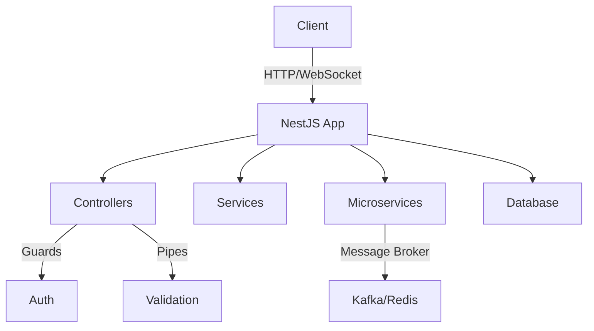

# NestJS

## 1. Core Concepts

### 1.1. Module

Organizes code into reusable units with controllers and providers.

```typescript title="app.module.ts"
import { Module } from "@nestjs/common";
import { CatsController } from "./cats.controller";
import { CatsService } from "./cats.service";

@Module({
  controllers: [CatsController],
  providers: [CatsService],
})
export class AppModule {}
```

### 1.2. Controller

Handles HTTP requests and defines routes.

```typescript title="cats.controller.ts"
import { Controller, Get, Param } from "@nestjs/common";
import { CatsService } from "./cats.service";

@Controller("cats")
export class CatsController {
  constructor(private readonly catsService: CatsService) {}

  @Get(":id")
  findOne(@Param("id") id: string): string {
    return this.catsService.findOne(id);
  }
}
```

### 1.3. Service (Provider)

Contains business logic, injectable into controllers.

```typescript title="cats.service.ts"
import { Injectable } from "@nestjs/common";

@Injectable()
export class CatsService {
  findOne(id: string): string {
    return `Cat with id ${id}`;
  }
}
```

### 1.4. Middleware

Processes requests before reaching controllers.

```typescript title="logger.middleware.ts"
import { Injectable, NestMiddleware } from "@nestjs/common";
import { Request, Response, NextFunction } from "express";

@Injectable()
export class LoggerMiddleware implements NestMiddleware {
  use(req: Request, res: Response, next: NextFunction) {
    console.log("Request:", req.method, req.url);
    next();
  }
}
```

### 1.5. Guard

Protects routes by checking permissions.

```typescript title="auth.guard.ts"
import { Injectable, CanActivate, ExecutionContext } from "@nestjs/common";

@Injectable()
export class AuthGuard implements CanActivate {
  canActivate(context: ExecutionContext): boolean {
    const request = context.switchToHttp().getRequest();
    return request.headers["api_key"] === "MY_API_KEY";
  }
}
```

### 1.6. Interceptor

Transforms request/response data.

```typescript title="transform.interceptor.ts"
import {
  Injectable,
  NestInterceptor,
  ExecutionContext,
  CallHandler,
} from "@nestjs/common";
import { Observable } from "rxjs";
import { map } from "rxjs/operators";

@Injectable()
export class TransformInterceptor implements NestInterceptor {
  intercept(context: ExecutionContext, next: CallHandler): Observable<any> {
    return next.handle().pipe(map((data) => ({ data })));
  }
}
```

### 1.7. Pipe

Validates or transforms input data.

```typescript title="create-cat.dto.ts"
import { IsString, IsInt } from "class-validator";

export class CreateCatDto {
  @IsString()
  name: string;

  @IsInt()
  age: number;
}
```

```ts title="cats.controller.ts"
import { Controller, Post, Body, ValidationPipe } from "@nestjs/common";
import { CreateCatDto } from "./create-cat.dto";

// You can add provider APP_PIPE (@nestjs/core) with new ValidationPipe({ whitelist: true }) on AppModule
@Controller("cats")
export class CatsController {
  @Post()
  create(@Body(ValidationPipe) createCatDto: CreateCatDto) {
    return createCatDto;
  }
}
```

## 2. Popular Packages

| Package             | Purpose                      | Integration Example                        |
| ------------------- | ---------------------------- | ------------------------------------------ |
| **class-validator** | Validates DTOs               | Use with `ValidationPipe` in controllers.  |
| **passport**        | Authentication (JWT, OAuth2) | Use `@nestjs/passport` for strategies.     |
| **swagger**         | Generates API docs           | Use `@nestjs/swagger` to annotate APIs.    |
| **typeorm**         | ORM for SQL databases        | Use `@nestjs/typeorm` for DB integration.  |
| **nestjs/config**   | Manages app configuration    | Use `@nestjs/config` to load `.env` files. |

**Config Example**:

```typescript title="app.module.ts"
import { Module } from "@nestjs/common";
import { ConfigModule } from "@nestjs/config";

@Module({
  imports: [ConfigModule.forRoot({ isGlobal: true })],
})
export class AppModule {}
```

## 3. Advanced Topics

### 3.1. Microservices

Enables distributed systems with message brokers.

```typescript title="app.module.ts"
import { Module } from "@nestjs/common";
import { ClientsModule, Transport } from "@nestjs/microservices";

@Module({
  imports: [
    ClientsModule.register([
      {
        name: "BOOKSTORE_SERVICE",
        transport: Transport.TCP,
        options: { host: "localhost", port: 3000 },
      },
    ]),
  ],
})
export class AppModule {}
```

**Common Issues & Solutions**:

- **Scaling**: Use Docker/Kubernetes for horizontal scaling.
- **Connection Issues**: Implement retry mechanisms and heartbeats.
- **Data Consistency**: Use event-driven patterns (e.g., Kafka).

### 3.2. WebSocket

Supports real-time communication.

```typescript title="chat.gateway.ts"
import {
  WebSocketGateway,
  SubscribeMessage,
  WebSocketServer,
} from "@nestjs/websockets";
import { Server } from "socket.io";

@WebSocketGateway({ cors: { origin: "*" } })
export class ChatGateway {
  @WebSocketServer() server: Server;

  @SubscribeMessage("chat")
  handleEvent(@MessageBody() payload: any): any {
    this.server.emit("chat", payload);
    return payload;
  }
}
```

**Common Issues & Solutions**:

- **Scaling**: Use Redis pub/sub for distributed WebSocket.
- **Dropped Connections**: Implement heartbeats.
- **Security**: Authenticate clients with tokens.

### 3.3. Security

Secures APIs with authentication and protections.

```typescript title="auth.module.ts"
import { Module } from "@nestjs/common";
import { PassportModule } from "@nestjs/passport";
import { JwtModule } from "@nestjs/jwt";

@Module({
  imports: [
    PassportModule.register({ defaultStrategy: "jwt" }),
    JwtModule.register({
      secret: "secretKey",
      signOptions: { expiresIn: "60m" },
    }),
  ],
})
export class AuthModule {}
```

**Common Issues & Solutions**:

- **Permission Errors**: Use role-based access control (RBAC).
- **Security Holes**: Apply Helmet and input validation.
- **Rate Limiting**: Use `express-rate-limit` for API protection.

## 4. System Architecture Diagram



## References

- [NestJS documentation](https://docs.nestjs.com/).
