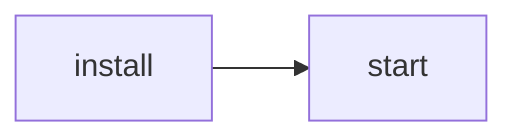

---
tags:
    - Environment
    - JavaScript
    - TypeScript
    - WebSocket
---

# Node.js

- Node.js is an open source server environment
- Node.js uses JavaScript on the server
- Node.js runs single-threaded, non-blocking, asynchronous programming
- Node.js can
  - Generate dynamic page content
  - Create, open, read, write, delete, and close files on the server
  - Collect form data
  - Add, delete, modify data in database
- **npm** is the standard package manager for Node.js

## Basic commands

```bash
> node --version
> node file.js
```

```bash
> npm install <package-name><@version> <--save-dev>
> npm i <package-name>@latest <-D>

> npm update <package-name>
> npm start
> npm run <task-name>
> npm run start-dev
```

```js
{
  "scripts": {
    "start-dev": "node lib/server-development",
    "start": "node lib/server-production"
  }
}
```



## Modules

```js
// myFirstModule.js
exports.myDateTime = function () {
  return Date();
};
// { myDateTime: func }

// other file
const dt = require('./myFirstModule');
console.log(dt.myDateTime());
```

## Built-in modules

| Modules | For |
| --- | --- |
| **assert** | test |
| buffer | binary data |
| child_processes | run a child processes |
| cluster | split single Node process -> multiple |
| **crypto** | handle OpenSSL cryptographic func |
| dns | DNS lookups & name resolution func |
| **events** | assign and trigger events |
| **fs** | handle file system |
| **http** | Node.js act as an HTTP server |
| **https** | Node.js act as an HTTPS server |
| **net** | create servers & clients |
| **os** | Provides information about operation system |
| **path** | handle file path |
| querystring | handle URL query string |
| readline | readable streams one line at the time |
| **stream** | handle streaming data |
| **string_decoder** | decode buffer objects to strings |
| **timers** | To execute a function after a given number of milliseconds |
| tls | implementing TLS (Transport Layer Security) and SSL (Secure Socket Layer) |
| **url** | parse URL strings |
| **util** | utility functions |
| vm | compile js code in a virtual machine - like `eval()` in js |
| zlib | compress or decompress files |

### HTTP

```js
var http = require('http');
var url = require('url');

http.createServer(function (req, res) {
  res.writeHead(200, {'Content-Type': 'text/html'});
  var q = url.parse(req.url, true).query;
  var txt = q.year + " " + q.month;
  res.end(txt); // Add to body
}).listen(8080);

// http://localhost:8080/?year=2017&month=July -> "2017 July"
```

### Testing

```js
import assert from 'node:assert';
import test from 'node:test';

test('that 1 is equal 1', () => {
  assert.strictEqual(1, 1);
});
test('that throws as 1 is not equal 2', () => {
  // throws an exception because 1 != 2
  assert.strictEqual(1, 2);
});
```

### Read & Hash a file

```js
import { createHash } from 'node:crypto';
import { readFile } from 'node:fs/promises';

const hasher = createHash('sha1');
hasher.setEncoding('hex');
// ensure you have a `package.json` file for this test!
hasher.write(await readFile('package.json'));
hasher.end();
const fileHash = hasher.read();
```

### Stream pipeline

```js
import { pipeline } from 'node:stream/promises';
import { createReadStream, createWriteStream } from 'node:fs';
import { createGzip } from 'node:zlib';

// ensure you have a `package.json` file for this test!
await pipeline // 🤔
(
  createReadStream('package.json'),
  createGzip(),
  createWriteStream('package.json.gz')
);
```

### Threads

```js
import { Worker, isMainThread,
  workerData, parentPort } from 'node:worker_threads';

if (isMainThread) {
  const data = 'some data';
  const worker = new Worker(import.meta.filename, { workerData: data });
  worker.on('message', msg => console.log('Reply from Thread:', msg));
} else {
  const source = workerData;
  parentPort.postMessage(btoa(source.toUpperCase()));
}
```

### How to keep packages up-to-date

Install `npm-check-updates`
  
  ```bash
  npm install -g npm-check-updates
  ```

Scan packages (You can repeat this step)

  ```bash
  ncu -u
  ```

Update packages (use `npm` or `yarn`)

  ```bash
  npm install
  ```

### Resources

1. [Node.js Documents (20.x)](https://nodejs.org/docs/latest-v20.x/api/index.html)
2. [w3schools - Node.js](https://www.w3schools.com/nodejs/nodejs_get_started.asp)
