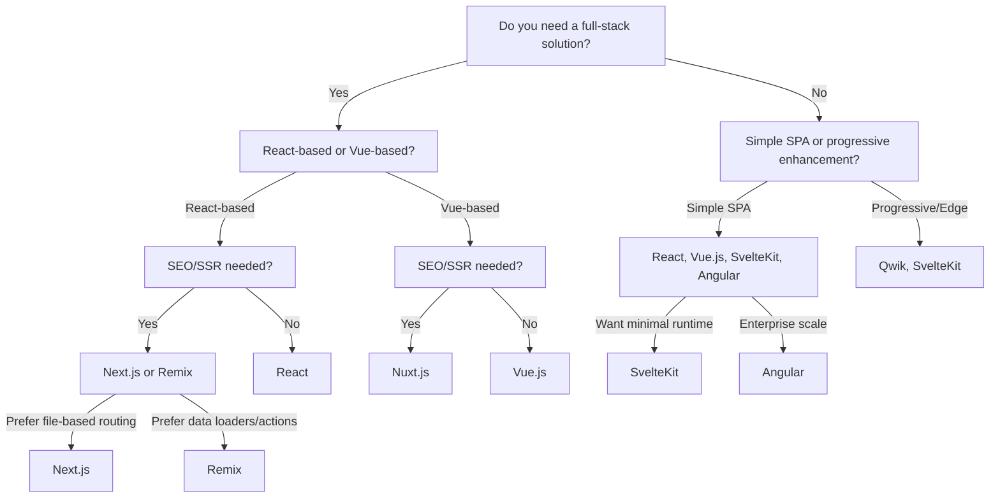

# Frontend Frameworks

## General Information

| **Framework**                        | **Release Year** | **Community & Support**                             |
| ------------------------------------ | ---------------- | --------------------------------------------------- |
| [React](https://react.dev/)          | 2013             | **Massive** - extensive ecosystem                   |
| [Next.js](https://nextjs.org/)       | 2016             | **Large** - active Vercel-backed community          |
| [Vue.js](https://vuejs.org/)         | 2014             | **Large** - active community                        |
| [Nuxt.js](https://nuxt.com/)         | 2016             | **Growing** - strong Vue community                  |
| [SvelteKit](https://kit.svelte.dev/) | 2020             | **Growing** - enthusiastic but smaller community    |
| [Remix](https://remix.run/)          | 2021             | **Growing** - strong React community, Vercel-backed |
| [Angular](https://angular.io/)       | 2016             | **Large** - enterprise adoption, Google-backed      |
| [Qwik](https://qwik.dev/)            | 2022             | **Growing** - active innovation, Builder.io-backed  |

## Architecture

| **Framework** | **Architecture**                                                    |
| ------------- | ------------------------------------------------------------------- |
| React         | Component-based library, unopinionated                              |
| Next.js       | Full-stack framework (React-based), opinionated                     |
| Vue.js        | Component-based library, progressive framework                      |
| Nuxt.js       | Full-stack framework (Vue-based), opinionated                       |
| SvelteKit     | Full-stack framework, compiler-based                                |
| Remix         | Full-stack framework (React-based), server-centric, opinionated     |
| Angular       | Component-based framework, opinionated, MVVM                        |
| Qwik          | Resumable, component-based, fine-grained reactivity, edge-optimized |

## Key Features

| **Framework** | **Key Features**                                                                                   |
| ------------- | -------------------------------------------------------------------------------------------------- |
| React         | - Virtual DOM - JSX - Hooks - Large ecosystem                                          |
| Next.js       | - SSR - SSG - File-based routing - API routes                                          |
| Vue.js        | - Reactive data binding - Vue CLI - Composition API - Directives                       |
| Nuxt.js       | - SSR/SSG - Auto-imports - File-based routing - Vue integration                        |
| SvelteKit     | - No runtime overhead - SSR/SSG - File-based routing - Svelte integration              |
| Remix         | - Nested routes - Loaders & actions - SSR/SSG - Data mutations - React ecosystem   |
| Angular       | - Two-way data binding - Dependency injection - RxJS - CLI - Angular Universal     |
| Qwik          | - Resumability - Instant loading - Fine-grained lazy loading - SSR/SSG - Qwik City |

## Performance & TypeScript

| **Framework** | **Performance**                                                                   | **TypeScript Support**                            |
| ------------- | --------------------------------------------------------------------------------- | ------------------------------------------------- |
| React         | Good, but depends on optimization (e.g., memoization)                             | Strong, via TypeScript definitions and JSX typing |
| Next.js       | Excellent, with SSR/SSG and incremental static regeneration                       | Excellent, native TypeScript support              |
| Vue.js        | Very good, lightweight with efficient updates                                     | Strong, official TypeScript support               |
| Nuxt.js       | Good, optimized for Vue with SSR/SSG                                              | Strong, native TypeScript support                 |
| SvelteKit     | Excellent, compiles to vanilla JS, minimal runtime                                | Excellent, native TypeScript integration          |
| Remix         | Excellent, fast data loading, minimal client JS, streaming rendering              | Excellent, native TypeScript support              |
| Angular       | Good, but can be heavy for large apps; optimized with Ivy and change detection    | Excellent, built-in TypeScript support            |
| Qwik          | Outstanding, instant interactivity, minimal JS shipped, highly optimized for edge | Excellent, first-class TypeScript support         |

## Ecosystem & Use Case

| **Framework** | **Ecosystem**                                                                    | **Best Use Case**                                                                |
| ------------- | -------------------------------------------------------------------------------- | -------------------------------------------------------------------------------- |
| React         | Extensive, thousands of libraries (e.g., Redux, React Router)                    | SPAs, dynamic UIs, reusable components                                           |
| Next.js       | Rich, integrated with Vercel, supports React ecosystem                           | Full-stack apps, SEO-friendly sites, e-commerce platforms                        |
| Vue.js        | Strong, includes Vue Router, Vuex, Vite                                          | SPAs, progressive web apps, lightweight projects                                 |
| Nuxt.js       | Strong, leverages Vue ecosystem with Nuxt modules                                | Vue-based full-stack apps, static sites, SEO-focused projects                    |
| SvelteKit     | Growing, includes Svelte stores, Vite, and adapter-based deployments             | High-performance apps, static sites, developer-friendly full-stack               |
| Remix         | Strong, leverages React ecosystem, supports loaders, actions, and data mutations | Data-driven apps, full-stack React apps, SEO, fast-loading sites                 |
| Angular       | Extensive, Angular Material, RxJS, CLI, enterprise tools                         | Large-scale enterprise apps, complex SPAs, long-term projects                    |
| Qwik          | Growing, Qwik City, integrations with Vite, adapters, and edge platforms         | Ultra-fast, SEO-focused sites, instant-loading apps, edge/serverless deployments |

## Learning Curve & Drawbacks

| **Framework** | **Learning Curve**                                                              | **Drawbacks**                                                                       |
| ------------- | ------------------------------------------------------------------------------- | ----------------------------------------------------------------------------------- |
| React         | Moderate, requires understanding of JSX and state management                    | - Requires additional libraries for routing/state - Boilerplate heavy           |
| Next.js       | Moderate, steeper with SSR/SSG concepts                                         | - Complex for simple SPAs - Vercel-centric ecosystem                            |
| Vue.js        | Low, intuitive API and gentle learning curve                                    | - Smaller ecosystem than React - Less enterprise adoption                       |
| Nuxt.js       | Moderate, requires Vue knowledge and SSR/SSG concepts                           | - Smaller community than Next.js - Vue dependency                               |
| SvelteKit     | Low, simple syntax but paradigm shift for Svelte                                | - Smaller ecosystem - Less mature for large-scale apps                          |
| Remix         | Moderate, requires understanding of loaders/actions and server-centric concepts | - Requires server-centric mindset - Less mature than Next.js - SSR required |
| Angular       | Steep, due to complex concepts and TypeScript requirements                      | - Verbose - Steep learning curve - Heavy bundle size for small apps         |
| Qwik          | Moderate, new paradigm (resumability), but familiar JSX-like syntax             | - New paradigm - Smaller ecosystem - Less mature for enterprise use         |

## Choosing framework

