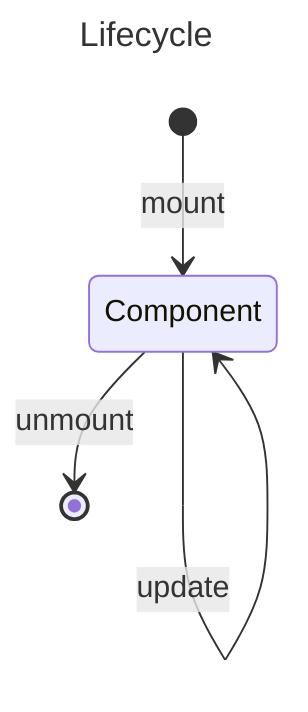

## JavaScript XML (JSX)

```jsx
// `<>` | `<Fragment>` | `<React.Fragment>`
const secretText = "Daniel";
const age = 17;
const users = (
  <>
    <div>John Doe</div>
    <div className="woman">Mary Jane</div>
    <input type="text" />
    <div>
      {1 + 1} {secretText}
    </div> // Expression {}
    {age >= 18 ? "mature" : "child"} // if statement
  </>
);
```

## Components



### Class Component

| Function                                                      | Feature                                      |
| ------------------------------------------------------------- | -------------------------------------------- |
| `contructor(props?) { super(props?); // state configs }`      |                                              |
| `static getDerivedStateFormProps(props, state) { return {} }` | Call before render (create & update)         |
| `render() { return <JSX/> }`                                  |                                              |
| `componentDidMount() {}`                                      | Call after 1st render                        |
| `shouldComponentUpdate() { return boolean; }`                 | Set up 1 time                                |
| `getSnapshotBeforeUpdate(props, state) {}`                    | access props & state _before_ update         |
| `componentDidUpdate() {}`                                     | Call after component update                  |
| `componentWillUnmount() {}`                                   | Call before component is about to be removed |

```jsx
class Car1 extends React.Component {
  constructor(props) {
    super(props);
    this.state = {
      color: "red",
    };
  }

  changeColor = () => this.setState({ color: "blue" });

  render() {
    return (
      <h2>
        I am a {this.state.color} {this.props.model}!
      </h2>
    );
  }
}

// Use with props: <Car1 model="Mustang" />
```

### Function Component

```jsx
// props = { children: null|JSX.Element, attr1: value1, attr2: value2, ..., attrN: valueN }`
function Name(props?) {
  return <JSX />;
}

// Usage
<Component attr1={value1} {...otherAttr} />
<Parent {...attrs}><Children /></Parent>
```

```jsx
// Event based on HTML Events
// on<EventName>={(event) => {}}
<button type="button" onClick={(e) => {}}>
  Click
</button>
```

```jsx
// conditions ? <CompIfTrue /> : <CompIfFalse />
function HomePage(user) {
  return <div>{user ? <Home /> : <Login />}</div>;
}
```

```jsx
function Calendar({ isAllowedButtonControls }) {
  return (
    <>
      {/* Other components */}
      {isAllowedButtonControls && <ButtonControls />}
    </>
  );
}
```

```jsx
function ItemList({ items }) {
  return (
    <>
      {/* Each children should have a unique key */}
      {items.map((item, index) => {
        return <JSX key={index} {...item} />;
      })}
    </>
  );
}
```

```jsx
function Car2() {
  return <h2>Hi, I am a Car!</h2>;
}
// Arrow function (with default props)
const Garage = ({ showGarage = true }) => {
  if (!showGarage) return <Fragment />;
  return (
    <>
      <h1>Who lives in my Garage?</h1>
      <Car2 /> {/* Component nested */}
    </>
  );
};

export default Garage;
// split component to reuse
// Using: import Garage from 'components/Garage';
```

### Feature Component

#### `<Fragment>` / `<>...</>`

- Wraps multiple elements without adding extra nodes to the DOM.
- Keeps your UI clean and avoids unexpected wrappers.

#### `<Suspense fallback={<Spinner />}>...</Suspense>`

- Used for components or data that take time to load.
- **Triggers only when using Suspense-aware features**, like:

  - 🛠️ Frameworks: **Relay**, **Next.js**
  - 📦 Lazy-loaded components:

    ```js
    const LazyReviewCar = lazy(() => import("./components/cars/ReviewCar.js"));
    ```

  - ⏳ React's experimental `use()` hook to read Promises

#### `<StrictMode><App /></StrictMode>`

- **Development-only tool** (no effect in production).
- Helps catch common issues early, like:

  - Deprecated APIs
  - Unexpected side effects
  - Unsafe lifecycle methods

#### `<Profiler id="Component" onRender={onRender}>...</Profiler>`

- Measures performance of a specific component.
- `onRender` callback example:

  ```js
  const onRender = (
    id,
    phase,
    actualDuration,
    baseDuration,
    startTime,
    commitTime
  ) => {
    // Log or analyze performance metrics
  };
  ```

- 📚 [View parameter docs](https://react.dev/reference/react/Profiler#onrender-parameters)

## Styles component

- Using sass/scss: `npm i sass`
- Both **CSS** & **SASS** can using as file or module

```css title="custom.css"
.custom-font-weight {
  font-weight: bold;
}
.bg-red {
  background: #ff0000;
}
```

```jsx title="Custom.jsx"
import React from "react"; // To use JSX
import styleModule from "custom.module.css"; // import as module
import "custom.css"; // using css file

const Custom = ({ name }) => {
  const customStyle = {
    fontSize: "2rem",
    color: "#333333",
  };
  // css module class will display like [filename]_[classname]__[hash]
  return (
    <div className="custom-font-weight" style={styleModule["bg-red"]}>
      <span style={customStyle}>{"Hello " + name}</span>
    </div>
  );
};
```
