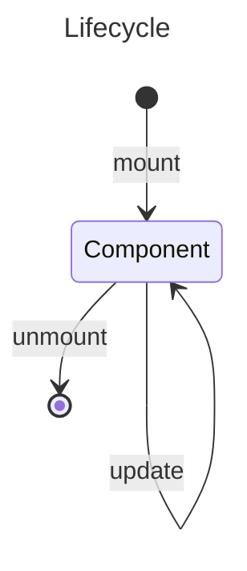

## JSX

- JavaScript XML
- Write HTML in JS
- `<>` | `<Fragment>` | `<React.Fragment>`

```jsx
const secretText = "Daniel";
const age = 17;
const users = (
  <>
    <div>John Doe</div>
    <div className="woman">Mary Jane</div>
    <input type="text" />
    <div>
      {1 + 1} {secretText}
    </div> // Expression {}
    {age >= 18 ? "mature" : "child"} // if statement
  </>
);
```

## Components



### Class Component

| Function                                                      | Feature                                      |
| ------------------------------------------------------------- | -------------------------------------------- |
| `contructor(props?) { super(props?); // state configs }`      |                                              |
| `static getDerivedStateFormProps(props, state) { return {} }` | Call before render (create & update)         |
| `render() { return <JSX/> }`                                  |                                              |
| `componentDidMount() {}`                                      | Call after 1st render                        |
| `shouldComponentUpdate() { return boolean; }`                 | Set up 1 time                                |
| `getSnapshotBeforeUpdate(props, state) {}`                    | access props & state _before_ update         |
| `componentDidUpdate() {}`                                     | Call after component update                  |
| `componentWillUnmount() {}`                                   | Call before component is about to be removed |

```jsx
class Car1 extends React.Component {
  constructor(props) {
    super(props);
    this.state = {
      color: "red",
    };
  }

  changeColor = () => this.setState({ color: "blue" });

  render() {
    return (
      <h2>
        I am a {this.state.color} {this.props.model}!
      </h2>
    );
  }
}

// Use with props: <Car1 model="Mustang" />
```

### Function Component

```jsx
function Name(props?) {
  return <JSX />;
}
```

- Props: `{ children: null|JSX.Element, attr1: value1, attr2: value2, ..., attrN: valueN }`
- Using with props: `<Component attr1={value1} {...otherAttr} />`
- Using with children: `<Parent {...attrs}><Children /></Parent>`
- Event
  - Based on HTML Events
  - `on<EventName>={(event?) => {}}`
- Conditionals
  - `conditions ? <CompIfTrue /> : <CompIfFalse />`
  - `conditions && <CompIfTrue />`
- List:
  - Using: `{listRender.map((item, index) => { return (<JSX key={index} {...item} />); } )}`
  - Each children should have a unique key

```jsx
function Car2() {
  return <h2>Hi, I am a Car!</h2>;
}
// Arrow function (with default props)
const Garage = ({ showGarage = true }) => {
  if (!showGarage) return <Fragment />;
  return (
    <>
      <h1>Who lives in my Garage?</h1>
      <Car2 /> {/* Component nested */}
    </>
  );
};

export default Garage;
// split component to reuse
// Using: import Garage from 'components/Garage';
```

### Feature Component

- `<Fragment> | <>` - Wrap all Elements and render in UI without unexpected element
- `<Suspense fallback={<Spinner />}>{children}</Suspense>`
  - Only Suspense-enabled data sources will activate the Suspense component.
    - Data fetching with Suspense-enabled frameworks like **Relay** and **Next.js**
    - Lazy-loading component code with `lazy`: `const LazyReviewCar = lazy(() => import('./components/cars/ReviewCar.js'));')`
    - Reading the value of a **Promise** with `use`
- `<StrictMode><App/></StrictMode>` - find common bugs in your components early during development
- `<Profiler id='Component' onRender={onRender}><Component /></Profiler>`
  - `const onRender = (id, phase, actualDuration, baseDuration, startTime, commitTime) => {}`
  - [View params explains](https://react.dev/reference/react/Profiler#onrender-parameters)

## Styles component

- Using sass/scss: `npm i sass`
- Both **CSS** & **SASS** can using as file or module

```css title="custom.css"
.custom-font-weight {
  font-weight: bold;
}
.bg-red {
  background: #ff0000;
}
```

```jsx title="Custom.jsx"
import React from "react"; // To use JSX
import styleModule from "custom.module.css"; // import as module
import "custom.css"; // using css file

const Custom = ({ name }) => {
  const customStyle = {
    fontSize: "2rem",
    color: "#333333",
  };
  // css module class will display like [filename]_[classname]__[hash]
  return (
    <div className="custom-font-weight" style={styleModule["bg-red"]}>
      <span style={customStyle}>{"Hello " + name}</span>
    </div>
  );
};
```
